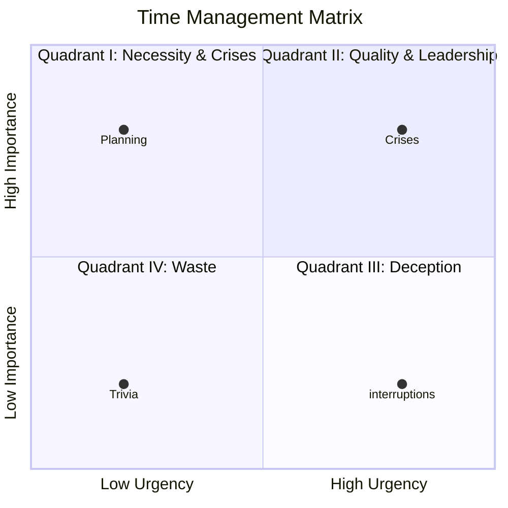
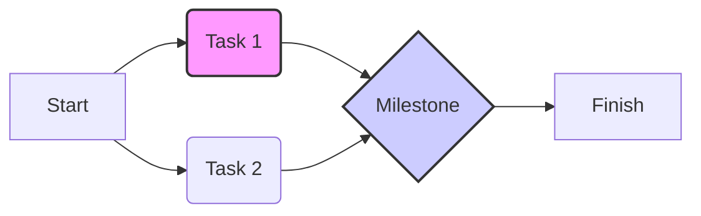

# Entrepreneurship & Project Management Exam Solutions

---

### **1. Define Analysis of market demand**
Analysis of market demand is a detailed study of various market segments to understand customer preferences, competitors, untapped demand, and prevalent trade practices. It aims to identify the depth and breadth of demand, flow of stock, and the status of customers regarding their buying capacity and preferences.
*(Source: Ent_345.pdf, Page 21, 22)*

---

### **2. Define Feasibility of Study**
Feasibility analysis (or feasibility study) is an assessment used to evaluate the strengths and weaknesses of a proposed project and provide directions for activities to improve the project and achieve desired results. It helps determine if a project is doable, if it makes effective use of resources, and if it should be undertaken to avoid blocking useful resources on non-viable tasks.
*(Source: Ent_345.pdf, Page 3)*

---

### **3. List any two components of tax burden in a project**
Two components of tax burden in a project include:
1.  **Direct Taxes:** Such as Income Tax and Corporate Tax, which are paid directly by the entity.
2.  **Indirect Taxes:** Such as GST on goods and inputs, and Customs duty on imported machinery.
*(Source: Ent_345.pdf, Page 55)*

---

### **4. List any Three Activities involved in construction phase.**
Three key activities involved in the construction phase are:
1.  **Site Preparation:** Clearing land, arranging utilities, and ensuring safety measures.
2.  **Resource Mobilization:** Arranging materials, labour, equipment, and contractors.
3.  **Scheduling Work:** Following time plans, milestones, and daily progress plans to ensure timely completion.
*(Source: Ent_345.pdf, Page 52)*

---

### **5. Define Procrastination**
Procrastination is the act of unnecessarily postponing decisions or actions despite knowing that there could be negative consequences. In an entrepreneurial context, it often stems from fear of failure, perfectionism, or feeling overwhelmed by the complexity of tasks, leading to delays in critical business activities like launching a product or making investment decisions.
*(Source: Web Search, Ent_345.pdf context implied)*

---

### **6. Explain Behavioral aspects of Entrepreneurial.**
Behavioral aspects of entrepreneurship refer to the psychological and personality traits that influence an entrepreneur's actions and success. Key elements include **Self-efficacy**, which is the individual's belief in their ability to perform demanding tasks based on prior success and psychological state. Other aspects include responsiveness to **Change Behaviour**, which involves transforming human behavior based on environmental and personal characteristics, and **Social Learning**, where behavior is determined by the interaction of environmental and personal elements.
*(Source: Ent_345.pdf, Page 83)*

---

### **7. Define the Project Finance.**
Project finance is the financing of long-term infrastructure, industrial projects, and public services based on a non-resource or limited-resource financial structure. It is a loan structure that relies primarily on the project's cash flow for repayment, with the project's assets, rights, and interests held as security, rather than the general assets or creditworthiness of the project sponsors.
*(Source: Ent_345.pdf, Page 44, 50)*

---

### **8. What is market and demand Analysis.**
Market and demand analysis is a process carried out by a project manager to evaluate a project idea by understanding how a firm's abilities can be synchronized with market requirements. **Market analysis** studies market needs, consumer preferences, and the competitive landscape, while **Demand analysis** aims at calculating the aggregated demand for a particular product or service using forecasting techniques.
*(Source: Ent_345.pdf, Page 4)*

---

### **9. List any two components of tax burden**
*(Refer to Answer 3)*
1.  **Direct Taxes:** e.g., Capital Gains Tax.
2.  **Indirect Taxes:** e.g., Excise duty (where applicable).
*(Source: Ent_345.pdf, Page 55)*

---

### **10. Define Resource Mobilization.**
Resource mobilization is a critical activity during the project execution and construction phase that involves arranging and organizing all necessary resources required for the project. This includes securing raw materials, hiring skilled and unskilled labour, procuring equipment and machinery, and appointing contractors to ensure the project proceeds according to plan.
*(Source: Ent_345.pdf, Page 52)*

---

### **11. What is Personality Determinants?**
Personality determinants are the factors that shape and influence an individual's personality, affecting how they view, analyze, and respond to things. These include **Biological Factors** (heredity, brain, physical features), **Situational Factors** (environmental constraints and situations), **Cultural Factors** (beliefs and values of the society), and **Family/Social Factors** (socialization and identification processes).
*(Source: Ent_345.pdf, Page 84)*

---

### **12. What are Change behaviors?**
Change behavior refers to any transformation or modification of human behavior, often explained by theories citing environmental, personal, and behavioral characteristics. The elements of change behavior include **Self-efficacy** (an impression of one's own ability), **Learning Theories** (behavior modified through learning simpler behaviors), and **Social Learning** (behavior determined by the interaction of environmental and personal elements).
*(Source: Ent_345.pdf, Page 83)*

---

### **13. Explain the Leadership style.**
Leadership style refers to the different behaviors or actions that a leader exhibits in different leadership positions to influence and support employees. The behavioral theory classifies leadership styles into three main types:
1.  **Autocratic (Authoritarian):** The leader relies on discipline, authority, and control, does not consult subordinates, and is result-oriented.
2.  **Democratic (Participative):** The leader involves employees in decision-making and shares information.
3.  **Laissez-Faire (Free-rein):** The leader gives subordinates freedom to make decisions.
*(Source: Ent_345.pdf, Page 88, 100)*

---

### **14. What do you mean by Technical Analysis?**
Technical analysis is a study used by engineering and technical experts to examine and formulate a project by assessing its technical viability. It involves analyzing aspects such as the manufacturing process/technology, technical arrangements, material inputs and utilities, product mix, plant capacity, location and site, machinery and equipment, and environmental aspects to ensure the project is technically feasible.
*(Source: Ent_345.pdf, Page 2, 33)*

---

### **15. Differentiate Technical analysis and market demand analysis.**
**Technical Analysis** focuses on the "how" of the project—it assesses the manufacturing process, technology, plant capacity, machinery, and location to ensure the project can physically be built and operated.
**Market Demand Analysis** focuses on the "who" and "how much"—it evaluates customer needs, market trends, competition, and forecasts the demand for the product to ensure there is a market for what is being produced.
*(Source: Ent_345.pdf, Page 2, 4, 33)*

---

### **16. What is market demand analysis.**
*(Refer to Answer 8)*
It is the strategic step in project formulation that involves situational analysis, data collection, market survey, and demand forecasting to quantify potential sales and understand consumer behavior.
*(Source: Ent_345.pdf, Page 4)*

---

### **17. Write about time management.**
Time management involves tools and processes that allow entrepreneurs to accomplish more in a set time period by identifying key uses of time and maximizing value. It is critical for entrepreneurs as they face daily challenges; it involves identifying time usage (e.g., meetings, travel) and determining if these activities add value, ultimately helping to reduce stress and improve organizational success.
*(Source: Ent_345.pdf, Page 83)*

---

### **18. What are motivation aspects.**
Motivation aspects in entrepreneurship refer to the internal and external factors that drive an entrepreneur to achieve goals, such as the desire for independence, financial rewards, and personal fulfillment. In the context of the syllabus, it includes understanding values, attitudes, and using incentives and a supportive environment to guide the team and maintain high morale and productivity.
*(Source: Ent_345.pdf, Page 54, 83)*

---

### **19. What is technical analysis**
*(Refer to Answer 14)*
It is the evaluation of the technical resources, hardware, software, and engineering requirements needed to convert a project idea into a working system.
*(Source: Ent_345.pdf, Page 3)*

---

### **20. Differentiate technical analysis and market demand analysis.**
*(Refer to Answer 15)*
Technical analysis deals with the internal capability to produce (machines, site, technology), whereas market demand analysis deals with the external opportunity to sell (customers, price, competitors).
*(Source: Ent_345.pdf, Page 2, 4)*

---

### **21. What are the types of personality determinant?**
The four main types of personality determinants are:
1.  **Biological Factors:** Heredity, brain structure, and physical features.
2.  **Situational Factors:** The specific environment or situation a person is placed in.
3.  **Cultural Factors:** Beliefs, values, and patterns of behavior expected by society/culture.
4.  **Family and Social Factors:** The influence of socialization and family upbringing.
*(Source: Ent_345.pdf, Page 84)*

---

### **22. Explain the elements of project organization for successful implementation**
Project organization involves structuring roles and responsibilities to execute a project effectively. Key elements include:
* **Structure:** Choosing between Functional, Project (Pure), or Matrix organizations based on needs.
* **Roles:** Defining the Project Manager, Functional Specialists, Support Team, and Contractors.
* **Coordination:** Ensuring harmonious work among multi-department teams.
* **Communication:** Establishing clear instructions and reporting mechanisms.
* **Leadership:** Motivating and guiding the team towards objectives.
*(Source: Ent_345.pdf, Page 52, 53)*

---

### **23. Explain the various determinants of personalities in detail.**
Personality is shaped by a complex interaction of several determinants:
1.  **Biological Factors:** These are innate characteristics. **Heredity** transmits qualities from parents to children. The **Brain** structure plays a role in personality, and **Physical Features** (height, appearance) influence how others interact with the individual and their self-image.
2.  **Situational Factors:** A person's personality can change depending on the situation. The constraints or pushes provided by a specific environment (e.g., a stressful business meeting vs. a family gathering) determine actions, sometimes more than innate traits.
3.  **Cultural Factors:** Culture dictates the "rules of the game" for behavior. It instills values regarding independence, aggression, competition, and cooperation. Individuals are often conditioned to behave in ways that their culture considers acceptable.
4.  **Family and Social Factors:** The socialization process within the family and identification with social groups significantly mold personality. Early childhood experiences and the role models within the family set the foundation for future behavioral patterns.
*(Source: Ent_345.pdf, Page 84)*

---

### **24. Explain Financial analysis and list out necessary technical analysis.**
**Financial Analysis** is the process of identifying the financial strengths and weaknesses of a firm by establishing relationships between items of the Balance Sheet and Income Statement. Its objectives are to measure short-term and long-term solvency, operating efficiency, and profitability. In project formulation, it involves estimating project costs, operating costs, fund requirements, and using tools like discounted cash flow.

**Necessary Technical Analysis** includes evaluating:
1.  **Manufacturing Process/Technology:** Selecting the right technology.
2.  **Plant Capacity:** Determining feasible normal and nominal maximum capacity.
3.  **Location and Site:** Assessing proximity to markets and raw materials.
4.  **Machineries and Equipments:** Selection based on production level.
5.  **Structure and Civil Works:** Site preparation, buildings, and outdoor works.
6.  **Environmental Aspects:** Effluent disposal and eco-friendly standards.
*(Source: Ent_345.pdf, Page 29, 30, 33-38)*

---

### **25. Explain Urgency time management matrix?**
The Urgency Time Management Matrix (often associated with Stephen Covey) classifies tasks based on two dimensions: **Urgency** and **Importance**. This helps in prioritizing work effectively.

* **Quadrant I (Urgent & Important):** Crises, pressing problems, and deadline-driven projects. These require immediate attention.
* **Quadrant II (Not Urgent but Important):** Prevention, relationship building, recognizing new opportunities, planning, and recreation. This is where effective entrepreneurs should spend most of their time for long-term success.
* **Quadrant III (Urgent but Not Important):** Interruptions, some calls, some mail, some reports, and pressing matters. These are often distractions disguised as work.
* **Quadrant IV (Not Urgent & Not Important):** Trivia, busy work, time wasters, and excessive relaxation. These should be minimized or eliminated.



*(Source: Ent_345.pdf, Page 83 (Context); Web Search for details; Diagram conceptual)*

---

### **26. Explain Project planning CPM techniques.**

**Critical Path Method (CPM)** is a deterministic project planning technique used when activity times are known and fixed. It is widely used in construction and manufacturing to optimize resource allocation and cost control.

**Steps in CPM:**

1. **Identify Activities:** List all tasks required to complete the project.
2. **Sequence Activities:** Determine the dependency between tasks.
3. **Draw Network Diagram:** Visual representation of the sequence.
4. **Estimate Time:** Assign a fixed duration to each activity.
5. **Identify Critical Path:** Calculate the longest path through the network; this determines the shortest time in which the project can be completed.
6. **Control:** Focus on critical activities to prevent delays, as any delay on the critical path delays the entire project.

**Equation for Earliest/Latest times (Concept):**
$$ EST = \max(EFT \text{ of predecessors}) $$
$$ LST = \min(LS \text{ of successors}) - \text{Duration} $$
*(Source: Ent_345.pdf, Page 53)*

---

### **27. Explain PERT Techniques in detail.**

**Program Evaluation and Review Technique (PERT)** is a probabilistic model used for project management when activity durations are uncertain, such as in R&D or new product development. Unlike CPM, PERT accounts for time variation by using three time estimates for each activity.

**Three Time Estimates:**

1. **Optimistic time ():** The minimum time required if everything goes perfectly.
2. **Most likely time ():** The time required under normal conditions.
3. **Pessimistic time ():** The maximum time required if things go wrong.

**Expected Time () Formula:**
The weighted average of the three estimates is calculated as:
$$ TE = \frac{O + 4M + P}{6} $$

**Key Features:**

* **Event-Oriented:** Focuses on the start and completion of events.
* **Risk Analysis:** Helps in analyzing the probability of completing a project by a scheduled date.
* **Network Diagram:** Similar to CPM, it uses a network to visualize tasks but focuses on the uncertainty of time.
*(Source: Ent_345.pdf, Page 54)*

---

### **28. Explain Time management strengths and weaknesses in detail.**

Time management approaches have distinct strengths and weaknesses that entrepreneurs must navigate:

**Strengths:**

* **Productivity:** Effective time management allows individuals to accomplish more in less time.
* **Stress Reduction:** By prioritizing tasks (e.g., using the Matrix), entrepreneurs reduce the anxiety of "fire-fighting" urgent issues.
* **Goal Achievement:** It ensures time is allocated to Quadrant II (Important/Not Urgent) activities like planning, which drives long-term success.
* **Resource Optimization:** Helps in identifying key uses of time and minimizing waste on trivial activities.

**Weaknesses (Potential Pitfalls):**

* **Urgency Addiction:** Entrepreneurs may become addicted to the "rush" of solving urgent problems (Quadrant I & III), neglecting long-term planning.
* **Rigidity:** Over-structuring time can reduce flexibility, which is often needed in dynamic entrepreneurial environments.
* **Misidentification:** Failing to distinguish between "Urgent" and "Important" leads to spending time on Quadrant III (Deception), thinking it is productive.
*(Source: Ent_345.pdf, Page 83)*

---

### **29. Describe in detail about attributes and models?**

This question refers to the attributes of personality and leadership models in entrepreneurship.

**Personality Attributes (Big-Five Model):**

1. **Extroversion:** Sociable, assertive, and spirited. High scorers are outgoing; low scorers are introverted.
2. **Emotional Stability:** Ability to withstand stress. High scorers are calm and confident; low scorers are anxious.
3. **Agreeableness:** Tendency to be cooperative and compassionate.
4. **Conscientiousness:** Measure of reliability, organization, and persistence.
5. **Openness:** Interest in novelty and creativity. High scorers are innovative.

**Physiognomy Personality Model (Sheldon):**

* **Endomorph:** Comfort-loving, sociable, slow reaction.
* **Mesomorph:** Aggressive, risk-taking, active, competitive (often associated with leadership).
* **Ectomorph:** Anxious, ambitious, inhibited, solitary.

**Leadership Models:**

* **Trait Theory:** Leaders are born with specific traits like drive, integrity, and self-confidence.
* **Behavioral Theory:** Leadership is defined by actions (Task-oriented vs. People-oriented).
* **Managerial Grid:** Classifies leaders based on concern for production vs. people (e.g., Team Management 9,9).
* **Situational Leadership:** Effectiveness depends on the match between leader style and situational factors.
*(Source: Ent_345.pdf, Page 86, 87, 96, 98)*

---

### **30. Discuss the project management during construction phase.**

Project management during the construction phase deals with converting the project plan into physical reality. The objective is to complete the project within time, budget, and quality parameters.

**Key Activities:**

1. **Site Preparation:** Grading, leveling, and connecting utilities.
2. **Resource Mobilization:** organizing materials, labour, and machinery.
3. **Scheduling:** Strictly following time plans and milestones.
4. **Quality Control:** Testing materials and ensuring construction standards are met.
5. **Cost Control:** Monitoring expenses to prevent wastage and overruns.
6. **Coordination:** Managing interactions between architects, engineers, and contractors.
7. **Risk & Safety Management:** Compliance with laws and managing hazards.
*(Source: Ent_345.pdf, Page 52)*

---

### **31. What are strengths? Explain motivation aspects in details.**

**Strengths (in context of SWOT/Project):** Strengths are internal capabilities or resources that help an entity achieve its objectives. In project formulation, this could be technical expertise, financial solvency, or a strong market demand.

**Motivation Aspects in Entrepreneurship:**
Motivation is the drive that initiates, guides, and maintains goal-oriented behaviors.

1. **Leadership Role:** A leader must motivate the team by creating a supportive environment and providing incentives.
2. **Internal/External Factors:** Entrepreneurs are motivated by "pull" factors (opportunity, independence) or "push" factors (necessity).
3. **Path-Goal Theory:** Leaders motivate subordinates by clarifying the path to goals, removing obstacles, and providing rewards.
4. **Human Factors:** Recognition, training, and a positive work culture are crucial for sustaining motivation among the project team.
*(Source: Ent_345.pdf, Page 54, 99)*

---

### **32. Explain in a detail about project organization.**

Project organization is the structure that facilitates the coordination and implementation of project activities. It defines the relationships between the project manager, the team, and other stakeholders.

**Types of Project Organization:**

1. **Functional Organization:** Based on traditional departments (e.g., Marketing, Finance). It offers specialization but may lead to slow decision-making and poor coordination across project tasks.
2. **Project (Pure) Organization:** A separate, independent unit is created for the project. The project manager has full authority. It ensures fast decisions and strong control but can be costly due to resource duplication.
3. **Matrix Organization:** A hybrid structure where staff report to both a functional manager and a project manager. It offers flexibility and optimal resource use but can cause conflict due to dual authority.

**Key Roles:**

* **Project Manager:** Leads the project, responsible for success/failure.
* **Functional Specialists:** Provide technical expertise.
* **Project Support Team:** Assists with administration and logistics.
*(Source: Ent_345.pdf, Page 52, 53)*

---

### **33. Interpret the Types of Project Financing**

Project financing in India involves various sources categorized by tenure and nature.

**1. Permanent/Fixed/Long-term Finance:**

* **Shares:** Equity capital raised from the public or promoters; no repayment obligation.
* **Debentures:** Long-term debt instruments acknowledging a debt; interest is paid.
* **Public Deposits:** Unsecured deposits accepted from the public.
* **Ploughing Back of Profits:** Reinvesting surplus profits into the business.
* **Loans from Financial Institutions:** Long-term loans from bodies like IFCI, IDBI, ICICI.

**2. Temporary/Variable/Short-term Finance:**

* **Commercial Banks:** Working capital loans.
* **Trade Credit:** Suppliers providing goods on credit.
* **Installment Credit:** Purchasing assets with down payments and installments.
* **Factoring:** Raising funds against accounts receivable.
* **Commercial Paper:** Unsecured promissory notes for short-term funds.
*(Source: Ent_345.pdf, Page 39, 40, 41)*

---

### **34. Describe in detail about project planning and control using CPM and PERT techniques.**

Project planning and control are essential to ensure a project is completed on time and within resources. Two major network techniques used are CPM and PERT.

**A. Critical Path Method (CPM):**
CPM is used for projects with well-defined, predictable activities (e.g., construction).

* **Process:** It involves breaking down the project into activities, determining their sequence, and estimating a fixed duration for each.
* **Critical Path:** The longest sequence of dependent tasks is identified. This path determines the minimum project duration. If any task on this path is delayed, the project is delayed.
* **Control:** Managers focus on critical activities. "Float" or "Slack" is calculated for non-critical tasks to see how much they can be delayed without affecting the deadline.

**B. Program Evaluation and Review Technique (PERT):**
PERT is used for projects with high uncertainty (e.g., R&D).

* **Probabilistic Time:** It uses three estimates (, , ) to calculate a weighted average Expected Time ().
* **Variance:** It calculates variance to understand the risk and uncertainty associated with time estimates.
* **Control:** It allows managers to calculate the probability of meeting a specific deadline using standard deviation concepts.

**Comparison:**

* **CPM** is deterministic (Time is known) and cost-oriented.
* **PERT** is probabilistic (Time is uncertain) and event-oriented.



*(Diagram represents a simple network flow found in CPM/PERT)*
*(Source: Ent_345.pdf, Page 53, 54)*

```
