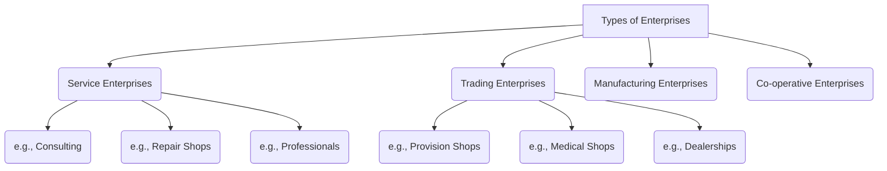

> *The reference page numbers are given from `ENT.pdf`*

-----

## Short Answers

**1. Define Conception of idea.**

Conception of idea, also referred to as idea generation, is the initial step in the entrepreneurial process. It involves generating new ideas through various methods, such as brainstorming, analyzing customer feedback, conducting market research, and performing competitive analysis.

*(Source: ENT.pdf, Page 23)*

-----

**2. Define project formulation.**

In the context of entrepreneurship, project formulation is the systematic process of designing, planning, and structuring a new business venture. It involves identifying the business idea, evaluating its feasibility, defining clear objectives, and preparing a detailed roadmap to successfully launch and grow the business. It is the crucial step in turning an entrepreneurial vision into a tangible, viable business.

*(Source: ENT.pdf, Page 33)*

-----

**3. Define Economic Environment.**

The economic environment is one of the broad categories of the industrial environment. It encompasses all the economic factors that affect business operations, including the economic system, national income and its distribution, monetary policy, fiscal policy, natural resources, and infrastructural facilities (such as power, transport, raw materials, and financial facilities).

*(Source: ENT.pdf, Page 2)*

-----

**4. Explain the meaning of first-generation Entrepreneur.**

A first-generation entrepreneur is an individual who starts a new business enterprise without having any prior entrepreneurial or business background in their family. They are the first in their family to start such a venture. These entrepreneurs are essentially innovators who use their own skills to combine different technologies or ideas to produce a marketable product or service. They must learn from their own mistakes, as they do not have an established family business to guide or support them.

*(Source: ENT.pdf, Pages 11, 22)*

-----

**5. Define the term Entrepreneur and Entrepreneurship.**

  * **Entrepreneur:** An entrepreneur is a person who identifies a business opportunity, organizes and manages a new business undertaking, and assumes the inherent risks for the sake of profit. The term originates from the French word *entreprendre*, meaning "to undertake." An entrepreneur is an innovator who assembles the necessary inputs (like resources, capital, and managers) and sets the organization in motion.
  * **Entrepreneurship:** Entrepreneurship is the process or purposeful activity undertaken by an entrepreneur to create value. It involves the functions of seeking investment and production opportunities, creating something new (innovation), organizing and coordinating resources, and bearing the risks and uncertainty associated with starting and running a business.

*(Source: ENT.pdf, Pages 3, 4, 15, 17, 20)*

-----

**6. Define Indian Industrial Environment Competency and its Importance.**

The "Competence" of the Indian Industrial Environment refers to the enhanced capabilities and favorable conditions available for entrepreneurship. This includes:

  * Vastly improved infrastructural facilities (land, power, transport, communication).
  * Enhanced investment capabilities.
  * Easy access to technology and R\&D laboratories.
  * A ready supply of skilled labor, technical experts, and professional managers.

The **importance** of this competence is that it enables Indian businesses to meet international quality standards and is supported by governmental encouragement, making the environment more conducive to starting and growing new enterprises.

*(Source: ENT.pdf, Page 5)*

-----

**7. List & draw different types of Enterprises.**

The provided document lists the following four main types of enterprises:

1.  **Service enterprises:** (e.g., Consulting agencies, repair shops, professionals like doctors and lawyers)
2.  **Trading enterprises:** (e.g., Provision shops, medical shops, dealerships)
3.  **Manufacturing enterprises:** (Further classified by form, e.g., sole proprietorship, partnership)
4.  **Co-operative enterprises**

Here is a diagram illustrating these types:

*(Source: ENT.pdf, Page 9)*

-----

**8. Explain the choice of technology in Entrepreneurship.**

The choice of technology is a critical decision made during the early stages of a project, which can have a significant impact on its success. It is an important economic decision that affects how a society allocates its resources, its productivity, and its competitiveness. Key factors that influence this choice include operation and maintenance costs, labor rates, uncertainty about future policies (e.g., climate policy), and uncertainty about future prices for inputs like electricity.

*(Source: ENT.pdf, Page 26)*

-----

**9. List any two characteristics of a successful Entrepreneur.**

Based on the provided text, two key characteristics of a successful entrepreneur are:

1.  **Self-Confidence:** Entrepreneurs must have a strong belief in themselves and their ability to achieve their goals. They are confident that they can make their business succeed.
2.  **Calculated Risk-Taking Ability:** An entrepreneur must be a moderate risk-taker. They must be able to assume risks but also learn from any failures, viewing defeat as an opportunity for success.

*(Source: ENT.pdf, Pages 5, 15, 17-18)*

-----

**10. Differentiate between small industries and heavy industries.**

The primary difference relates to their scale, investment, and output.

  * **Small Industries (Small Scale):** These require a lower capital investment (defined in the text as 25 Lakh up to 1 crore on plant and machinery). They typically have a high labor orientation and often produce consumer goods or components.
  * **Heavy Industries (Large Scale):** These involve a much larger investment (defined as anything above 5 crore). They undertake the manufacturing of bigger, more complex systems or machines that demand high technology.

These industries are often linked, as heavy industries may outsource the production of various components to small-scale industries to lower production costs.

*(Source: ENT.pdf, Pages 1, 9, 12)*

-----

**11. Define economic growth.**

Economic growth is the result of creative activity and innovation. It is defined as the process of employing resources in a new way or bringing in a new combination of means of production. An economy's growth depends on its rate of innovation and technical progress. Entrepreneurs play a key role in accelerating this process by identifying new ideas and putting them into effect.

*(Source: ENT.pdf, Page 5)*

-----

**12. Define women entrepreneurs.**

Women entrepreneurs are defined as female individuals who are involved in establishing and managing entrepreneurial enterprises. The document provides examples such as Vandana Luthra (VLCC) and Suchi Mukherjee (Limeroad).

*(Source: ENT.pdf, Pages 11-12)*

-----

**13. Identify any three sources of entrepreneurial ideas.**

Three sources for generating entrepreneurial ideas mentioned in the document are:

1.  Customer feedback
2.  Market research
3.  Competitive analysis

*(Source: ENT.pdf, Page 23)*

-----

**14. Recall any two important stages of project formulation.**

Two important stages (or components) of project formulation are:

1.  **Business Idea and Opportunity Identification:** This initial stage involves generating the business idea, conducting market research to validate it, and clearly defining the unique value proposition the business will offer.
2.  **Conducting Feasibility Analysis:** This stage is a critical evaluation to determine the idea's viability. It assesses market feasibility (is there demand?), technical feasibility (can it be built?), financial feasibility (is it financially sustainable?), and legal/regulatory feasibility.

*(Source: ENT.pdf, Pages 33-34)*

-----

**15. Difference between Entrepreneurs and First-Generation Entrepreneurs?**

The primary difference lies in their family and business background.

  * An **Entrepreneur** is a broad term for any individual who founds, runs, and assumes the risk of a new business.
  * A **First-Generation Entrepreneur** is a specific type of entrepreneur who is the *first person* in their family to start a business. They do not have a pre-existing family business background to provide guidance or inheritance. This is in contrast to "second-generation entrepreneurs," who inherit and manage existing family firms.

*(Source: ENT.pdf, Pages 11, 22)*

-----

**16. Define the Conception of India.**

The term "Conception of India" is not defined in the provided documents. The question itself appears in the source PDF (`HtmltoPdf.pdf`), but no corresponding answer or explanation exists in the texts. It is likely a typographical error for "Conception of idea," which is defined in the answer to question 1.

*(Source: N/A - Not found in documents)*

-----

**17. Define Collaborative Interaction in Technology Development.**

Collaborative interaction in technology development refers to the use of technology (known as "collaborative technologies") to enable and facilitate communication, collaboration, and the sharing of information among different individuals and groups. These technologies can include tools for real-time communication (like video conferencing), project management platforms, and shared document systems (like Google Docs).

*(Source: ENT.pdf, Page 29)*

---

## Long Answers

### 1. Explain the basic concepts of Entrepreneurship.

(Page number: 4, 20, 21)

Entrepreneurship is the purposeful activity of an entrepreneur. It is not just about starting a business, but a process involving several core concepts:

* **Value Creation:** It is an attempt to create value by recognizing a business opportunity.
* **Innovation:** It is the function of creating something new, such as a new product, service, or process, or continuously searching for new ideas.
* **Organization & Coordination:** It involves organizing and coordinating the necessary resources (like land, labor, and capital) to pursue the opportunity.
* **Risk-Bearing:** It is defined by the willingness to accept the risks and handle the economic uncertainty associated with a new enterprise.
* **Profit Potential:** It is an economic activity where the goal is to initiate, maintain, or grow a venture to create wealth or profit.

---

### 2. Explain major challenges faced by women Entrepreneurs in India.

(Page number: Not found in the provided PDF)

The provided documents mention women entrepreneurs as a topic but do not detail the specific challenges they face. However, based on general information, the major challenges for women entrepreneurs in India typically include:

* **Limited Access to Finance:** Women often face greater difficulty securing loans and venture capital. This can be due to a lack of collateral in their own name, as property is often held by male relatives, and biases from lenders who may underestimate their business acumen.
* **Balancing Work and Family:** Societal expectations often place the primary responsibility for household chores and childcare on women. This "double burden" makes it extremely difficult to dedicate the long hours and intense focus required to build a successful enterprise.
* **Lack of Support Networks:** Many business and professional networks are male-dominated, limiting women's access to valuable mentors, industry contacts, and partnership opportunities that are crucial for growth.
* **Societal and Gender Bias:** Women entrepreneurs may not be taken as seriously as their male counterparts by suppliers, clients, or even employees. They often have to work harder to prove their credibility and overcome stereotypes about their capabilities in business.

---

### 3. Demonstrate the Entrepreneurship & Economic growth.

(Page number: 5)

Entrepreneurship is a creative and innovative function that directly contributes to economic growth. It acts as a key driver of the economy in the following ways:

* **Acts as an Agent of Production:** The entrepreneur is the agent who brings together all the other factors of production (land, labor, capital) and provides the management and control to make them productive.
* **Spurs Industrialization:** Entrepreneurship leads to industrial development. This industrialization, in turn, creates vast employment opportunities and expands related sectors like transport and communication.
* **Exploits New Ideas:** Entrepreneurs look for new ideas and put them into effect for economic development. This includes introducing new products, using new methods of production, or opening new markets.
* **Augments National Income:** The resulting industrial activity increases the national income and contributes effectively to government revenue by paying direct and indirect taxes, which can then be used for public welfare.

---

### 4. Explain the concept of collaborative interaction for technology development.

(Page number: 29)

Collaborative interaction in technology development refers to the use of technology to help individuals and groups communicate, collaborate, and share information. The main goal is to drive innovation, enhance productivity, and create a cohesive work culture, which is especially important in a globalized world with remote work.

These technologies can be broken into two main types:

* **Synchronous (Real-time):** These tools allow people to communicate at the same time, regardless of location. Examples include internal messaging systems, online meeting platforms, and video conferencing.
* **Asynchronous (Not at the same time):** These technologies allow for collaboration when participants are working at different times. Examples include email, shared document systems (like Google Docs), and project management platforms.

---

### 5. Illustrate the small-scale industries in India.

(Page number: 8)

Small Scale Industries (SSI) are illustrated by their significant role and distinct characteristics within the Indian economy.

* **Economic Role:** Their primary importance lies in their high potential for creating employment, ensuring a more equitable distribution of wealth, and promoting balanced regional growth (i.e., developing rural areas).
* **Contribution:** As a sector, they are a major contributor to the nation's economy, accounting for nearly 55% of the total industrial output and 40% of the total exports.
* **Characteristics:** They are defined by having a low capital intensity (requiring less investment to start) and a high labor orientation (creating many jobs). They are also noted for achieving a high degree of sophistication and being highly adaptable to changing situations.

---

### 6. List the main objectives of small-scale industries with examples.

(Page number: 8)

The main objectives of small-scale industries are:

* **Expanding employment opportunities:** To create more jobs, as SSIs are labor-intensive (e.g., a local bakery or textile unit).
* **Dispersal of industries in rural areas:** To promote balanced regional development and reduce urban migration (e.g., a food processing unit set up near a farm).
* **Production of consumer goods on large scale:** To meet the demands of the population (e.g., manufacturing of soap, pens, or plastic goods).
* **Mobilization of local skills and capital:** To use resources that might otherwise remain idle (e.g., a handicraft business using local artisan skills).
* **Equalitarian distribution of income and wealth:** To spread economic benefits more widely in society.
* **Adoption of modern techniques:** To improve quality and efficiency.

---

### 7. Explain the significance of risk management in project formulation.

(Page number: 33, 35)

Risk management is a critical step in the project formulation process. It involves identifying potential risks that could threaten the venture, such as financial risk, market risk, operational risk, or personal risk.

Its significance is that it allows the entrepreneur to move from just an idea to a viable plan. Instead of ignoring threats, the entrepreneur proactively develops:

* **Mitigation Strategies:** Plans to reduce the risks.
* **Contingency Plans:** Backup plans in case things go wrong.

For example, when formulating a project, an entrepreneur might identify "data migration issues" as a risk and develop a "mitigation strategy" to back up all data first. By doing this, risk management is crucial for turning an entrepreneurial vision into a tangible and viable business and ultimately improves the chances of successful project execution.

---

### 8. Explain the choice of technology in industry in detail.

(Page number: 26, 27, 28)

The choice of technology is a critical decision made in the early stages of a project that can have a substantial impact on its economic viability. This choice affects a firm's resource allocation, productivity, and overall competitiveness.

Key factors influencing this choice include:
* Operation and maintenance costs
* Labor rates
* Uncertainty about future policies or prices (e.g., electricity prices)

A disciplined selection methodology is needed to compare all available technologies from economic, technical, environmental, and commercial standpoints. A major consideration is the trade-off with **new technologies**. While they can offer substantial cost benefits, they also carry **increased risk** due to potential design inaccuracies or start-up problems. Therefore, the potential benefits of a new technology must be carefully weighed against the risks it presents.

---

### 9. Describe the different types of Entrepreneurs.

(Page number: 4, 14)

Entrepreneurs can be classified into four main types based on their approach to innovation and change:

* **Innovative Entrepreneurs:** This type is more interested in introducing new ideas, products, or methods into the market. They are aggressive in experimentation and invest in research and development.
* **Imitating (or Adoptive) Entrepreneurs:** Often called "copy cats," these entrepreneurs observe an existing successful business model and replicate it. They are ready to adopt successful innovations and often help improve an existing product or process.
* **Fabian Entrepreneurs:** These entrepreneurs are very careful and cautious about adopting any changes. They show great skepticism and are not prone to sudden decisions, often only changing when it becomes necessary.
* **Drone Entrepreneurs:** This type dislikes change and refuses to adopt new opportunities or methods. They stick to traditional or orthodox systems, even if they are outdated and uneconomical.

---

### 10. List & Explain any four tips for first-generation entrepreneurs to success.

(Page number: 22, 23)

First-generation entrepreneurs are those who are the first in their family to start a business and lack a family business background. Four tips for their success are:

1.  **Manage your finances well:** Money will always be in short supply. It is critical to focus on your monthly cash flow to ensure you can pay all expenses. Any surplus cash should be invested, as these investments can help you survive bad periods.
2.  **Be debt free:** Avoid taking on debt or loans to run your business as much as possible. The key is to increase your monthly cash flows so you can use your own money to operate and grow.
3.  **Avoid fast expansion:** Many businesses fail because they expand too quickly. The goal is not to get big as fast as possible, but to build a solid business that can be sustained over a long period. Expansion should only come after the business is stable.
4.  **Focus on revenue before profits:** In the initial years, the focus should be on increasing sales and growing cash inflows, not on immediate profitability. By keeping costs low and growing revenue, profits will eventually follow.

---

### 11. Demonstrate the characteristics of Entrepreneurs.

(Page number: 5, 15, 17, 18)

Entrepreneurs possess a distinct set of characteristics that are essential for success. These include:

* **Self-Confidence:** They must have a strong belief in themselves and their ability to achieve their goals.
* **Calculated Risk-Taking Ability:** Entrepreneurship involves risk, but entrepreneurs are moderate risk-takers who learn from their failures.
* **Initiative and Self-Starter:** They must have initiative, accept personal responsibility for outcomes, and be proactive, not waiting for permission to act.
* **Passion:** This is one of the most important traits. They genuinely love their work and are willing to put in extra hours because the business provides a joy that goes beyond money.
* **Creativity:** They are able to make connections between seemingly unrelated events and often come up with new solutions.
* **Strong Work Ethic & Endurance:** They have the ability to work long hours for a sustained period and are often the first to arrive at the office and the last to leave.