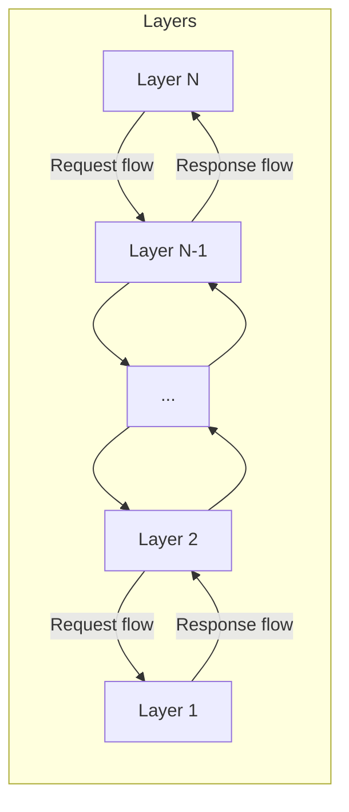
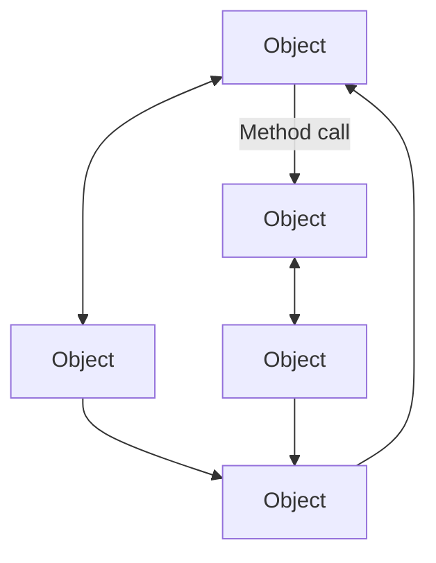
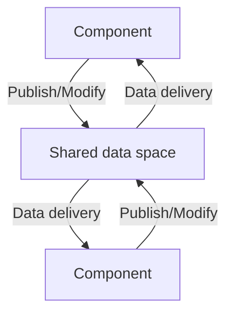
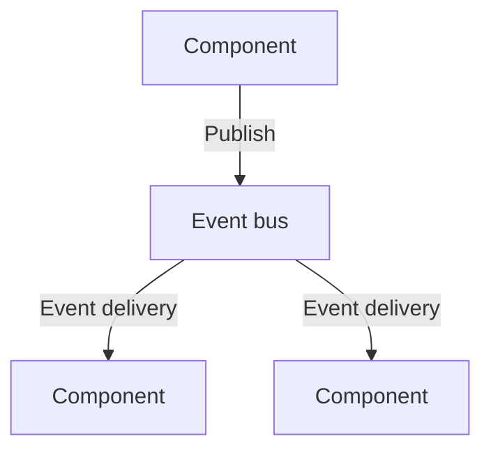
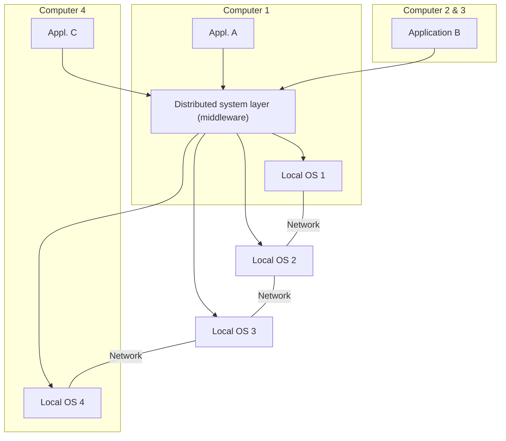
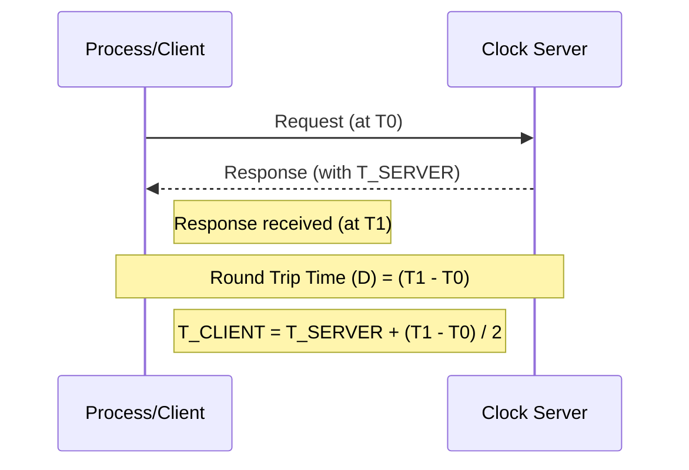
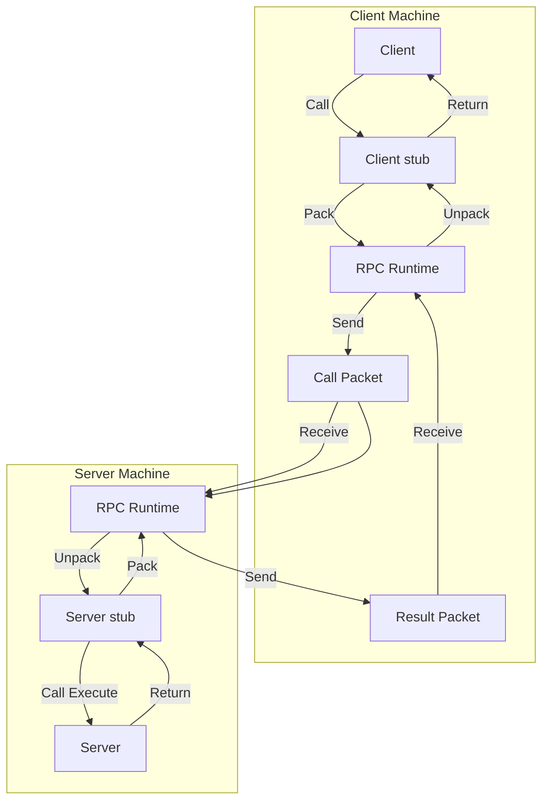
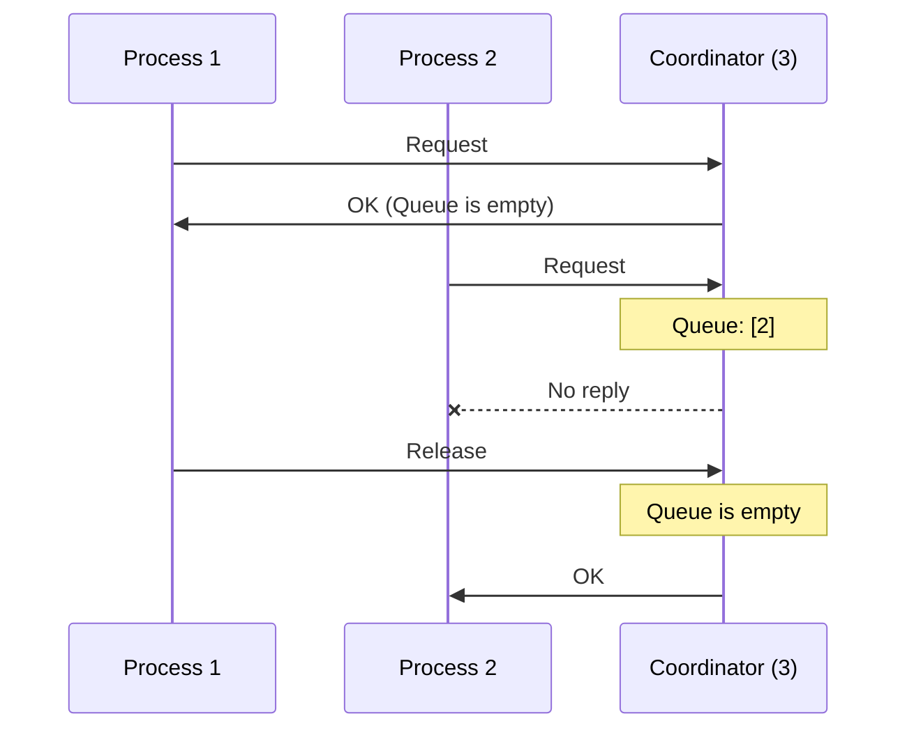
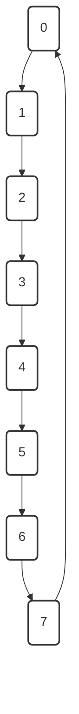
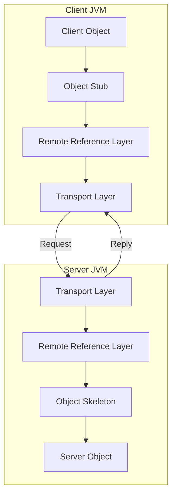

> *The reference page numbers are given from `DiS.pdf`*

-----

### 1\. With neat sketches, explain architectural styles in detail.

Architectural styles describe the organization of distributed systems. The document discusses four main types:

  * **Layered Architectures:** Components are organized into layers, similar to the OSI model. Each layer provides services to the layer above it and acts as a client to the layer below. A request flows down from the top layer, and the response flows back up from the bottom.
  * **Object-Based Architectures:** This style features a loosely coupled arrangement of objects. Each object has an interface, and interactions happen through method calls. These procedural calls are often implemented as Remote Procedure Calls (RPC).
  * **Data-Centered Architectures:** This architecture is built around a central shared data store, such as a database or repository. Other components access this store to add, delete, or modify data.
  * **Event-Based Architectures:** In this style, communication happens through the propagation of events. Components publish events to a system bus, which then delivers the events to any components that have subscribed to them.

*(Found in DiS.pdf, Pages 6-7)*

Below are simplified diagrams based on the sketches in the document:

**Layered Architecture (Page 6)**

**Object-Based Architecture (Page 6)**

**Data-Centered Architecture (Page 7)**

**Event-Based Architecture (Page 7)**

-----

### 2\. Describe the concept of middleware with a neat sketch.

Middleware is a software layer that sits between the operating system and the distributed applications running on different machines. Its purpose is to hide the complexity and heterogeneity of the distributed system from users and applications. It provides a consistent and uniform interface, making a collection of independent computers appear to its users as a single, coherent system. Middleware offers necessary services and abstractions, such as Remote Procedure Calls (RPC) and Remote Method Invocation (RMI), and provides independence from the underlying platform, hardware, and programming language.

*(Found in DiS.pdf, Pages 1, 8)*

**Middleware Concept (Page 1)**

-----

### 3\. Discuss physical clock algorithms in detail.

Physical clock synchronization is a mechanism to synchronize the time of all computers in a distributed system. The document details several algorithms to achieve this:

  * **Christian's Algorithm:** This is a simple algorithm where a machine sends a Remote Procedure Call (RPC) to a time server to obtain the current time (e.g., UTC). The machine measures the round-trip time of the RPC. It then sets its own clock by taking the server's time and adding half of the round-trip time to it, which helps account for the network delay. The formula is: $T_{CLIENT} = T_{SERVER} + (T_{1} - T_{0}) / 2$.
  * **Berkeley Algorithm:** This algorithm is used in systems without a central time server receiving UTC. A master node (or server) periodically polls all other machines (slaves) for their time. It computes an average time from the responses, ignoring any outliers. The master then tells all machines to either advance their clocks to this new average time or slow down their clocks until they match.
  * **Network Time Protocol (NTP):** NTP is a decentralized protocol used to synchronize computer clocks over a network. The network is organized into a hierarchy of "Stratums," where Stratum 0 is a high-precision reference clock (like an atomic clock). Stratum 1 servers are directly connected to Stratum 0, Stratum 2 servers synchronize with Stratum 1, and so on. NTP calculates the round-trip delay and time offset between a client and server to keep the clocks synchronized.

*(Found in DiS.pdf, Pages 38-41)*

**Christian's Algorithm (Page 39)**

-----

### 4\. Mention the importance of replication and explain in detail about replication protocols.

**Importance of Replication:**
Replication, or creating copies of data on multiple servers, is important for two main reasons:

1.  **Reliability:** If one server fails, users can be switched to another replica, ensuring the system remains available.
2.  **Performance:** Load can be distributed among the replicas, which is useful in cases of increased workload or a large number of users.

**Replication Protocols:**
Replication protocols manage how and when replicas are created and updated.

  * **Replica Placement:**
      * **Permanent Replicas:** A small number of permanently existing replicas, often organized as clusters.
      * **Server-Initiated Replicas:** Replicas created by the data owner to enhance performance, often placed geographically close to users (also called "push caches").
      * **Client-Initiated Replicas:** Replicas created at the request of a client, such as a web browser's cache.
  * **Update Propagation Protocols:**
      * **Push-based (Server-based):** The server "automatically" sends updates to the replicas. This is useful when a high degree of consistency is needed.
      * **Pull-based (Client-based):** The client must request the update from the server. If there is no request, there is no update. This is common for client caches.
  * **Epidemic Protocols:** These are used to implement eventual consistency, spreading updates like a disease.
      * **Anti-Entropy:** A server P picks a random server Q and they exchange updates. This can be a push, a pull, or both.
      * **Gossiping (Rumor Spreading):** A server P with a new update "gossips" by pushing it to a random server Q. If Q already knew the update, P stops spreading. If not, Q joins in and starts gossiping to other servers as well.
  * **Consistency Protocols:** These are specific implementations of consistency models.
      * **Primary-Based Protocols:** A "primary" replica is designated for each data item and is responsible for coordinating writes. In a *remote-write* protocol, all writes go to a single remote server. In a *local-write* protocol, the data item migrates to the replica that wants to write to it.

*(Found in DiS.pdf, Pages 54, 62-66)*

-----

### 5\. Discuss the types of communication in detail.

The document discusses several types of communication in distributed systems:

  * **Message-Oriented Communication:** This involves processes on different machines exchanging explicit messages.
      * **Persistent vs. Transient:**
          * **Persistent:** The message is stored by the system until it is successfully delivered (e.g., email).
          * **Transient:** The message is stored only as long as the sending and receiving applications are running (e.g., messages in a router).
      * **Synchronous vs. Asynchronous:**
          * **Synchronous:** The sender is blocked (waits) until the message is stored in a local buffer at the receiver's end.
          * **Asynchronous:** The sender continues executing immediately after sending the message.
  * **Stream-Oriented Communication:** This is a connection-oriented form of communication that supports continuous data transfer (e.g., audio, video, sensor data) where timing is crucial.
  * **Multicast Communication:** This supports sending a single message to multiple receivers simultaneously.
  * **Remote Procedure Call (RPC):** A protocol that allows a program to request a service from a program on another computer as if it were a local call.
  * **Remote Method Invocation (RMI):** A Java-specific mechanism that allows an object on one Java Virtual Machine (JVM) to invoke methods on an object in another JVM.

*(Found in DiS.pdf, Pages 24-27)*

-----

### 6\. Explain the different faults classified in distributed systems.

The document classifies faults in several ways:

  * **By Duration:**
      * **Transient Faults:** These occur once and then disappear. If the operation is repeated, the fault is gone.
      * **Intermittent Faults:** These faults occur, vanish, and then reappear, often in a loose, unpredictable pattern (e.g., a loose connection).
      * **Permanent Faults:** These faults continue to exist until the faulty component is physically replaced (e.g., a burnt-out chip or a disk crash).
  * **By Processor Behavior:**
      * **Fail-Silent Faults (Fail-Stop):** A faulty processor simply stops working and does not respond to any subsequent input.
      * **Byzantine Faults:** A faulty processor continues to run but behaves incorrectly. It may issue wrong answers or even work maliciously with other faulty processors to appear correct.
  * **By Failure Model (Server Failures):**
      * **Crash Failure:** A server works correctly until it suddenly halts.
      * **Omission Failure:** A server fails to respond, send, or receive messages.
      * **Timing Failure:** A server's response lies outside the specified time interval (too fast or too slow).
      * **Response Failure:** The server's response is incorrect, either by providing the wrong value or deviating from the correct flow of control.
      * **Arbitrary Failure:** A server may produce any response at any time (this includes Byzantine faults).

*(Found in DiS.pdf, Pages 68-70)*

-----

### 7\. Describe all the types of distributed systems.

The document categorizes distributed systems into three main types:

1.  **Distributed Computing Systems:** These systems are used for high-performance computing tasks.
      * **Cluster Computing:** A collection of (often homogenous) computers connected by a high-speed network, working together as a single integrated resource to perform a single task.
      * **Grid Computing:** Involves coordinating resources that are *not* centrally controlled (different hardware, OS, networks) to solve large-scale problems.
      * **Cloud Computing:** Involves storing data and applications on remote servers accessed via the internet.
2.  **Distributed Information Systems:** These systems are focused on managing and integrating business information and applications.
      * **Transaction Processing Systems:** These focus on database applications where operations are carried out as transactions, which must have ACID (Atomic, Consistent, Isolated, Durable) properties.
3.  **Distributed Pervasive Systems:** These are systems involving mobile and embedded devices that are often all around us.
      * **Examples:** Electronic healthcare systems, sensor networks.

*(Found in DiS.pdf, Page 3-4)*

-----

### 8\. Compare and contrast RPC & RMI.

**Remote Procedure Call (RPC)** and **Remote Method Invocation (RMI)** are both mechanisms for communication in a distributed system, but they have key differences:

  * **Paradigm:**
      * **RPC:** Is **procedural**. It allows a client to call a *function or procedure* that is located on a remote server.
      * **RMI:** Is **object-oriented** and Java-specific. It allows an object in one Java Virtual Machine (JVM) to invoke *methods* on a remote object in another JVM.
  * **Components:**
      * **RPC:** Uses a **client stub** (on the client side) and a **server stub** (on the server side). The stubs handle the packing (marshaling) of parameters into a message and unpacking (unmarshaling) them on the other end.
      * **RMI:** Also uses a **stub** (client-side gateway), but it uses a **skeleton** (server-side gateway). The skeleton is responsible for reading parameters, invoking the method on the actual remote object, and transmitting the result back.
  * **Abstraction:**
      * **RPC:** Hides the message-passing mechanism from the user, making a remote call look like a local one.
      * **RMI:** Provides a higher level of abstraction by preserving the object-oriented paradigm, allowing for remote object interaction while minimizing the difference between local and remote objects.

In short, RPC is for calling remote functions, while RMI is for invoking remote methods on objects (primarily in Java).

*(Found in DiS.pdf, Pages 27-31)*

**RPC Mechanism (Page 28)**

-----

### 9\. Compare and contrast external and internal synchronization.

**External Synchronization** and **Internal Synchronization** are two ways to achieve clock synchronization in a distributed system:

  * **External Synchronization:** This method requires the presence of an **external reference clock** (e.g., a UTC source). All nodes in the system set and adjust their time according to this single, external, authoritative time source.
  * **Internal Synchronization:** This method is used when no external reference clock is available. Instead, each node shares its local time with the *other nodes* in the system. The nodes then collectively set and adjust their time accordingly, for example, by computing an average time among themselves.

The key difference is that external synchronization syncs all nodes to an outside reference, while internal synchronization syncs all nodes *to each other*.

*(Found in DiS.pdf, Page 37)*

-----

### 10\. Discuss mutual exclusion algorithms in detail.

Mutual exclusion ensures that no two processes can be in the same "critical section" (accessing a shared resource) at the same time. The document discusses four algorithms to achieve this:

1.  **Centralized Algorithm:** One process is elected as the **coordinator**. When a process wants to access the resource, it sends a *request* to the coordinator. If the resource is free, the coordinator sends an *OK* reply. If not, the coordinator queues the request and sends no reply. When the process finishes, it sends a *release* message, and the coordinator grants permission to the next process in the queue.
2.  **Decentralized Algorithm:** This algorithm relies on voting. To access a shared resource, a process must get a "majority vote" from a set of coordinators. It needs to acquire $m > n/2$ votes (where $n$ is the total number of coordinators) to gain access.
3.  **Distributed Algorithm:** A process sends a *request* message (containing the resource name, its process number, and a logical timestamp) to *all* other processes. A process that receives this request will:
      * Send *OK* if it is not using the resource and doesn't want to.
      * Queue the request and not reply if it is already using the resource.
      * Compare timestamps if it *also* wants the resource; the one with the lower timestamp wins.
        A process can enter the critical section only after receiving an *OK* from all other processes.
4.  **Token Ring Algorithm:** This is a simple approach where a "token" (a special message) is passed between processes in a logical ring. A process can only access the shared resource if it currently holds the token. Once it is done, it passes the token to the next process in the ring. This ensures no starvation and guarantees mutual exclusion.

*(Found in DiS.pdf, Pages 46-48)*

**Centralized Algorithm (Page 47)**

**Token Ring Algorithm (Page 48)**

-----

### 11\. Explain in detail data-centric and client-centric consistency models.

Consistency models are "contracts" between a distributed data store and its processes, defining the rules for data to be considered correct.

**Data-Centric Consistency Models:**
These models focus on maintaining a **consistent, globally accessible** data store, especially in the presence of *concurrent* read/write operations by multiple processes. They define what it means for the data store as a whole to be in a valid state.
Examples include:

  * **Strict Consistency:** The "holy grail." Any read on a data item returns the value of the most recent write, as if all writes are instantaneously visible to all processes in an absolute global time order.
  * **Sequential Consistency:** A weaker model. The result of any execution is the same as if all read/write operations were executed in *some* sequential order, and all processes see that *same* interleaved order.
  * **Causal Consistency:** Even weaker. It requires that writes that are *causally related* must be seen by all processes in the same order. Concurrent (non-causally related) writes may be seen in different orders.
  * **FIFO Consistency:** Writes done by a *single process* are seen by all others in the order they were issued. Writes from *different* processes may be seen in different orders.

**Client-Centric Consistency Models:**
These models focus on maintaining a consistent view for an **individual client process** that is accessing the data store. These are used in systems where simultaneous updates are rare (like DNS or web caching). The emphasis is on what the *client* sees, not on a global guarantee at every instant.

  * The primary model here is **Eventual Consistency**. This model only guarantees that if no new updates are made, all replicas will *eventually* become consistent. This allows for high availability and performance, as stale data may be returned temporarily.

*(Found in DiS.pdf, Pages 55-61)*

-----

### 12\. Describe the process of reliable client-server communication.

Reliable client-server communication aims to mask failures that can occur in both processes and communication channels. This is often handled by a reliable transport protocol like TCP, which masks omission failures (lost messages) by using acknowledgments and re-transmissions.

However, in RPC (Remote Procedure Call), the goal is to hide this communication, and several specific failures must be handled:

1.  **Client is unable to locate the server:** This can happen if the server is down. The system handles this by raising an exception to the client (e.g., "page cannot be reached") rather than blocking infinitely.
2.  **The request message from client to server is lost:** The client's OS starts a timer when it sends a request. If it does not receive a reply or an acknowledgment within a certain period, it re-transmits the request.
3.  **The reply message from server to client is lost:** This is handled the same way. The client's timer expires, and it re-sends the request. This can be problematic if the server performs the operation twice (e.g., "print text twice" instead of once), so the operation must be designed to be *idempotent* (safe to repeat).
4.  **The server crashes:** This is the hardest problem, as the crash can occur *before*, *during*, or *after* executing the request. The client cannot know what happened. Strategies are needed to determine if the request was executed at all, exactly once, or multiple times.
5.  **The client crashes:** If a client sends a request and then crashes, the server's computation becomes an **orphan**. Orphans can waste server resources (CPU cycles, locks on data), so mechanisms are needed to detect and terminate them.

*(Found in DiS.pdf, Pages 78-80)*

-----

### 13\. Differentiate between Persistent and transient communication.

  * **Persistent Communication:** A message submitted by the sender is **stored by the communication system** (e.g., on disk) for as long as it takes to deliver it to the receiver. The sender and receiver do not need to be running at the same time. The classic example is **email**.
  * **Transient Communication:** A message is **stored only as long as the sending and receiving applications are running**. If the receiver is not running, the message is typically discarded. This type of communication is common in network routers, where messages are held only until they can be passed to the next hop.

*(Found in DiS.pdf, Page 24)*

-----

### 14\. Give short notes on self-management.

Self-management refers to distributed systems that can automatically adjust and adapt themselves when changes or problems occur, without human intervention. This automatic adaptation is characterized by four properties:

1.  **Self-configuration:** The system can configure itself.
2.  **Self-managing:** The system can manage its own state and resources.
3.  **Self-healing:** The system can detect and recover from faults.
4.  **Self-optimization:** The system can monitor its performance and tune itself to improve efficiency.

These systems are often built using a **feedback control system**. The system's "Observed output" is fed into a "Metric estimation" component. An "Analysis" component compares this to a "Reference input" (the desired state) and sends "Adjustment triggers" to "Adjustment measures," which apply "Corrections" to the system.

*(Found in DiS.pdf, Page 9)*

-----

### 15\. What is fault tolerance?

Fault tolerance is the property that enables a system to **continue operating properly** in the event of a failure of one or more of its components.

It's important to distinguish between a *fault* and a *failure*:

  * A **fault** is an incorrect internal state in the system (e.g., a memory leak, a blocked thread, bad data).
  * A **failure** is the system's inability to perform its intended job (e.g., the website is down).

Fault tolerance is the set of mechanisms that prevent faults from becoming failures.

*(Found in DiS.pdf, Page 67)*

-----

### 16\. List the applications of distributed systems.

The document lists several applications of distributed systems, including:

  * **Finance and Commerce:** Online banking, e-bay, Amazon.
  * **Information Society:** Search engines, Wikipedia, social networking.
  * **Creative Industries and Entertainment:** Online gaming, music, YouTube.
  * **Health Care:** Online patient records, health informatics.
  * **Education:** E-learning.
  * **Transport & Logistics:** GPS, Google Maps.
  * **Environment Management:** Sensor technology.

*(Found in DiS.pdf, Pages 4-5)*

-----

### 17\. Write short notes on virtualization in distributed systems.

Virtualization is the process of creating a virtual (logical) version of a physical resource. It allows a single physical instance of a resource or application to be shared among multiple organizations or users.

  * **Hardware Virtualization:** This refers to creating a **Virtual Machine (VM)**, which runs its own guest operating system on top of the host machine's existing OS and hardware.
  * **Types of Virtualization:**
    1.  **Application Virtualization:** Allows a user to have remote access to an application from a server.
    2.  **Network Virtualization:** Allows for running multiple virtual networks on the same physical network (e.g., a VPN).
    3.  **Desktop Virtualization:** Allows a user's operating system to be stored remotely on a server, so it can be accessed and controlled from any device.
    4.  **Storage Virtualization:** An array of servers managed as a single virtual storage pool (e.g., AWS).
  * **Advantages:** Virtualization offers more flexibility and efficiency, lowers costs, and enables running multiple different operating systems on a single piece of hardware.

*(Found in DiS.pdf, Pages 18-19)*

-----

### 18\. List the protocols of consistency.

The document lists several "Consistency Protocols," which are specific implementations of a consistency model:

  * **Sequential Consistency**
  * **Weak Consistency** (using synchronization variables)
  * **Atomic Transactions**

The document also describes **Primary-Based Protocols** as a widely implemented set:

  * **Remote Write Consistency Protocol:** All writes are performed at a single, remote primary server.
  * **Local Write Consistency Protocol:** The data item *migrates* to the replica that wishes to perform a write, making that replica the new primary for that item.

*(Found in DiS.pdf, Page 65-66)*

-----

### 19\. Define naming and list the types of naming.

**Definition:**
A **name** in a distributed system is a string of bits or characters used to refer to an **entity** (e.g., a host, printer, file, or web page). To operate on an entity, you need to access it at an **access point**. The name of an access point is called an **address**.

**Types of Naming:**

1.  **Unstructured Naming (Flat Naming):** Names are simply random bit strings (identifiers) with no internal structure. They are easy for machines to use but not human-readable.
2.  **Structured Naming:** Names are organized into a **name space**, which is often a human-readable, hierarchical structure (e.g., a file path like `/home/steen/mbox` or a domain name like `cse.dtu.in`).
3.  **Attribute-Based Naming:** Entities are found by searching for their attributes or metadata, rather than a single name. This is used in **Directory Services** like LDAP (Lightweight Directory Access Protocol).

*(Found in DiS.pdf, Pages 32, 34, 35)*

-----

### 20\. What is process resilience?

Process resilience is the ability to **prevent faults from turning into failures**. A *fault* is an incorrect internal state (like a bad value), while a *failure* is the system's inability to do its job.

A common way to achieve process resilience is by **arranging processes in a group**. All members of the group are identical (replicas). When a message is sent to the group, it is delivered to all members, but only one of them performs the requested service. If one process in the group fails (e.g., crashes), it is assumed that one of the other identical processes will still be functioning and can take over, thus "masking" the fault and preventing a system failure.

*(Found in DiS.pdf, Page 72)*

---

### 21. Give short notes on Byzantine fault.

A Byzantine fault is a type of fault in a distributed system where a component, such as a processor, continues to operate but behaves incorrectly, erratically, or maliciously. Unlike a processor that simply stops (a fail-silent fault), a processor with a Byzantine fault might send wrong answers to requests or send conflicting information to different parts of the system. This makes it the most difficult type of fault to manage, as the faulty component may appear to be working correctly.

*(Found on Pages: 69, 70)*

---

### 22. List the characteristics of a distributed system.

The main characteristics of a distributed system are:
* **Resource Hiding:** Computers and communication details are mostly hidden from users.
* **Uniform Interaction:** It provides a consistent and uniform way for users to interact with the system.
* **Scalability:** The system is designed to be easy to expand or scale.
* **Continuous Availability:** It aims to be continuously available, even if parts of it fail.

*(Found on Page: 1)*

---

### 23. What are the key differences between a distributed system and a computer network?

A **computer network** is the underlying infrastructure that connects autonomous computers, allowing them to communicate.

A **distributed system** is a software layer built *on top* of a network. Its primary goal is to make this collection of independent computers **appear to its users as a single, coherent system**. The key difference is this abstraction; a distributed system's main purpose is to hide the fact that there are multiple computers, whereas in a simple network, the user is often aware of and interacts with specific, individual machines.

*(Found on Page: 1)*

---

### 24. Differentiate between synchronous and asynchronous communication in the context of IPC.

In the context of Inter-Process Communication (IPC):

* **Synchronous Communication:** The sending process is **blocked** after sending a message. It must wait until its message is received (or at least stored in a buffer) at the receiver's end before it can continue its own execution.
* **Asynchronous Communication:** The sending process **does not block**. It sends the message and can immediately continue with its own tasks, regardless of whether the receiver has processed the message yet.

*(Found on Pages: 24, 25)*

---

### 25. Write short notes on replication and consistency.

**Replication** is the process of creating and managing multiple copies of data or services on different computers within a distributed system. The primary goals of replication are to improve **reliability** (if one copy fails, others are available) and **performance** (load can be distributed, and users can access data from a nearby copy).

**Consistency** refers to the challenge of ensuring that these multiple copies remain in agreement. A **consistency model** acts as a contract that defines the rules for how and when changes (writes) are propagated and become visible to other processes (reads). This ranges from **Strong Consistency**, where all copies are identical at all times, to weaker models like **Eventual Consistency**, where copies are guaranteed to become the same over time.

*(Found on Pages: 54, 55, 62)*

---

### 26. Describe the different types of transparencies that a distributed system should provide.

Transparency is a key goal of a distributed system, aiming to hide the fact that processes and resources are physically distributed. The different types include:

* **Access Transparency:** Hides differences in data representation and how a resource is accessed.
* **Location Transparency:** Hides where a resource is physically located.
* **Migration Transparency:** Hides the fact that a resource may be moved to a different location.
* **Relocation Transparency:** Hides that a resource may be moved to another location *while it is in use*.
* **Replication Transparency:** Hides the fact that a resource is replicated (i.e., multiple copies exist).
* **Concurrency Transparency:** Hides that a resource may be shared by several competing users at the same time.
* **Failure Transparency:** Hides the failure and recovery of a resource from the user.

*(Found on Page: 2)*

---

### 27. Explain clock synchronization techniques and their importance in distributed systems.

**Importance:** Clock synchronization is crucial in distributed systems for coordinating actions between processes, especially for **event ordering** (knowing what happened before what) and ensuring **mutual exclusion** (preventing simultaneous access to shared resources). Since each computer has its own clock, their times can drift, leading to inconsistencies.

**Techniques:**
* **Physical Clocks:** These algorithms try to synchronize the clocks to a real, standard time (like UTC).
    * **Christian's Algorithm:** A client issues an RPC to a time server to get the time and adjusts its own clock, accounting for network delay.
    * **Berkeley Algorithm:** A master polls other "slave" machines for their times, computes an average, and then tells the slaves how to adjust.
    * **Network Time Protocol (NTP):** A decentralized protocol that synchronizes clocks over a network using a hierarchy (strata) of time servers.
* **Logical Clocks:** These techniques don't rely on real time. Instead, they focus on maintaining a consistent *order* of events.
    * **Lamport's Logical Clocks:** Assigns timestamps to events based on a "happens-before" relationship, ensuring that if event A causes event B, the timestamp of A is less than the timestamp of B.

*(Found on Pages: 37, 38, 39, 40, 41, 42, 43, 44)*

---

### 28. Discuss the design goals and challenges of distributed systems.

The primary **design goals** of a distributed system are:

* **Resource Sharing:** To easily and securely use hardware, software, or data from anywhere in the system.
* **Openness:** To be able to easily extend and improve the system, often by using standard interfaces.
* **Scalability:** To remain efficient and manageable even as the number of users and resources grows.
* **Fault Tolerance:** To continue operating, perhaps at a reduced level, even when components fail.
* **Transparency:** To hide the complexity and distributed nature of the system from users and applications.
* **Concurrency:** To allow multiple users to share resources and perform tasks simultaneously.

The **challenges** are inherently tied to achieving these goals, and include:
* **Handling Failures:** Detecting, masking, and recovering from partial failures.
* **Maintaining Consistency:** Keeping data synchronized across multiple replicated copies.
* **Synchronization:** Coordinating actions and ordering events correctly without a shared global clock.

*(Found on Pages: 2, 37, 54, 67)*

---

### 29. Distinguish between centralized systems and distributed systems with a diagram.

A **centralized system** typically follows a **client-server architecture**. In this model, a single, powerful server provides all resources and services to multiple client computers. The server is the single point of control and potential failure.

A **distributed system**, particularly a decentralized one like a **peer-to-peer (P2P)** system, has **no central server**. Each node (or "peer") in the system is equal and can act as both a client and a server, sharing the load and data among themselves. The system is a collection of autonomous computers that work together to appear as one coherent unit.

*(Found on Pages: 1, 10, 12)*

---

### 30. Describe the Election algorithm in a distributed system.

An election algorithm is used in a distributed system to choose a single process to act as a **coordinator** when the previous coordinator fails or when the system is initializing. The goal is to ensure that all living processes agree on the new coordinator. Two common algorithms are:

1.  **The Bully Algorithm:** In this algorithm, any process that detects the coordinator's failure can initiate an election. It sends an ELECTION message to all processes with a *higher* process ID.
    * If no higher-ID process responds, the initiating process "wins" and becomes the new coordinator.
    * If a higher-ID process receives the message, it responds with an "OK" message, indicating it is alive and will take over the election. The process with the highest ID ultimately "bullies" all others and wins.

2.  **The Ring Algorithm:** This algorithm assumes processes are arranged in a logical ring.
    * A process that detects a failure sends an ELECTION message containing its own ID to its next-alive successor.
    * Each process that receives the message adds its own ID to the list and forwards it around the ring.
    * When the message returns to the process that started it, it contains the IDs of all active processes. The initiator then circulates a new message announcing the process with the highest ID as the new coordinator.

*(Found on Pages: 50, 51, 52, 53)*

---

### 31. Explain the difference between message-oriented and stream-oriented communication.

The key difference lies in the nature of the data flow:

* **Message-Oriented Communication:** This involves the explicit sending and receiving of discrete units of data called **messages**. Processes communicate by exchanging these individual, self-contained packets of information.
* **Stream-Oriented Communication:** This is a connection-oriented model that supports a **continuous flow of data**, such as audio, video, or sensor readings. In this model, timing plays a crucial role. Data is sent as a continuous stream of bytes, rather than as distinct messages.

*(Found on Pages: 24, 25, 26)*

---

### 32. What is process migration?

Process migration (also referred to as **code migration** in the text) is the act of moving a process from one machine to another within a distributed system. The primary reasons for this are to improve performance, either by **balancing the load** (moving processes from a heavily loaded machine to a lightly loaded one) or by **improving communication time** (moving the process to the machine where a large data set it needs resides).

Migration can be:
* **Weak Migration:** Only the code segment is transferred. The process must restart execution from the beginning.
* **Strong Migration:** Both the code segment and the execution segment (its current state, stack, and data) are transferred, allowing the process to continue from where it left off.

*(Found on Page: 23)*

---

### 33. What is heterogeneity in distributed systems?

Heterogeneity refers to the fact that a distributed system is often built from a wide variety of different components. This includes differences in:

* **Hardware:** Such as different types of computers or processors.
* **Software:** Such as different operating systems (e.g., Windows, Linux) or components written in different programming languages.
* **Networks:** Different network protocols, security mechanisms, etc.

A key goal of distributed systems, often handled by **middleware**, is to manage this heterogeneity and present a single, uniform interface to applications, making the system "Platform Independent" or "Hardware Independent."

*(Found on Pages: 1, 3, 8)*

---

### 34. Draw the architecture of a distributed system.

A common way to visualize the architecture of a distributed system is to see it as a **middleware** layer. This middleware layer sits between the local operating systems on each independent computer and the applications running on top. This layer provides a uniform interface to the applications, hiding the complexity of the underlying network and the differences between the machines.

*(Found on Page: 1)*

---

### 35. Define the terms marshalling and external data representation.

* **Marshalling:** This is the process of taking application-level data, such as the parameters for a remote method call, and converting them into a format (e.g., a byte stream) suitable for transmission over a network. The reverse process, converting the byte stream back into data structures at the receiving end, is called **unmarshalling**. This is a key step in systems like RMI.

* **External Data Representation (EDR):** (This term was not found in the provided PDF). EDR refers to a standard, platform-neutral format for encoding data. Because different computers (e.g., with different CPUs) may store data differently, an EDR is needed to ensure that data marshalled on one machine can be correctly unmarshalled on another, regardless of its local hardware or OS.

*(Marshalling found on Page: 31; EDR definition from external knowledge)*

---

### 36. List the components of a Java RMI system.

A Java RMI (Remote Method Invocation) system consists of three main layers:

1.  **Stub/Skeleton Layer:** This layer intercepts method calls.
    * The **Stub** is the client-side object that acts as a proxy, marshalling parameters and sending the request to the server.
    * The **Skeleton** is the server-side object that receives the request, unmarshals the parameters, calls the actual remote object, and marshals the result to send back.
2.  **Remote Reference Layer:** This layer manages the references and links between the client and the remote object.
3.  **Transport Layer:** This is the underlying network layer (e.g., TCP/IP) responsible for the actual transmission of data between the client and server JVMs.

*(Found on Page: 30, 31)*

---

### 37. What is a multi-threaded server in the context of client-server communication?

A multi-threaded server is a server that uses multiple threads to handle client-server communication, allowing it to process multiple client requests in parallel. A common architecture is the **dispatcher/worker model**. In this model, a single "dispatcher" thread receives all incoming requests. It then hands off each request to a separate "worker" thread from a pool. This allows the dispatcher to immediately go back to listening for new requests, while the worker threads handle the processing and I/O for their assigned clients. This approach improves performance and responsiveness by overlapping communication and processing.

*(Found on Pages: 16, 17)*

---

### 38. Discuss the characteristics of inter-process communication in a distributed environment.

In a distributed environment, Inter-Process Communication (IPC) involves exchanging information between processes that are running on separate, networked computers. Its key characteristics are:

* **Communication Model:** It can be **Message-Oriented**, where processes exchange discrete messages, or **Stream-Oriented**, which involves a continuous flow of data like audio or video.
* **Synchronization:** It can be **Synchronous**, where the sender blocks (waits) until the message is received, or **Asynchronous**, where the sender continues executing immediately after sending.
* **Persistence:** It may be **Persistent**, where the communication system stores a message until it's successfully delivered (like email), or **Transient**, where the message is discarded if it can't be delivered immediately (like a message in a router).
* **Abstraction Level:** It can be low-level message passing or abstracted into higher-level models like **Remote Procedure Calls (RPC)** or **Remote Method Invocation (RMI)**, which hide the network communication from the programmer.

*(Found on Pages: 24, 25, 27, 30)*

---

### 39. With a suitable diagram, describe the communication process between distributed objects using Remote Method Invocation (RMI).

Remote Method Invocation (RMI) allows an object in one JVM (the client) to invoke a method on an object in another JVM (the server). This communication is facilitated by two key components: the **Stub** on the client side and the **Skeleton** on the server side.

The process is as follows:
1.  The client object makes a regular method call to the **Stub** object, which acts as a local proxy.
2.  The Stub **marshals** (packages) the method parameters and transmits them, via the transport layer, to the server JVM.
3.  The **Skeleton** on the server side receives the request and **unmarshals** the parameters.
4.  The Skeleton invokes the corresponding method on the *actual* remote server object.
5.  When the method finishes, the Skeleton **marshals** the return value and sends it back to the client.
6.  The Stub receives the reply, **unmarshals** the return value, and passes it back to the original client object that made the call.

*(Found on Pages: 30, 31)*

---

### 40. Describe the request-reply protocol used in distributed communication.

The request-reply protocol is a fundamental communication pattern in distributed systems, most commonly used in the **client-server architecture**. The protocol works in a few simple steps:

1.  The **Client** process initiates the communication by sending a **Request** message to the Server process, asking for a service.
2.  After sending the request, the Client typically blocks and **waits** for a response.
3.  The **Server** process receives the request.
4.  The Server **carries out** the requested service or operation.
5.  Once the service is complete, the Server sends a **Reply** message back to the Client, containing the results.

This basic protocol is the foundation for higher-level communication mechanisms like Remote Procedure Calls (RPC).

*(Found on Pages: 10, 27)*