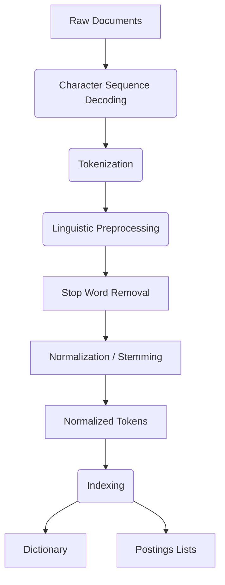

> *The reference page numbers are given from `IRS.pdf`*

-----

## Unit 1

## Short Answer Questions

**1. What 'ITEM' term in IRS**

In the context of an Information Retrieval System (IRS), the term "Item" refers to the smallest complete textual unit that is processed and manipulated by the system. The specific definition of an item depends on how a particular source or system treats its information; an item could be a full document, a paragraph, or a single news story.

-----

**2. Data Mart**

*This term was not found in the provided PDF. Here is a general definition.*

A **data mart** is a simple form of a data warehouse that is focused on a single subject or line of business, such as sales, finance, or marketing. Unlike a data warehouse, which stores data for the entire enterprise, a data mart contains a smaller, more targeted subset of data. This makes it easier and faster for a specific department to access and analyze the data relevant to their needs.

-----

**3. What is Precision & Recall**

Precision and Recall are two key measures used to evaluate the effectiveness and quality of an information retrieval system:

  * **Precision:** This is the fraction of the retrieved documents that are actually relevant to the user's information need. (Page 3)
  * **Recall:** This is the fraction of *all relevant documents* in the entire collection that were successfully retrieved by the system. (Page 29, defined implicitly)

-----

**4. Define IRS**

**Information retrieval (IR)** is defined as finding material (usually of an unstructured nature, like text) that satisfies an information need from within large collections (usually stored on computers). (Page 1)

-----

## Long Answer Questions

**1. Document Database Search**

This type of search typically refers to the simplest form of document retrieval, which does not use an index: a **linear scan**. In this method, a computer starts at the beginning of the document collection and reads through all the text sequentially to find matches for the query. This process is commonly called **"grepping"** (after the Unix command `grep`). This approach works for simple queries on modest-sized collections, but it is not efficient or scalable for the large-scale collections and complex matching operations used in modern information retrieval. (Page 1)

-----

**2. Index base searching**

Index-based searching is the standard, efficient method for information retrieval, designed to avoid the slow process of linearly scanning the entire text collection for every query. The most common structure used is the **inverted index**.

This index is built in advance and consists of two main parts:

1.  **Dictionary:** A list of all unique terms (the vocabulary) found in the collection.
2.  **Postings:** For each term in the dictionary, a "postings list" stores the IDs (or `docID`s) of all documents that contain that term.

When a user issues a query (e.g., *Brutus AND Caesar*), the system locates each term in the dictionary, retrieves its corresponding postings list, and performs set operations (like an **intersection**) on those lists to find the documents that satisfy the query. This is vastly faster than a linear scan. (Pages 1, 3, 5)

-----

**3. What is Information Retrieval System? Explain about types of searches in IRS?**

An **Information Retrieval System (IRS)** is a system designed for finding material that satisfies a user's information need from within large collections. This material is typically of an unstructured nature, such as text documents. (Page 1)

Modern IR systems support several types of searches:

  * **Ad hoc Retrieval:** This is the most standard task, where a user enters a "one-off" query to the system to find relevant documents. (Page 3)
  * **Boolean Retrieval:** This model allows users to pose queries using Boolean operators like **AND**, **OR**, and **NOT** to combine terms (e.g., *Brutus AND Caesar AND NOT Calpurnia*). (Pages 1, 2)
  * **Ranked Retrieval:** Instead of just returning all documents that match, this method scores and ranks the retrieved documents, presenting the "best" or most relevant answers first. This is essential for large collections. (Page 2)
  * **Phrase Queries:** These queries retrieve documents where the terms appear in the exact sequence specified (e.g., "friends, romans, countrymen"). This requires a more advanced index, such as a positional index. (Page 8)
  * **Proximity Queries:** A query (e.g., `Romans NEAR countrymen`) that finds documents where the terms appear close to each other, such as within the same sentence or within a specific number of words. (Page 2)
  * **Wildcard Queries:** These queries use a special character (like `*`) to match variations of a term. This is useful if the user is uncertain of the spelling (e.g., `S*dney`) or wants to find multiple word forms (e.g., `judicia*`). (Page 9)
  * **Semi-structured Search:** This allows searching on specific document fields or "zones," such as finding a document where the *title* contains "Java" and the *body* contains "threading". (Page 1, 21)

-----

**4. Explain briefly about functional Overview? Draw with figure?**

A functional overview of an index-based Information Retrieval System can be broken into two main processes: **Indexing** and **Querying**.

**1. Indexing Process:**
This is the "offline" process of preparing the data for fast retrieval.

  * **Collection:** First, the documents to be indexed are collected.
  * **Tokenization:** The text of each document is broken down into a list of tokens (usually words).
  * **Linguistic Preprocessing:** The tokens are normalized to create "indexing terms." This can include steps like case-folding (e.g., `Friends` -\> `friend`).
  * **Inverted Index Creation:** The system creates an **inverted index**. This structure has two main parts:
      * **Dictionary:** A list of all unique terms (the vocabulary).
      * **Postings Lists:** For each term, a list of all document IDs (`docID`) that contain that term. (Pages 3-4)

**2. Querying Process:**
This is the "online" process of responding to a user's request.

  * **Query Preprocessing:** The user's query is processed using the same tokenization and linguistic preprocessing steps used for the documents.
  * **Postings Retrieval:** The system looks up each query term in the dictionary to retrieve its corresponding postings list.
  * **Query Processing:** The system processes these lists. For a query like `Brutus AND Caesar`, it will **intersect** the two lists to find documents containing both terms. For ranked retrieval, it will use these lists to calculate a relevance score for each document.
  * **Results:** The final set of matching (or top-ranked) documents is returned to the user. (Page 5)

Here is a figure illustrating this overview:

```mermaid
graph TD
    subgraph Indexing Process
        A(Document Collection) --> B(Tokenization);
        B --> C(Linguistic Preprocessing);
        C --> D(Indexing);
        D --> E[Inverted Index \n(Dictionary + Postings)];
    end

    subgraph Querying Process
        F(User Query) --> G(Query Preprocessing);
        G --> H(Retrieve Postings);
        E --> H;
        H --> I(Process Postings \n e.g., Intersect, Score);
        I --> J(Return Results);
    end
```

-----

**5. Explain about objectives of Information Retrieval Systems?**

The primary objective of an Information Retrieval (IR) system is to find and retrieve material that **satisfies a user's information need**. The system aims to provide documents from a large collection that are **relevant** to the user's query. A document is considered relevant if the user perceives it as containing information of value with respect to their personal information need. (Pages 1, 3)

Beyond this core objective, other important goals for a modern IR system include:

  * **Speed:** To process queries over massive document collections quickly. (Page 2)
  * **Flexible Matching:** To support more complex query operations than simple term matching, such as phrase queries, proximity queries (e.g., "terms NEAR each other"), and wildcard queries. (Page 2, 9)
  * **Ranked Retrieval:** To score and rank the retrieved documents, presenting the *best* and most relevant answers first. This is crucial for navigating large result sets. (Page 2)
  * **User Happiness:** The ultimate goal is user utility, or "user happiness." While factors like response speed are important, the most critical factor is the relevance of the search results. (Page 28)

-----

**6. Explain about Information Retrieval System Capabilities (Querying, Browsing, Miscellaneous Capabilities)**

Information Retrieval Systems have a range of capabilities beyond just simple searching.

  * **Querying:** This is the most common capability, allowing a user to retrieve documents that satisfy an information need. This includes various search types, such as **Boolean retrieval** (using AND, OR, NOT), **ranked retrieval** (scoring and sorting results), **phrase queries**, **proximity queries**, and **wildcard queries**. (Pages 1, 2, 8, 9)
  * **Browsing:** This capability supports users in exploring a document collection, often without a specific query in mind. One example is the **Scatter-Gather** interface, which clusters the entire collection into topic groups. The user can then "gather" (select) interesting groups, merge them, and have the system re-cluster the new set, allowing for iterative exploration. (Page 1, 52)
  * **Miscellaneous Capabilities:** This includes other tasks for processing and organizing documents:
      * **Filtering:** A system can "filter" a stream of new documents against a user's standing information need (e.g., routing new articles on a specific topic to the correct person). (Page 1)
      * **Clustering:** This is the task of automatically grouping a set of documents based on their content, putting similar documents together. This can be used to cluster search results to help a user understand the different topics returned for a query. (Page 1)
      * **Classification:** This is the task of assigning a document to one or more predefined classes or categories, such as "sports" or "China". (Page 1)

-----

**7. Explain about Digital Libraries and Data ware houses with list of software's?**

*The provided PDF does not contain detailed descriptions or software lists for these topics. It mentions "digital libraries" only as an application of structured retrieval. Here is a general explanation.*

**Digital Libraries**
A digital library is a managed collection of documents, such as books, articles, and images, stored in electronic format. It is an application of **structured retrieval**, which allows users to search not only the text but also the metadata associated with the documents (like author, title, and date). The goal is to provide an organized way for a specific community of users to access and manage this digital information. (Page 33)

  * **Common Software:** DSpace, Greenstone, EPrints, Fedora Commons.

**Data Warehouses**
A data warehouse is a large, centralized repository that stores historical and current data from many different operational sources within an organization. Unlike a standard database designed for transactions (like placing an order), a data warehouse is designed for large-scale query, reporting, and analysis (OLAP). It integrates data from various departments (like sales, marketing, and finance) to provide a single, unified view of the entire organization, helping to support business decisions.

  * **Common Software:** Snowflake, Google BigQuery, Amazon Redshift, Microsoft Azure Synapse Analytics, Teradata.

-----

## Unit 2

## Short Answer Questions

**1. Define about stemming algo**

Stemming is a process of linguistic preprocessing and token normalization . It's a method for creating equivalence classes by reducing different variations of a word to a common root form, known as a "stem." For example, a user might use a wildcard query like `judicia*` to find variants like "judicial" or "judiciary" ; a stemming algorithm automates this by reducing both terms to a common stem. This process is considered a form of lossy compression because the original forms of the words are lost .

*(Found on pages: 6, 8, 9, 14)*

-----

**2. What is Cataloging & Indexing?**

  * **Cataloging:** This term is not defined in the provided PDF. In general information science, cataloging is the process of creating metadata (such as author, title, and subject) for documents and organizing these descriptions in a structured list (a catalog) to make them easier to find.
    *(Answer for "Cataloging" is from external knowledge, as it is not in the PDF.)*
  * **Indexing:** Indexing is the process of building a data structure in advance to avoid having to linearly scan every document in a collection for each query . In information retrieval, this typically means creating an **inverted index**. This index consists of a **dictionary** (the set of all unique terms) and, for each term, a **postings list** (a list of all documents that contain that term) .

*(Found on pages: 2, 3 for "Indexing")*

-----

**3. What is Information Extraction?**

The provided PDF does not define Information Extraction. It defines Information Retrieval (IR) as "finding material (usually text) of an unstructured nature that satisfies an information need from within large collections" .

In contrast, Information Extraction (IE) is a different task that involves automatically identifying and pulling out specific, structured information (like names, dates, locations, or relationships) from unstructured text. While IR returns a list of relevant *documents*, IE returns *facts* extracted from those documents.

*(Answer for "Information Extraction" is from external knowledge, as it is not in the PDF.)*

-----

## Long Answer Questions

**1. lexical analysis**

The PDF does not use the specific term "lexical analysis," but it describes the equivalent steps under the heading "Determining the vocabulary of terms" . This is the process of converting a document's raw character stream into a set of normalized indexing terms. The main steps are:

  * **Tokenization:** This is the initial task of chopping the character sequence into "tokens" (pieces), which are useful semantic units. This step often involves splitting the text by whitespace and removing punctuation characters . For example, the input `Friends, Romans, Countrymen,` would be tokenized into the output `Friends`, `Romans`, `Countrymen` .
  * **Linguistic Preprocessing:** After tokenization, these tokens are normalized to create the final "indexing terms" . This involves several sub-steps:
      * **Stop Word Removal:** Extremely common words that appear to have little value in selecting documents (like "a", "the", "to") are often identified as stop words and excluded from the index .
      * **Normalization (Equivalence Classing):** This process canonicalizes tokens so that matches can occur despite superficial differences . This includes **case-folding** (e.g., mapping "Windows" and "windows" to the same term) and **stemming** (reducing words to their root, like matching "judicial" and "judiciary") .

*(Found on pages: 3, 6, 7, 9)*

-----

**2. Phrase Detection & Document parsing**

  * **Phrase Detection:** This is handled in the context of processing "phrase queries." To allow the system to detect and verify that words appear in a specific sequence, a **positional index** is used . Unlike a standard index, a positional index stores the specific token positions for each term within each document (e.g., `docID: <position1, position2, ...>`) . When a user searches for a phrase, the system retrieves the positional postings for each term and checks that their positions are compatible (e.g., that one word appears directly after another) .
  * **Document Parsing:** The PDF describes this as the initial part of the indexing process, involving two main phases:
    1.  **Document Delineation:** Determining what constitutes a "document unit" for indexing. For example, we might decide that each file in a folder is a separate document .
    2.  **Character Sequence Decoding:** Converting the raw byte stream of a document (which could be in various encodings like ASCII or UTF-8) into a linear sequence of characters that can then be tokenized .

*(Found on pages: 6, 8, 13)*

-----

**3. Explain about types of Cataloging?**

The provided PDF does not contain the term "cataloging" or discuss its types.

From external knowledge, cataloging in library and information science is generally divided into two main types:

  * **Descriptive Cataloging:** This involves describing the document as a physical object. It records details like the title, author, publisher, publication date, and format.
  * **Subject Cataloging:** This involves describing the intellectual content of the document. It consists of assigning standardized subject headings (like Library of Congress Subject Headings) or classification numbers (like the Dewey Decimal System) to organize the document by topic.

*(Answer from external knowledge, as it is not in the PDF.)*

-----

**4. Explain about Objectives of Indexing?**

The primary objective of indexing is to build a data structure in advance to avoid the slow and inefficient process of linearly scanning every document in a large collection for each query .

The specific objectives achieved by indexing are:

  * **Speed:** To process queries and retrieve results from very large document collections (e.g., billions of words) **quickly** .
  * **Flexible Matching:** To allow for **more flexible and complex matching operations** that are not possible with simple scanning. This includes proximity queries, such as finding "Romans NEAR countrymen" (e.g., within 5 words) .
  * **Ranked Retrieval:** To enable **ranked retrieval**, which is crucial for large collections. This allows the system to return the *best* or *most relevant* answers first, rather than just every document that happens to match the query terms .

*(Found on pages: 2, 3)*

-----

**5. Explain briefly about Indexing process? Draw with Text processing of Flow chart?**

The indexing process involves converting a collection of documents into an inverted index. The major steps are:

1.  **Collect Documents:** Gather the set of documents to be indexed .
2.  **Parse Documents:** Turn each document into a list of tokens. This involves **tokenization** (splitting the text into words) and **linguistic preprocessing** (normalizing these tokens by case-folding, stemming, and removing stop words) .
3.  **Assemble Pairs:** Create (term, docID) pairs for every normalized term in every document.
4.  **Sort Pairs:** Sort this entire list of pairs, using the term as the primary key and the docID as the secondary key .
5.  **Build Index:** Iterate through the sorted pairs and group them. This creates the final inverted index, which consists of two parts:
      * **Dictionary:** The list of all unique terms, along with statistics (like document frequency) and pointers to their postings lists .
      * **Postings Lists:** For each term, a list of all the docIDs it appears in .

*(Found on pages: 3, 4, 12)*

Here is a flow chart of the text processing pipeline:



-----

**6. Explain briefly about Data structures?**

The most important data structure in information retrieval is the **Inverted Index**, which is described as being "without rivals as the most efficient structure for supporting ad hoc text search" . It has two main components:

1.  **The Dictionary:** This structure stores the vocabulary (all unique terms). To allow for fast lookup, it is often implemented as a **hash table** or a **search tree** (like a B-tree) .
2.  **The Postings Lists:** For each term in the dictionary, this is a list of all document IDs (docIDs) that contain the term. These lists are kept sorted by docID, which is crucial for efficiently processing queries by "merging" or "intersecting" the lists .

Other key data structures mentioned include:

  * **Positional Index:** An enhanced version of the inverted index where the postings lists also store the `position(s)` of the term in each document. This is necessary to process phrase queries .
  * **k-gram Index:** A data structure used to handle wildcard queries. It's an index of all k-grams (sequences of $k$ characters) found in the vocabulary terms. Its postings link k-grams to the terms that contain them .
  * **Permuterm Index:** An alternative for wildcard queries. It stores all possible rotations of a term (e.g., `hello$` becomes `hello$`, `ello$h`, etc.) in its dictionary, allowing wildcard queries to be processed with a simple lookup .

*(Found on pages: 3, 5, 8, 10)*

-----

**7. Explain about Stemming Algorithm as well as types of stemming?**

A stemming algorithm is a rule-based process for reducing words to their root form, or "stem." It is a form of lossy compression that works by removing common suffixes from a token . The most famous example is the **Porter stemmer**, which is mentioned in the text .

The provided PDF does not detail other types of stemming, but common approaches include:

  * **Suffix-Stripping Algorithms:** This is the most common category, to which the Porter stemmer belongs. These algorithms use a set of heuristic rules to "strip" or remove known suffixes in stages.
  * **Lemmatization:** This is a more advanced and linguistically sophisticated approach. Instead of just chopping off suffixes, lemmatization uses a dictionary and morphological analysis to return the true dictionary base form of a word (its "lemma"). For example, a lemmatizer would know that the lemma of "was" is "be," whereas a stemmer might fail or return "wa."
  * **Lookup-based Stemmers:** These algorithms use a pre-compiled lookup table to map all known inflected forms of a word to their common stem.

*(Page 14 mentions the Porter stemmer. The descriptions of the types are from external knowledge.)*

-----

**8. Explain briefly about Inverted File Structure?**

The **Inverted File Structure**, referred to in the text as the **Inverted Index**, is the most efficient data structure for ad hoc text search . It gets its name because it inverts the standard document-to-term mapping; instead of listing terms for each document, it lists documents for each term.

It is composed of two main parts:

1.  **The Dictionary (or Vocabulary):** This contains the list of all unique indexing terms. It is often kept in memory for fast access. For each term, it stores a pointer to its corresponding postings list on disk . It also commonly stores the **document frequency** for each term (the number of documents the term appears in) .
2.  **The Postings Lists:** This part is stored on disk . For every term in the dictionary, there is a corresponding postings list . This list stores the IDs (docIDs) of all documents that contain that term . The postings lists are always stored sorted by docID. This sorted order is critical, as it allows the system to efficiently find documents that match multiple terms (an "AND" query) by "merging" or "intersecting" the sorted lists .

*(Found on pages: 3, 4, 5)*

-----

**9. What is Signature File Structure? Explain briefly about Signature File Structure?**

The provided PDF does not describe the Signature File Structure. It is an older, alternative indexing method to the inverted index.

A signature file works by creating a "signature" (a fixed-length bit string, or "bitmask") for each document. This document signature is created by first generating a bit pattern (a "word signature") for every word in the document (e.g., using hashing) and then combining all these word signatures together using a bitwise OR operation.

To process a query, the query terms are also converted into a query signature. The system then linearly scans all the *document signatures*. A document is considered a potential match if its signature "contains" the query signature (which can be checked quickly with bitwise logic). This method is "lossy" and can produce "false positives" (documents that match the signature but don't contain the query words), so a final filtering step is required to check the text of the potential matches.

*(Answer from external knowledge, as it is not in the PDF.)*

-----

**10. What is N-Gram Data Structure? Explain briefly about N-Gram Data Structure?**

The PDF refers to this as a **k-gram index** (where $n=k$) . This is a data structure primarily used for processing wildcard queries (e.g., `fi*mo*er`). An n-gram is a sequence of $n$ characters .

The n-gram index data structure is an index where the **dictionary** consists of all possible n-grams (e.g., 3-grams like `cas`, `ast`, `stl`) that are found in any term in the main vocabulary . The **postings list** for each n-gram points to all the *vocabulary terms* (not documents) that contain that n-gram .

To resolve a wildcard query, the query itself is broken into n-grams. The system retrieves the postings lists for these n-grams and intersects them to get a list of candidate terms. These candidate terms are then checked against the full query, and the terms that match (e.g., "fishmonger") are then looked up in the main inverted index to retrieve the final documents.

*(Found on page: 10)*

-----

**11. Explain briefly about Hidden Markov Mod[el]**

The provided PDF does not discuss Hidden Markov Models (HMMs). It discusses other probabilistic models, such as unigram and bigram language models .

A Hidden Markov Model is a statistical model used to represent sequences where the underlying system is a "Markov process" with "hidden" states. This means the system has a set of states that are not directly observable, but which emit *observable symbols*.

An HMM is defined by two main sets of probabilities:

1.  **Transition Probabilities:** The probability of moving from one hidden state to another.
2.  **Emission Probabilities:** The probability of a specific hidden state "emitting" or producing a specific observable symbol.

In information retrieval and NLP, HMMs are often used for tasks like Part-of-Speech (POS) tagging. In this task, the words in a sentence are the "observable symbols," and the parts of speech (e.g., noun, verb, adjective) are the "hidden states" that the model's algorithm tries to infer.

*(Answer from external knowledge, as it is not in the PDF.)*

-----

## Unit 3

## Short Answer Questions

### 1\. What is recall?

The provided document discusses recall in the context of evaluation (e.g., "Precision-recall curves" on Page 29), but it does not offer a direct, standalone definition.

In information retrieval, **recall** is a performance metric that measures the fraction of *relevant* documents that were successfully retrieved by the system. It answers the question, "Of all the relevant documents that exist, how many did the system find?"

It is calculated with the formula:

$$
\text{Recall} = \frac{\text{Number of relevant documents retrieved}}{\text{Total number of relevant documents}}
$$

-----

### 2\. Define Clustering.

**Clustering** is a form of unsupervised learning that groups a set of documents into subsets, or clusters. The primary goal is to create clusters that are "coherent internally, but clearly different from each other." In other words, documents within the same cluster should be as similar as possible to one another, while also being as dissimilar as possible from documents in other clusters. (Page 51)

-----

### 3\. Over-Generation of additional Metrics

The term "Over-Generation of additional Metrics" is not a standard term in information retrieval and is not defined or discussed in the provided document.

This term may be a typo, as "overgeneration" is more commonly used in the field of Natural Language Generation (NLG). In that context, it refers to a system producing more output (e.g., more words or sentences) than is correct or necessary, which is a different concept from retrieval evaluation.

-----

### 4\. Define fall out

The term **fall-out** is not defined in the provided document. In information retrieval, fall-out is an evaluation metric that measures the proportion of *non-relevant* documents that are retrieved by a search. It is also known as the **false-positive rate (FPR)**.

It is calculated by dividing the number of non-relevant documents retrieved by the total number of non-relevant documents in the entire collection:

$$
\text{Fall-out} = \frac{\text{Number of non-relevant documents retrieved}}{\text{Total number of non-relevant documents}}
$$

-----

## Long Answer Questions

### 1\. Information extraction

The provided document does not define **Information Extraction (IE)**. While Information *Retrieval* (IR), as defined in the document, is about finding *relevant documents* from a collection (Page 1), Information *Extraction* is a different task.

IE is the process of automatically identifying and extracting specific, structured pieces of information (such as names, dates, organizations, or relationships) from unstructured text. For example, rather than returning a whole news article about a corporate merger (which IR would do), an IE system would extract the names of the two companies, the value of the deal, and the date of the merger, and then store that data in a structured database.

-----

### 2\. Explain briefly about Automatic Indexing? Explain about types of classes Automatic Indexing

**Automatic Indexing** is the process of building an index in advance to avoid linearly scanning texts for every query, which allows for fast retrieval (Page 2). The document describes this as a four-step process (Page 3):

1.  **Collect:** Gather the documents that need to be indexed.
2.  **Tokenize:** Break the text of each document into a list of individual tokens (words).
3.  **Linguistic Preprocessing:** Normalize these tokens into "indexing terms." This involves steps like case-folding (making everything lowercase), stop-word removal (deleting common words like "the"), and stemming (reducing words to their root).
4.  **Index:** Create the final inverted index. This structure consists of a dictionary (all unique indexing terms) and their corresponding postings lists (a list for each term, noting which documents it appears in).

The document does not explicitly define "types of classes" for automatic indexing. However, it describes different *methods* and *components* used in the process, such as **Blocked sort-based indexing** (Page 12) for efficiently building the index and **Dynamic indexing** (Page 13) for updating the index as new documents are added.

-----

### 3\. Explain briefly about Statistical Indexing?

The document does not use the specific term **"Statistical Indexing."** However, it describes the core concepts of this approach, which moves beyond just noting whether a term is present (like in the basic Boolean model) and instead uses statistical properties of terms to assign importance weights.

The most prominent example of this described in the document is **tf-idf weighting** (Pages 22-23). This method assigns a composite weight to each term in each document based on two statistics:

  * **Term Frequency (tf):** This measures how often a term appears in a specific document. The idea is that a term mentioned more frequently is more important to that document's topic (Page 22).
  * **Inverse Document Frequency (idf):** This measures how rare a term is across the entire collection. Terms that appear in many documents (like "the") are less informative than terms that appear in only a few. A high idf score means the term is rare and thus has high discriminating power (Page 23).

This statistical weighting is what allows a retrieval system to rank documents by their relevance to a query, rather than just returning a large, unordered set of matches.

-----

### 4\. Explain briefly about Natural Language?

In the context of indexing, this question refers to the use of Natural Language Processing (NLP) techniques. The document covers this under the topic of **linguistic preprocessing** (Page 6), which is essential for determining the vocabulary of terms to be included in the index.

After the text is broken into tokens, linguistic preprocessing is used to build equivalence classes of those tokens to create the final "indexing terms." This involves several key steps (Pages 6-7):

  * **Tokenization:** This is the task of chopping the character stream into tokens, often while also throwing away punctuation. For example, "Friends, Romans, Countrymen," becomes the tokens "Friends", "Romans", and "Countrymen".
  * **Stop Word Removal:** This is the process of excluding extremely common words (e.g., "the", "a", "to", "of") from the index. These words are of little value in selecting matching documents and removing them significantly reduces the size of the index.
  * **Normalization:** This is the process of canonicalizing tokens so that matches can occur despite superficial differences in the text. This includes **stemming** (which the document mentions using, e.g., the Porter stemmer) to reduce words to a common root (e.g., "automates", "automatic", "automation" all become "automat") and **case-folding** (treating "Windows" and "windows" as the same term).

-----

### 5\. Explain briefly about Hypertext Linkage Indexing?

The document does not use the term **"Hypertext Linkage Indexing"** but has a detailed section on **"Link Analysis"** (Page 61), which is the use of the web's hyperlink graph structure to improve search ranking. This analysis is based on two key intuitions:

1.  **Anchor Text:** The clickable text in a hyperlink (called "anchor text") from page A to page B is often a good, concise description of page B. Search engines can index the target page (B) using the anchor text terms from all the pages that link *to* it. This is extremely useful for finding pages that may not describe themselves well (e.g., the "ibm.com" homepage being findable for the query "computer" even if the word doesn't appear on the page) (Page 61).
2.  **Endorsement:** A hyperlink from page A to page B is often treated as an endorsement, or a conferral of authority, from the creator of A to page B (Page 61).

This link analysis is used to calculate static, query-independent scores for pages, such as **PageRank** (which measures a page's importance based on the links it receives from other important pages) and **Hubs and Authorities** scores (which identify pages that are good information hubs or good authorities on a topic). These scores are then used as important signals in the final ranking of search results (Pages 61-62).