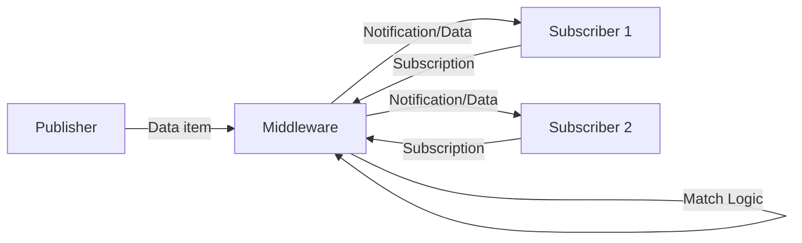

# Distributed Systems Question Bank Solutions

---

**1. How to achieve fault tolerance in distributed object based systems?** \
Fault tolerance in distributed object-based systems, such as CORBA, is primarily achieved through **object replication** or by grouping objects into **object groups**. This allows the system to mask failures; if one replica fails, others can continue to provide the service, ensuring high availability. In systems like Globe, specific **replication subobjects** handle consistency and replication strategies to ensure fault tolerance.

---

**2. List the key components of CORBA architecture.** \
The key components of the CORBA architecture include:
* **Object Request Broker (ORB):** The core that connects clients and objects.
* **IDL (Interface Definition Language):** Defines the object interfaces.
* **Stub (Client Proxy):** Client-side code for marshaling requests.
* **Skeleton:** Server-side code for unmarshaling requests.
* **Object Adapter:** Handles incoming invocation requests on the server side.
* **Interface Repository:** Database of interface definitions.
* **Implementation Repository:** Database of object implementations.

*(See diagram in `Dist_Sys_Unit_3_Notes_Part_2.pdf` Page 1)*

---

**3. Write short notes on SOAP?** \
**SOAP (Simple Object Access Protocol)** is a standard XML-based protocol used for exchanging structured information in the implementation of web services. A SOAP message consists of an **Envelope** (defines the start and end), an optional **Header** (attributes), and a **Body** (the actual XML data). It typically runs over HTTP but can use other transport protocols.

---

**4. What are the key characteristics of distributed file system?** \
The key characteristics include **transparency** (structure, access, naming, and replication transparency), **user mobility** (users can access files from any node), and **performance** (comparable to centralized systems). Other important characteristics are **simplicity**, **data integrity** (concurrency control), **high availability**, **scalability**, **security**, and **heterogeneity**.

---

**5. Define and identify the importance of Hadoop?** \
**Hadoop** is an open-source framework provided by Apache to process and analyze very huge volumes of data (Big Data) using clusters of commodity hardware. Its importance lies in its ability to provide scalable storage via **HDFS (Hadoop Distributed File System)** and distributed processing via **MapReduce**, making it a cost-effective solution used by major tech companies like Facebook and Yahoo.

---

**6. How to analyze the BigData?** \
Big Data in the Hadoop ecosystem is analyzed using tools like **Apache Pig** and **Apache Hive**. **Pig** uses a high-level data flow language (Pig Latin) to execute MapReduce jobs for exploring large datasets. **Hive** acts as a data warehouse, providing a SQL-like query language (HQL) to query and analyze structured data stored in HDFS.

---

**7. How to achieve synchronization in distributed object based systems?** \
Synchronization in distributed object-based systems is often handled via **transaction services** or **concurrency control** mechanisms provided by the middleware (e.g., CORBA Concurrency Control Service). In **DCOM**, synchronization can be managed through **transaction attributes** (e.g., REQUIRES NEW, REQUIRED) associated with class objects, ensuring atomic changes. In **Globe**, synchronization is managed within the **replication subobject** to control method invocations.

---

**8. List the key components of Globe architecture.** \
The key components of a **Globe local object** include:
* **Semantics Subobject:** Implements the actual functionality of the object.
* **Communication Subobject:** Handles network-independent communication.
* **Replication Subobject:** Manages consistency and state replication logic.
* **Control Subobject:** Connects the user-defined semantics to the replication subobject.

*(See diagram in `Dist_Sys_Unit_3_Notes_Part_2.pdf` Page 12)*

---

**9. Write short notes on REST?** \
**REST (Representational State Transfer)** is an architectural style for distributed systems, particularly web services, that uses standard HTTP methods (GET, POST, PUT, DELETE) to interact with resources identified by URIs. It emphasizes **stateless** communication, where each request contains all necessary information, and relies on a uniform interface to improve scalability and reliability.

---

**10. What are the services of distributed file system?** \
A distributed file system provides three main categories of services:
1.  **Storage Service:** Allocation and management of space on secondary storage.
2.  **True File Service:** Handles file-sharing semantics, caching, replication, and concurrency control.
3.  **Name/Directory Service:** Manages directory operations like creation, deletion, and mapping names to files (naming transparency).

---

**11. Define and identify the importance of MapReduce?** \
**MapReduce** is a distributed data processing model and execution environment designed to run on large clusters of commodity machines. Its importance lies in its scalability and fault tolerance; it divides massive tasks into a **Map phase** (processing key-value pairs) and a **Reduce phase** (aggregating results), allowing parallel computation across thousands of nodes efficiently.

---

**12. What is Apache web server?** \
The **Apache Web Server** is a robust, open-source HTTP server that delivers web content to clients. It typically uses a process-based or thread-based architecture to handle incoming requests, processing them via modules (like PHP or SSL) and serving static or dynamic content back to the user's browser. It is a key component of the web infrastructure.

---

**13. Explain in detail about DCOM in distributed object based systems?** \
**DCOM (Distributed Component Object Model)** is Microsoft's extension of COM to support communication across networks.

* **Overview:** It enables software components to communicate directly over a network in a reliable, secure, and efficient manner. It evolved from OLE and COM.
* **Architecture:**
    * **SCM (Service Control Manager):** Responsible for activating objects, similar to CORBA's implementation repository.
    * **Object Proxy:** Client-side representation that handles marshaling.
    * **Object Stub:** Server-side component that receives requests.
    * **Registry:** Stores configuration and class information.
* **Object Model:** DCOM enforces strict binary interfaces. Clients interact with interfaces (collections of operations) rather than objects directly. Interfaces are identified by unique IIDs (Interface Identifiers).
* **Services:** DCOM relies on the underlying OS (Windows) for services like security, directory (Active Directory), and transactions (MTS/COM+), rather than defining its own specifications like CORBA.
* **Garbage Collection:** It uses reference counting (AddRef/Release) and pinging for lifecycle management.

*(See diagram in `Dist_Sys_Unit_3_Notes_Part_2.pdf` Page 7)*

---

**14. Discuss about the key components in CORBA architecture in detail?** \
The **Common Object Request Broker Architecture (CORBA)** consists of several vital components facilitating distributed object communication:

1.  **Object Request Broker (ORB):** The middleware core that acts as a software bus, allowing objects to communicate transparently across different machines and languages. It handles message routing and connection management.
2.  **IDL (Interface Definition Language):** A declarative language used to define object interfaces independently of the implementation language. It maps to various languages like C++, Java, etc.
3.  **Client Stubs (Static IDL Proxy):** Code generated from IDL that resides on the client. It provides a local interface for the remote object and handles the marshaling (packing) of parameters into messages.
4.  **Server Skeletons:** Code on the server side that unmarshals arguments and calls the actual object implementation.
5.  **Dynamic Invocation Interface (DII):** Allows clients to construct requests at runtime without having compile-time knowledge of the object interface (no static stub).
6.  **Object Adapter (POA):** Sits between the ORB and the object implementation. It handles object reference generation, activation, and mapping requests to specific servants (code).
7.  **Interface Repository:** A runtime database containing interface definitions, allowing dynamic discovery of methods.

*(See diagram in `Dist_Sys_Unit_3_Notes_Part_2.pdf` Page 1)*

---

**15. Discuss the Service Oriented Architecture (SOA) and its key features?** \
**Service-Oriented Architecture (SOA)** is an architectural pattern where application components provide services to other components via a communications protocol, typically over a network.

* **Definition:** It packages functionality as a set of interoperable services that can be used within multiple, separate systems from several business domains.
* **Key Features:**
    * **Interoperability:** Services can communicate despite different underlying languages or platforms.
    * **Loose Coupling:** Services are independent; changes in one do not necessarily break others.
    * **Reusability:** Services are designed to be reused in different applications.
    * **Service Discovery:** Mechanisms exist to find services (e.g., UDDI).
    * **Composition:** Multiple services can be combined to form complex applications.
    * **QoS Support:** Facilitates Quality of Service through Service Level Agreements (SLAs).

---

**16. List and explain the characteristics of Distributed file systems in detail?** \
A Distributed File System (DFS) has several critical characteristics:

1.  **Transparency:**
    * **Structure Transparency:** Clients don't need to know the number or location of file servers.
    * **Access Transparency:** Local and remote files are accessed using the same operations.
    * **Naming Transparency:** File names do not reveal their physical location.
    * **Replication Transparency:** Multiple copies of files are hidden from the user.
2.  **User Mobility:** Users can access their files and environment (e.g., home directory) from any node in the system.
3.  **Performance:** The system should offer performance comparable to a centralized file system, minimizing latency introduced by the network.
4.  **Simplicity:** The interface should be simple, similar to local file systems, with a minimal command set.
5.  **High Availability:** The system must continue to function despite partial failures (node or link crashes), often achieved through replication.
6.  **Scalability:** The system should handle growth in nodes and users without significant service disruption.
7.  **High Reliability:** Probability of data loss should be minimized via backups and fault tolerance.
8.  **Heterogeneity:** Ability to access shared data across diverse hardware and operating system platforms.

---

**17. Explain in detail about emerging trends in distributed systems?** \
Distributed systems are evolving rapidly. Key emerging trends include:

* **Ubiquitous Edge Computing:** Moving processing power closer to the data source (the "edge") to reduce latency. This includes **Edge-AI integration**, where AI processing happens locally on devices, and **Smart Infrastructure** for cities (traffic, energy) handled by distributed edge nodes.
* **Cloud-Distributed Integration:** Cloud platforms are increasingly adopting distributed principles for **Scalable Infrastructure** (dynamic resource allocation) and **Load Balancing** to distribute traffic globally.
* **Grid Computing:** Connecting disparate computers to act as a virtual supercomputer for data-intensive tasks.
* **Security Enhancements:** Adoption of **Zero Trust Architectures** (never trust, always verify) and **Advanced Cryptography** (quantum-resistant algorithms) to protect distributed data.
* **Quantum Computing:** Integration of **Quantum-Enhanced Systems** for optimization problems and the development of **Quantum Networks** for ultra-secure communication via entanglement.
* **Interoperability:** A focus on open standards and APIs to allow seamless communication between diverse cross-domain systems.

---

**18. Discuss the security challenges in distributed coordination based systems?** \
In distributed coordination systems like Publish/Subscribe, security is challenging due to the decoupling of publishers and subscribers.
* **Content-Based Routing Security:** In content-based routing, routers need to inspect message content to make routing decisions. This conflicts with end-to-end encryption.
* **Decoupling Issues:** Since publishers don't know subscribers, traditional authentication and access control are difficult.
* **Solution Approach:** A trusted **Accounting Service (AS)** or Broker can be used. The publisher encrypts the message. The AS provides specific encryption/decryption keys to authorized subscribers, allowing them to decrypt content without the middleware needing full access to the plain text, thus balancing routing needs with data privacy.

---

**19. Explain the key design issues in achieving fault tolerance and security in distributed object based systems?** \
* **Fault Tolerance:** The primary design issue is masking failures.
    * **Replication:** In **CORBA**, this is handled by a separate server/service (not built-in initially). In **Globe**, it is handled by the **Replication Subobject** within the local object, allowing object-specific consistency protocols.
    * **Object Groups:** Creating groups of replicas where the client communicates with the group as a single entity (transparent to the client).
* **Security:**
    * **Trust & Authorization:** In **DCOM**, security is based on Windows (Kerberos, ACLs). In **Globe**, a **Security Subobject** checks for authorized communication and parameter values.
    * **Level of Implementation:** **CORBA** defines a Security Service. **DCOM** uses the environment's security. **Globe** integrates security per object.
    * **Decoupled Policy:** Separating the policy (rules) from the mechanism (enforcement) is key, allowing security policies to be passed to the ORB or middleware as local objects.

---

**20. Discuss about the key components of Sun NFS architecture in detail?** \
The **Sun Network File System (NFS)** architecture allows remote file access over a network.
* **Virtual File System (VFS):** An abstraction layer in the kernel that distinguishes between local and remote files. It provides a standard interface for system calls, redirecting remote requests to the NFS client.
* **NFS Client:** A module on the client machine. When VFS detects a remote file request, it passes it to the NFS client, which wraps the request into RPC calls.
* **NFS Server:** Runs on the server machine. It receives RPC requests, interacts with the local file system (via VFS), and returns results. It is stateless (in older versions).
* **RPC (Remote Procedure Call):** The communication mechanism used to route requests between client and server.
* **XDR (External Data Representation):** A standard data serialization format used by RPC to ensure data compatibility across heterogeneous machines.
* **Mount Protocol:** A separate protocol used to mount remote file systems into the local directory hierarchy before they can be accessed.

*(See diagram in `Dist_Sys_Unit_4_Notes.pdf` Page 27)*

---

**21. Explain the types of distributed file systems in detail?** \
Distributed file systems can be broadly categorized into:

1.  **Network File Systems (NFS-like):**
    * Based on a **Client-Server Architecture**.
    * The server exports a directory, and the client mounts it.
    * File access is transparent; remote files look local.
    * Examples: **Sun NFS**, **AFS (Andrew File System)**. AFS uses stateful servers and aggressive caching (Venus/Vice), while NFS is typically stateless (v3).
2.  **Cluster-Based Distributed File Systems:**
    * Designed for massive scalability and high throughput, often running on commodity hardware.
    * **Striping:** Files are split into chunks (e.g., 64MB) and distributed across many nodes.
    * **Master/Chunkserver Model:** A single master handles metadata, while multiple chunkservers store data.
    * Example: **Google File System (GFS)**. It optimizes for large files and append-heavy workloads.
3.  **Peer-to-Peer / DHT-Based Systems:**
    * Decentralized storage where every node acts as both client and server.
    * Uses Distributed Hash Tables (DHT) like Chord for locating files.
    * Example: **Ivy**, **Past**.

---

**22. Define web proxy caching and mention its role in distributed computing with suitable examples.** \
**Web Proxy Caching** involves using an intermediary server (proxy) to store copies of frequently accessed web content (pages, images). When a client requests a resource, the proxy checks its local cache. If found, it serves it directly; otherwise, it fetches it from the original server.
* **Role:** It significantly reduces network traffic, lowers latency for users, and reduces the load on the origin server.
* **Example:** In a corporate network, a proxy server caches the company's daily news page. When 1000 employees access it, the page is fetched once from the external web server and served 999 times from the local proxy cache.

*(See diagram in `Dist_Sys_Unit_4_Notes.pdf` Page 40)*

---

**23. Describe the architecture of distributed coordination based system with a neat sketch?** \
The architecture of a distributed coordination-based system (specifically **Publish/Subscribe**) decouples the sender (publisher) and receiver (subscriber).

* **Publishers** generate data items (events) and send them to the middleware.
* **Subscribers** register their interest in specific data items via **subscriptions** (using attributes or topics).
* **Middleware:** The core component that matches published events to subscriptions. It manages the **Event Channel**.
* **Delivery:** Upon a match, the middleware delivers the data to the subscriber (Push) or sends a notification for the subscriber to fetch it (Pull/Read).



*(Diagram reference: `Dist_Sys_Unit_5_Notes.pdf` Page 4)*

---

**24. Explain Grid Computing and its significance in modern computing environments.**

**Grid Computing** is a distributed computing model where a network of loosely coupled, heterogeneous computers work together to perform large tasks, acting as a **virtual supercomputer**.

* **Significance:** It allows organizations to utilize idle resources (CPU, storage) from various administrative domains to solve complex scientific or analytical problems (e.g., weather simulation, genome sequencing) that are too large for a single machine. It enables high-throughput computing and resource sharing at a low cost compared to building physical supercomputers.

---

**25. What are the two primary functions required by the Map-Reduce programming model?**

The two primary functions are:

1. **Map Function:** Processes input data (key-value pairs) and produces a set of intermediate key-value pairs.
2. **Reduce Function:** Takes the intermediate data, groups it by key, and aggregates the values to produce the final output.

---

**26. List out any four CORBA services.**

Four common CORBA services are:

1. **Naming Service:** For binding names to object references.
2. **Concurrency Service:** For managing locks and concurrent access.
3. **Transaction Service:** For handling atomic transactions across multiple objects.
4. **Event Service:** For decoupled, asynchronous notification and communication.

---

**27. What are two main goals of a Distributed File System (DFS)?**

The two main goals are:

1. **Network Transparency:** Users should not be aware of the physical location of the files; they should access remote files exactly as they access local ones.
2. **High Availability:** Files should remain accessible even in the event of partial system failures (server or network crashes), typically achieved via replication.

---

**28. What are Pig and Hive?**

**Apache Pig** is a high-level data flow platform that uses a scripting language called **Pig Latin** to write MapReduce programs easily; it is preferred by programmers for handling unstructured/semi-structured data. **Apache Hive** is a data warehouse infrastructure built on top of Hadoop that provides a SQL-like interface (**HQL**) to query and manage structured data stored in HDFS; it is preferred by data analysts.

---

**29. Write about the Internet Inter-ORB Protocol (IIOP).**

**IIOP (Internet Inter-ORB Protocol)** is a protocol defined by CORBA to enable communication between different ORBs over the Internet using **TCP/IP**. It allows systems written in different languages and running on different platforms to interoperate by standardizing how object references and messages are formatted and transmitted across the network, essentially serving as the bridge for CORBA's interoperability.

---

**30. What role does the Master Node play in GFS(Google file system)?**

The **Master Node** in GFS is the central coordinator. It stores **metadata** (file names, access control, mapping of files to chunks, and chunk locations). It handles system-wide activities like **lease management** (locking), **garbage collection** of orphaned chunks, and **chunk migration** between chunkservers. Crucially, it does **not** handle the actual data transfer to clients, preventing it from becoming a bottleneck.

---

**31. Explain in detail about consistency and replication in distributed object based systems?** \

* **Replication:**
* **CORBA:** Historically did not support replication natively. It relies on separate services or fault-tolerant CORBA implementations.
* **Globe:** Built with replication in mind. The **Replication Subobject** in the local object contains the implementation of a consistency protocol (e.g., master-slave). This allows different objects to have different replication strategies hidden from the client.
* **DCOM:** Does not provide built-in support for replication; it relies on the underlying OS or application logic.


* **Consistency:**
* Consistency models ensure all replicas show the same data.
* **Globe:** Supports flexible consistency models (object-specific).
* **Active Replication:** All replicas perform the operation.
* **Primary-Backup:** One primary handles updates and propagates them to backups (common in fault-tolerant CORBA).


---

**32. Discuss about DCOM in detail?**

*(See answer to Question 13. DCOM is Microsoft's distributed component model using SCM, Proxies, and Stubs, relying on Windows services for security and transactions.)*

---

**33. Explain how replication works in web hosting systems?**

Replication in web hosting is primarily handled via **Content Delivery Networks (CDNs)**.

* **Origin Server:** Updates content (master copy).
* **Edge Servers:** Replicas of the content are distributed to edge servers located geographically closer to users.
* **Mechanism:** When a client requests a page, DNS resolution directs them to the nearest Edge Server (replica).
* **Consistency:** Updates are propagated from the origin to edge servers either via **Push** (origin sends updates) or **Pull** (edge requests update upon expiration/TTL). Akamai is a prime example of this global replication architecture.

---

**34. Describe the working and design of the Google File System (GFS)?**

**GFS** is designed for large-scale data processing on commodity hardware.

* **Architecture:** Consists of a single **Master** and multiple **Chunkservers**.
* **Files:** Files are divided into fixed-size **Chunks** (64 MB). Each chunk is identified by a unique 64-bit Chunk Handle.
* **Replication:** Each chunk is replicated (default 3 copies) across different chunkservers for fault tolerance.
* **Operation:**
1. Client asks Master for chunk location (metadata).
2. Master replies with the IP of the chunkserver holding the replica.
3. Client caches this metadata and communicates **directly** with the Chunkserver to read/write data (avoiding Master bottleneck).


* **Writes:** Uses a primary replica for each chunk to order concurrent mutations, which are then pushed to secondary replicas.

*(See architecture diagram in `Dist_Sys_Unit_4_Notes.pdf` Page 20)*

---

**35. What is MapReduce? Explain its working with an example.**

**MapReduce** is a programming model for processing large datasets in parallel.

* **Working:**
1. **Input:** Data is split into chunks.
2. **Map Phase:** The user defines a `Map` function that processes input key-value pairs and outputs intermediate key-value pairs.
3. **Shuffle/Sort:** The framework groups all intermediate values associated with the same key.
4. **Reduce Phase:** The user defines a `Reduce` function that merges the values for a specific key to produce the final output.


* **Example (Word Count):**
* **Input:** "Deer Bear River"
* **Map:** Outputs `(Deer, 1), (Bear, 1), (River, 1)`.
* **Shuffle:** Aggregates counts for "Deer", "Bear", etc.
* **Reduce:** Sums the list `[1, 1...]` for each word.


---

**36. Explain virtualization in distributed computing and its advantages.**

**Virtualization** creates a virtual version of a resource (server, storage, network) rather than a physical one. It allows a single physical machine to run multiple Virtual Machines (VMs).

* **Types:** Application, Network, Desktop, and Storage virtualization.
* **Advantages:**
* **Efficiency:** Higher utilization of physical hardware.
* **Isolation:** Applications run in isolated environments; a crash in one VM doesn't affect others.
* **Flexibility:** VMs can be easily migrated or cloned.
* **Cost:** Reduces hardware costs (CAPEX) and operational costs (OPEX) by consolidating servers.


---

**37. What is the primary focus of the GLOBE system architecture?**

The primary focus of **Globe (Global Object Based Environment)** is **scalability**. It aims to support a billion shared objects distributed worldwide. Unlike CORBA or DCOM, which focus on interoperability or functionality, Globe focuses on partitioning the state of objects across multiple machines (truly distributed objects) and handling location/replication internally to scale efficiently across a wide-area network (WAN).

---

**38. What is the purpose of a Web Proxy Cache?**

The purpose of a **Web Proxy Cache** is to store copies of frequently or recently accessed web documents closer to the client. This **reduces latency** for the user (content loads faster), **conserves bandwidth** (fewer requests go to the external internet), and **reduces the load** on the remote origin servers.

---

**39. What is SOA (Service-Oriented Architecture)?**

**SOA** is an architectural style for building software systems based on interacting **services**. A service is a self-contained unit of functionality (like "CheckCredit" or "ProcessOrder") that can be accessed remotely. SOA allows different applications to communicate and reuse these services via standard protocols (like SOAP/HTTP), promoting interoperability and flexibility in enterprise systems.

---

**40. List a few emerging trends in distributed systems?** \

* **Edge Computing:** Processing data near the source (IoT devices).
* **Zero Trust Security:** Strict identity verification for every user/device.
* **Quantum Computing:** Using quantum mechanics for massive computational speedups.
* **Serverless Computing:** Developers run code without managing servers (FaaS).
* **Green Computing:** Optimizing distributed systems for energy efficiency.

---

**41. What protocol typically forms the basis of communication for SUN NFS?**

**RPC (Remote Procedure Call)** is the protocol that forms the basis of communication for Sun NFS. Specifically, NFS operations (like read, write, lookup) are defined as RPC procedures that the client invokes on the server. It often uses **XDR** for data formatting on top of the RPC transport.

---

**42. What is the core function of a CDN (Content Delivery Network) in a distributed web-based system?**

The core function of a **CDN** is to improve the performance and availability of web content by distributing copies of the content to **edge servers** located geographically close to end-users. When a user requests content, the CDN redirects the request to the nearest edge server, minimizing network hops and latency.

---

**43. Write short notes on DCOM, CORBA & GLOBE?** \

* **CORBA:** An industry standard (OMG) for distributed objects focusing on **interoperability** across languages and platforms using IDL and ORBs.
* **DCOM:** Microsoft's technology for distributed objects, focusing on **functionality** within the Windows ecosystem, using binary interfaces and OS-level services.
* **GLOBE:** A research system focusing on **scalability** (billion users/objects) by physically distributing object state and encapsulating replication logic within the object itself (local objects/subobjects).

*(Comparison Table in `Dist_Sys_Unit_3_Notes_Part_2.pdf` Page 16)*

---

**44. Discuss about CODA in detail?**

**Coda** is a distributed file system derived from AFS, optimized for high availability and mobile computing.

* **Disconnected Operation:** A key feature where a client can continue working when the network is down. It uses a local cache (hoarding) to store files.
* **Replication:** It uses server replication (Volume Storage Group - VSG) to ensure data is available even if some servers fail.
* **Conflict Resolution:** Upon reconnection, Coda synchronizes the local cache with the servers. If conflicts arise (file modified in both places), it attempts automatic resolution or flags it for the user.

---

**45. What is REST architecture?**

**(See Answer 9)** REST (Representational State Transfer) is a resource-based architectural style for web services. It relies on stateless communication, standard HTTP methods, and URIs to identify resources, offering a simpler, scalable alternative to SOAP-based services.

---

**46. How is it used in web services?**

In **RESTful web services**, functionality is exposed as resources (e.g., `/users`, `/orders/1`). Clients interact with these resources using standard HTTP verbs:

* **GET:** To retrieve a resource representation.
* **POST:** To create a new resource.
* **PUT:** To update an existing resource.
* **DELETE:** To remove a resource.
Data is typically exchanged in **JSON** or **XML** format.

---

**47. Explain the architecture and working of the NFS (Network File System).**

**NFS Architecture:**

* **Client-Server:** Clients mount remote directories exported by servers.
* **RPC-Based:** All file operations (read/write) are sent as RPC requests.
* **VFS Layer:** Intercepts file calls; checks if the file is local or remote.
* **Caching:** Clients cache file data and attributes to reduce network traffic.
* **Session Semantics:** (NFSv3) Changes to a file are visible to others only after the file is closed (or flushed), though modern NFS approximates UNIX semantics closer.
* **Stateless Server:** (NFSv3) Server doesn't maintain state (like open file pointers) for clients, making crash recovery easy. (NFSv4 introduced statefulness).

---

**48. Compare Hadoop, Pig, and Hive in the context of big data processing.** \

* **Hadoop:** The foundational **framework** providing storage (HDFS) and raw processing power (MapReduce). It requires low-level Java programming.
* **Pig:** A **scripting platform** running on top of Hadoop. It uses **Pig Latin**, a data-flow language suitable for semi-structured data and complex transformations. It is easier to write than raw MapReduce.
* **Hive:** A **data warehousing** tool on top of Hadoop. It uses **HQL** (SQL-like) to query structured data. It is best for summarization, ad-hoc queries, and users familiar with SQL databases.

---

**49. Explain in detail distributed coordination based systems?**

Distributed coordination-based systems focus on how processes communicate and coordinate actions.

* **Taxonomy:** Coordination models are classified by **Temporal** (coupled/decoupled in time) and **Referential** (coupled/decoupled in name) dimensions.
* **Direct:** Coupled in both (e.g., RPC).
* **Mailbox:** Temporally decoupled, Referentially coupled (e.g., Email).
* **Meeting:** Temporally coupled, Referentially decoupled (e.g., Publish/Subscribe).
* **Generative (Linda):** Decoupled in both (e.g., Shared Tuple Spaces).


* **Publish/Subscribe:** The most common coordination model. Publishers send events; Subscribers subscribe to specific topics or content attributes. Middleware matches them.
* **Routing:** Efficiently routing events to subscribers using **content-based routing** is a key challenge in these systems.

*(See taxonomy diagram in `Dist_Sys_Unit_5_Notes.pdf` Page 1)*

```

