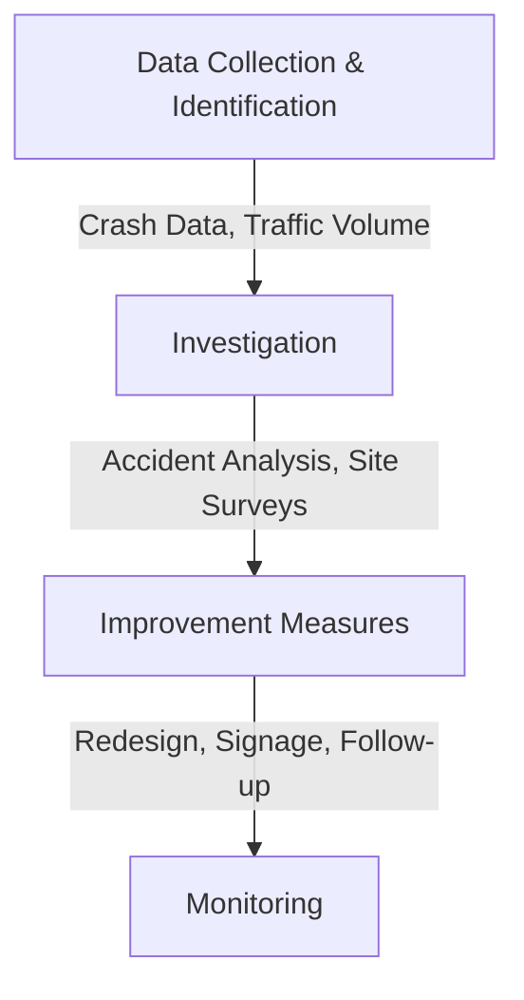
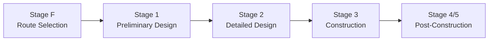
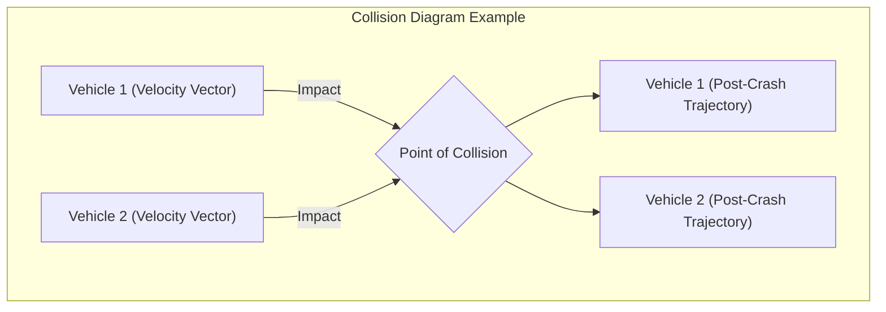

# ERSE CIE-I Study Guide

**1. Define Road accident.** \
Road accidents are a serious concern worldwide that can lead to injury, fatalities, and significant property damage. They frequently occur due to various factors, including driver error, poor road conditions, adverse weather conditions, vehicle defects, and the involvement of pedestrians or cyclists.
*(Found on Page 1)*

---

**2. Define safe vehicle design.** \
Safe vehicle design focuses on ensuring the safety of passengers, pedestrians, and other road users. The core principle involves the integration of advanced engineering, technology, and materials to minimize risks during a crash and reduce injuries.
*(Found on Page 10)*

---

**3. What are speed control measures?** \
Speed control measures are strategies implemented to reduce traffic speeds and improve safety. Key measures include:
* **Enforcement:** Regular speed checks with radar, automated speed cameras, and speed bumps.
* **Technology:** Intelligent Speed Adaptation (ISA) such as in-car alerts and geo-fencing.
* **Road Design:** Traffic calming measures like roundabouts and narrowed roads, along with variable speed limits.
*(Found on Pages 7-8)*

---

**4. Define black spot.** \
In road safety, a black spot refers to a specific location where accidents, collisions, or near-miss events frequently occur. These spots are often created by a combination of dangerous road conditions, poor geometry, and high traffic volumes.
*(Found on Page 16)*

---

**5. Define statistical analysis in accident studies.** \
Statistical analysis involves using techniques to collect, analyze, interpret, and present accident data. These methods are crucial for making informed decisions, drawing conclusions about crash causes, and predicting future accident trends based on empirical data.
*(Found on Page 15)*

---

**6. Define RSA investigation.** \
A Road Safety Audit (RSA) investigation is a systematic, formal assessment of existing or proposed roads and intersections. It is conducted by an independent, multidisciplinary team to proactively identify and qualitatively assess potential safety issues and suggest improvements to reduce accidents.
*(Found on Pages 26-27)*

---

**7. List out any two points to establish safety in urban areas.** \
1.  **Crime Prevention:** Implementing community policing strategies and ensuring well-lit streets to deter criminal activity.
2.  **Traffic Safety:** Developing safe pedestrian infrastructure (like secure crossings) and strictly enforcing speed limits.
*(Found on Pages 1-2)*

---

**8. Define the term collision.** \
A collision is an event where two or more objects interact and exert forces upon each other. Collisions can be categorized as **Elastic** (where kinetic energy and momentum are conserved) or **Inelastic** (where momentum is conserved, but kinetic energy is not).
*(Found on Page 3)*

---

**9. Write a short note on traffic calming.** \
Traffic calming involves urban design strategies aimed at reducing vehicle speeds to improve safety for pedestrians and cyclists. The goal is to make streets more comfortable for non-motorized users while maintaining traffic flow. Common physical measures include speed bumps, chicanes (curved road sections), road narrowing, roundabouts, and raised crosswalks.
*(Found on Page 4)*

---

**10. Define Black Spot.** \
A black spot is a high-risk location on a road network characterized by a high frequency of accidents or near-misses over a defined period. Authorities identify these spots to implement targeted engineering and safety improvements.
*(Found on Page 16)*

---

**11. List out any one application of computer analysis of accident data. What is Indian Global level?** \
* **Application:** Identifying Accident Patterns and Trends, which helps authorities understand peak accident times, locations, and high-risk causative factors.
* **Indian & Global Level:** The provided notes refer to this broadly as a prompt for comparison, asking to clarify if the user wants to compare Indian vs. global trends in areas like technology, economy, culture, politics, or environmental issues.
*(Found on Pages 19 & 3)*

---

**12. What are Road Safety Improvement Strategies?** \
Road Safety Improvement Strategies focus heavily on managing speed and infrastructure. Key strategies include:
* Speed Limit Enforcement (cameras, speed bumps).
* Intelligent Speed Adaptation (ISA) technology in cars.
* Road Design Improvements (traffic calming, clear signage).
* Public Awareness Campaigns and Behavioral Incentives.
* Enhanced Law Enforcement and stricter Speeding Penalties.
*(Found on Pages 7-8)*

---

**13. What is Accident data?** \
Accident data is the information gathered, stored, and analyzed from a vehicle or transportation environment during or after a crash. This data includes vehicle telemetry (speed, braking), environmental conditions, human factors, and crash dynamics, which are crucial for understanding the root causes of accidents and improving overall safety designs.
*(Found on Page 14)*

---

**14. What are key elements of a Road Safety Audit?** \
The key elements of a Road Safety Audit (RSA) include:
1.  **Scope and Objectives:** Ensuring safety is integrated at every design and operational stage.
2.  **Audit Phases:** Conducting audits across pre-construction, construction, and post-construction stages.
3.  **Team Involvement:** Utilizing an independent, multi-disciplinary team.
4.  **Data Collection:** Reviewing historical crash data and road conditions.
5.  **Road Design & Human Factors:** Evaluating alignment, intersections, pedestrian facilities, and driver behavior.
*(Found on Pages 23-25)*

---

**15. Define Road accidents.** \
*(See Answer for Question 1)* \
Road accidents are unexpected events on roadways resulting in injury, fatality, or property damage, usually caused by driver error, poor road environments, or vehicle defects.
*(Found on Page 1)*

---

**16. What is safety in urban areas?** \
Safety in urban areas involves a comprehensive approach to making cities secure for residents and visitors. It integrates Crime Prevention (policing and surveillance), Traffic Safety (pedestrian infrastructure), Emergency Service readiness, inclusive Urban Planning (mixed-use and green spaces), and Community Engagement.
*(Found on Pages 1-2)*

---

**17. Explain Traffic clamings.** \
*(See Answer for Question 9)* \
Traffic calming utilizes physical strategies to reduce vehicle speed and improve non-motorized user safety. These measures, often placed near residential areas or schools, include speed bumps, chicanes, road narrowing, pedestrian islands, and bollards.
*(Found on Page 4)*

---

**18. What are human factors, vehicle factors?** \
* **Human Factors:** The study of how people interact with systems and environments. It blends psychology and engineering to optimize performance, ensuring systems align with human perception, cognition, and physical abilities to reduce error.
* **Vehicle Factors:** The mechanical and design elements influencing a vehicle's performance and safety. This includes the engine type, vehicle weight, tire size/tread, aerodynamics, suspension, braking systems, and built-in safety features.
*(Found on Pages 4-6)*

---

**19. Write about Accident data.** \
Accident data collection involves extracting information from vehicles (often via "black boxes") and the accident scene to understand crash dynamics. The data recorded typically spans four categories: **Vehicle Data** (speed, braking, airbag deployment), **Environmental Data** (weather, road surface), **Human Factors** (seatbelt use, driver condition), and **Crash Dynamics** (impact force, collision angle). This information drives safety research, regulatory compliance, and legal investigations.
*(Found on Pages 14-15)*

---

**20. Explain Black spot identification.** \
Black spot identification is the process of locating road areas with concentrated accident histories. It relies heavily on **Accident Data Analysis** over a defined period (e.g., 3-5 years). Authorities also conduct a **Road Conditions Review** to spot poor signage or dangerous curves, and analyze **Traffic Volume** metrics, as highly congested areas are more prone to recurring incidents.
*(Found on Pages 16-17)*

---

**21. What is Road safety Audit?** \
A Road Safety Audit (RSA) is a systematic and formal evaluation of a road or intersection's safety performance. It spans the entire lifecycle of a project—planning, design, construction, and operation—with the primary goal of identifying potential hazards and recommending improvements to reduce crash likelihood.
*(Found on Page 22)*

---

**22. Explain the importance of human factors in road safety.** \
Human factors are crucial because they seek to understand human capabilities and cognitive limits (like attention and memory) to design more intuitive, user-friendly transportation systems. By applying principles of ergonomics and cognitive engineering, human factors minimize the risk of driver error, enhance situational awareness, and ultimately increase the efficiency and safety of the driving environment.
*(Found on Pages 4-5)*

---

**23. Describe the traffic calming techniques used in urban areas.** \
Techniques used in urban areas focus on physically restricting vehicle momentum. Key methods include:
* **Speed Bumps/Humps:** Raised pavement forcing direct deceleration.
* **Chicanes:** Winding or curved road sections that break up long, straight speeding paths.
* **Road Narrowing:** Constricting lane width to naturally encourage slower driving.
* **Raised Crosswalks & Pedestrian Islands:** Giving priority and safe refuge to pedestrians crossing busy streets.
*(Found on Page 4)*

---

**24. Explain the process of black spot identification and investigation.** \
The process follows a structured methodology from discovery to intervention.

```mermaid
flowchart TD
    A["Data Collection & Identification"] -->|"Crash Data, Traffic Volume"| B["Investigation"]
    B -->|"Accident Analysis, Site Surveys"| C["Improvement Measures"]
    C -->|"Redesign, Signage, Follow-up"| D["Monitoring"]
```

1.  **Identification:** Identifying clusters of crashes using historical data, road condition reviews, and public reporting.
2.  **Investigation:** Performing deep accident analysis to find trends, conducting engineering site surveys to examine road geometry, and utilizing simulation studies.
3.  **Improvement:** Implementing design changes (like widening roads or adding signals) and monitoring the site to ensure the hazards are resolved.
*(Found on Pages 16-17)*

---

**25. Explain the importance of accident data collection data.** \
Collecting accident data is vital for objective accident investigation, allowing experts to determine the exact cause of a crash, whether it be mechanical, human, or environmental. It ensures **Regulatory Compliance** for vehicle manufacturers during crash testing and facilitates the development of **Advanced Safety Systems** (like ADAS). Furthermore, it provides essential post-crash insights needed by engineers to improve future vehicle designs and reduce overall traffic fatalities.
*(Found on Pages 14-15)*

---

**26. Describe the vehicle factors contributing to vehicle control.** \
Vehicle control and stability are dictated by several engineering factors:
* **Suspension System:** Shock absorbers and stabilizers dictate ride quality and vehicle stability during maneuvers.
* **Tire Size and Type:** Tread pattern and pressure directly affect traction, braking, and handling on the road.
* **Braking System:** The efficiency of disc/drum brakes and Anti-lock Braking Systems (ABS) determine stopping power and prevent wheel lockup.
* **Vehicle Weight & Aerodynamics:** Lighter, aerodynamic vehicles respond differently under acceleration and high-speed turning.
*(Found on Pages 5-6)*

---

**27. What are statistical methods of accident data?** \
Statistical methods are quantitative techniques used to interpret crash data. They range from **Descriptive Statistics** (mean, variance) summarizing the data, to **Inferential Statistics** (hypothesis testing, regression) making predictions about broader traffic populations. Other advanced methods include **Multivariate Analysis** for complex variable relationships and **Time Series Analysis** to track accident trends over specific intervals.
*(Found on Pages 15-16)*

---

**28. What are Black Spot Identification & Investigations?** \
*(See Answer for Question 24)* \
Black spot identification and investigation is a safety protocol designed to pinpoint road locations with high accident frequencies. Authorities identify these zones via crash data and traffic volume metrics, then investigate the underlying engineering or behavioral root causes to deploy physical improvements like better lighting, signage, or road redesigns.
*(Found on Pages 16-17)*

---

**29. What are the Causes and Recording of crash data?** \
The recording of crash data—often via Event Data Recorders (Black Boxes)—is triggered by the need to understand complex vehicular failures. The primary causes/reasons for recording this data include supporting **Accident Investigation** (determining fault and providing legal evidence), ensuring **Regulatory Compliance** with government safety testing, and driving **Research and Development** to engineer safer vehicle structures and intelligent driver assistance programs.
*(Found on Pages 14-15)*

---

**30. What is Accident Reconstruction?** \
Accident reconstruction is the scientific process of investigating, analyzing, and determining the exact dynamics and causes of a vehicle collision. It utilizes physical evidence from the scene (skid marks, debris), vehicle telemetry data, and physics-based software simulations. The primary goals are to determine the root cause, reconstruct the chronological sequence of the crash, and assess legal responsibility.
*(Found on Pages 18-19)*

---

**31. What is Road Safety Audits and Investigations?** \
Road Safety Audits (RSAs) and Investigations are formal, independent assessments of road networks at any stage of development. An independent multidisciplinary team qualitatively assesses the road to spot hazards like inadequate sight distances or poor intersection designs. The goal is proactive risk management—providing actionable recommendations to enhance safety for all road users before crashes occur.
*(Found on Pages 26-27)*

---

**32. Explain applications of computer analysis of accident data.** \
Computer analysis of large crash datasets has transformative applications across sectors. It allows traffic engineers to optimize **Road Safety** by pinpointing geographical accident hotspots and predicting disruptions. Insurance companies use it for **Risk Assessment** and detecting fraudulent claims. Furthermore, manufacturers rely on computational data for **Vehicle Safety R&D**, running virtual crash simulations to test autonomous systems and structural integrity.
*(Found on Pages 19-21)*

---

**33. Discuss human factors refers to study how people interact with system.** \
Human factors is an interdisciplinary field that examines how humans interact with machines, environments, and software. It heavily incorporates cognitive engineering to understand the limits of human attention and decision-making. In road safety, the objective is to design vehicle interfaces and road signs that are intuitive, reducing cognitive load and preventing user errors that lead to accidents.
*(Found on Pages 4-5)*

---

**34. What are the elements that influence a vehicle performance?** \
A vehicle's performance is governed by multiple interconnected factors:
* **Powertrain:** Engine type, size, and transmission setup.
* **Physical Dynamics:** Vehicle weight and aerodynamic shape impact acceleration, drag, and fuel efficiency.
* **Contact & Control:** Tire specifications (width, pressure), suspension design, and Drive Type (AWD, FWD) dictate handling and traction.
* **Condition:** Vehicle age, wear and tear, and routine maintenance status critically affect baseline performance.
*(Found on Pages 5-6)*

---

**35. Explain about methods and tools in accident reconstruction.** \
Accident reconstruction relies on a blend of field data and computational tools:
1.  **Data Collection:** Gathering physical evidence like skid marks, debris mapping, witness statements, and downloading Black Box (EDR) telemetry.
2.  **Vehicle Damage Analysis:** Studying crush depth to calculate impact speed and force vectors.
3.  **Simulation Software:** Utilizing advanced programs like PC-Crash or MADYMO to generate a virtual physics-based model of the event.
4.  **Mathematical Models:** Applying the laws of physics regarding momentum, kinetic energy transfer, and friction.
*(Found on Page 19)*

---

**36. Explain any four statistical methods to collect analyze interpret data.** \
1.  **Descriptive Statistics:** Techniques like calculating the mean, median, and standard deviation to summarize the basic features of a crash dataset without making broader predictions.
2.  **Inferential Statistics:** Using hypothesis testing (e.g., t-tests) and regression analysis to make predictions about a larger population based on a smaller sample.
3.  **Probability Theory:** Utilizing probability distributions (like Normal or Poisson) to model uncertainty and quantify random phenomena in traffic events.
4.  **Time Series Analysis:** Analyzing data points recorded at specific intervals to identify trends or forecast future occurrences using methods like ARIMA.
*(Found on Pages 15-16)*

---

**37. Explain about road safety audit process.** \
The RSA process is divided into distinct chronological stages to ensure safety is woven into the infrastructure lifecycle.

```mermaid
flowchart LR
    A["Stage F \n Route Selection"] --> B["Stage 1 \n Preliminary Design"]
    B --> C["Stage 2 \n Detailed Design"]
    C --> D["Stage 3 \n Construction"]
    D --> E["Stage 4/5 \n Post-Construction"]
```

* **Stage F (Route Selection):** Identifying the safest general path for a new project.
* **Stage 1 & 2 (Design):** Auditing the initial layout, followed by scrutinizing detailed features like signage and lane markings.
* **Stage 3 (Construction):** Inspections during building to ensure worksite safety.
* **Stage 4/5 (Monitoring):** Observing the active road post-opening to catch unforeseen safety issues.
*(Found on Pages 25-26)*

---

**38. Explain briefly about Collision and Condition Diagrams.** \
**Collision Diagrams** are visual tools used in physics and engineering to illustrate the interaction of objects during an impact. They map out the initial trajectories, the forces acting upon impact, and the final trajectories of the objects (distinguishing between elastic and inelastic states).

```mermaid
graph TD
    subgraph Collision_Diagram ["Collision Diagram Example"]
        A["Vehicle 1 (Velocity Vector)"] -->|Impact| C{"Point of Collision"}
        B["Vehicle 2 (Velocity Vector)"] -->|Impact| C
        C --> D["Vehicle 1 (Post-Crash Trajectory)"]
        C --> E["Vehicle 2 (Post-Crash Trajectory)"]
    end
```

**Condition Diagrams** represent systems where behavior shifts based on specific inputs or constraints. Often used in control systems or Finite State Machines (FSM), they map out logical decision trees—showing how a system transitions from one state to another based on conditional triggers.
*(Found on Pages 3-4)*

---

**39. Explain Application of computer analysis of Accident data.** \
*(See Answer for Question 32 for overlapping details)* \
Computer analysis processes massive volumes of crash data to improve systemic safety. It is applied in **Traffic Management** to optimize signal timing based on congestion caused by accidents, and in **Forensic Analysis** to build accurate 3D accident reconstructions for legal use. Furthermore, it powers **Predictive Machine Learning Models** that can dynamically assess risk and adjust variable speed limits in real-time, while also helping Public Health sectors track injury statistics to formulate targeted prevention policies.
*(Found on Pages 19-21)*

---

**40. Explain Accident Reconstruction.** \
Accident reconstruction is a highly technical investigation aimed at reverse-engineering a crash to find its root cause. Investigators combine site analysis (skid marks, environmental conditions) with vehicle data (damage assessment, black box EDR data). By applying mathematical physics formulas—evaluating momentum, friction, and energy transfer—and utilizing specialized simulation software (like PC-Crash), experts can perfectly model the event. This process is heavily utilized in court for legal liability claims, insurance settlements, and advising structural safety improvements.
*(Found on Pages 18-19)*

---

**41. Explain briefly Road safety audit process.** \
*(See Answer for Question 37)* \
The process guarantees independent safety checks at every phase of a road's creation. It begins at **Stage F (Route Selection)** to evaluate macro-level risks, moves through **Stage 1 & 2 (Preliminary and Detailed Design)** to refine geometric alignments and signage, involves **Stage 3 (Construction)** to ensure the build matches safety specs, and concludes with **Stage 4/5 (Post-Construction)** to monitor the live traffic flow for emergent hazards.
*(Found on Pages 25-26)*

---

**42. Explain key elements of a Road safety audit in detail.** \
A successful Road Safety Audit relies on several foundational elements:
* **Multidisciplinary Team:** The audit must be conducted by independent experts specializing in traffic engineering, road safety, and human behavior to ensure unbiased evaluations.
* **Comprehensive Data Review:** Analysts rigorously check historical crash data, current road conditions, and user behavioral patterns.
* **Assessment of Road Features:** The team evaluates geometric alignment, intersection layouts, signage visibility, lighting, and safe accommodations for vulnerable road users (pedestrians/cyclists).
* **Reporting & Mitigation:** The final deliverable is a comprehensive report prioritizing hazards and providing specific, cost-effective safety recommendations and follow-up monitoring plans.
*(Found on Pages 23-25)*

---

**43. What are Accident data collection and analysis explain in detail.** \
Accident data collection and analysis is the end-to-end process of gathering crash information to generate actionable safety insights.
* **Collection:** Investigators extract physical data from the crash site (skid marks, damage) and digital telemetry from vehicle "black boxes" (speed, braking, airbag deployment status). They also collect environmental parameters and human factor evidence (seatbelt use, intoxication).
* **Analysis:** Using statistical techniques and computer software, the data is processed to identify patterns (like common accident hotspots or peak crash times). Analysts use this data to perform root cause analysis, test the effectiveness of active safety features (like ABS), and build predictive machine learning models.
* **Outcome:** The analyzed data directly influences traffic policy adjustments, insurance risk modeling, and the engineering of advanced vehicle safety systems.
*(Found on Pages 14-16 & 19-21)*
