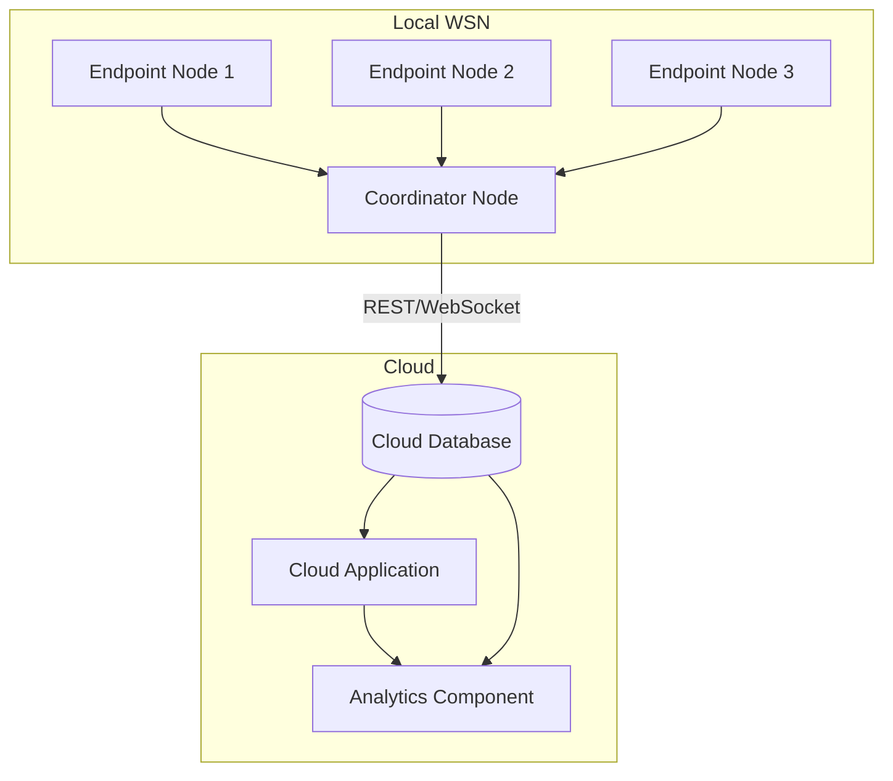
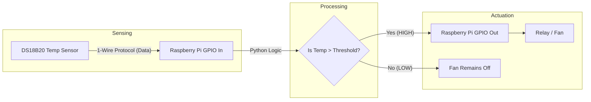

# IoT CIE-1 Important Questions & Answers

## 1 Mark Questions

**1. Define internet of things.**

The Internet of Things (IoT) is defined as a dynamic global network infrastructure with self-configuring capabilities based on standard and interoperable communication protocols. In this network, physical and virtual "things" have identities, physical attributes, and virtual personalities, and they use intelligent interfaces to seamlessly integrate into the information network. *(Page 2)*

**2. List the Domain specific Iots**

The domain-specific IoTs include:
1. Home Automation
2. Cities
3. Environment
4. Energy
5. Retail
6. Logistics
7. Agriculture
8. Industry
9. Health & LifeStyle

*(Pages 3, 15-17)*

**3. What is YANG used for in IoT system management?**

YANG is a data modeling language used to formally model the configuration and state data, as well as the structure and operations, of network devices manipulated by the NETCONF protocol. *(Pages 26, 31)*

**4. Name one function of SNMP in IoT.**

One primary function of SNMP in IoT is monitoring device performance, such as reading temperature sensor data or checking device battery levels and network failures. *(Page 30)*

**5. What is the function of a sensor in an IoT system?**

A sensor's function is to monitor and collect physical or environmental data (such as temperature, humidity, or motion) from the surroundings and convert these changes into electronic data for the IoT system to process. *(Pages 10, 46)*

**6. Explain its characteristics of IoT**

Key characteristics of IoT include:
1. **Dynamic & Self Adapting**: Devices dynamically adapt to changing contexts.
2. **Self Configuring**: Devices setup networking automatically.
3. **Interoperable Communication Protocols**: Devices support standard protocols to communicate.
4. **Unique Identity**: Each device has a unique identifier (like an IP address).
5. **Integrated into Information Network**: Devices exchange data with other systems.

*(Pages 2-3)*

**7. Differentiate between Sensors and Actuators with examples**

A sensor detects physical environmental changes and converts them into data (e.g., a DHT11 temperature and humidity sensor). An actuator receives data or control signals and converts that electrical energy into mechanical physical motion or action (e.g., a motor, a hydraulic piston, or an LED). *(Pages 46-55)*

**8. Explain Embedded Systems in IoT architecture**

An embedded system is a highly specialized computer system containing a microprocessor or microcontroller, memory (RAM/ROM), networking units, and I/O units, all embedded within a device to perform specific, dedicated tasks within the broader IoT architecture. *(Page 11)*

**9. Define software defined networking (SDN)**

Software Defined Networking (SDN) is a networking architecture approach that decouples the control plane and the data plane, enabling the control, management, and programming of network behaviors centrally through software applications using open APIs. *(Page 19)*

**10. Explain network function virtualization (NFV)**

Network Functions Virtualization (NFV) refers to the use of software and virtual machines running on generic servers to replace dedicated physical network appliances (like firewalls, load balancers, and routers) in order to lower expenses and increase network scalability. *(Page 24)*

**11. Explain SNMP Protocol and its applications in IoT**

Simple Network Management Protocol (SNMP) is a legacy protocol used to manage and monitor network devices. In IoT, its applications include reading data from devices via `GET`, changing configurations via `SET`, and receiving alert messages via `TRAP` (e.g., detecting network failures). *(Page 30)*

**12. Define the term "Metadata" in the context of IoT device resources**

Metadata in IoT context refers to "data about data," which describes the properties, semantic context, capabilities, and formatting of the resources provided by an IoT device, helping systems properly discover, interpret, and manage the sensor data. *(General Knowledge)*

**13. State the difference between a Physical Device and a Virtual Entity in IoT**

A Physical Device is the actual hardware (like a sensor or a microcontroller) that interacts with the physical world. A Virtual Entity is the abstract, digital representation or model of that physical device within the system's software/information model. *(Page 28)*

**14. What is the role of the Data Plane in an SDN architecture?**

The Data Plane consists of physical or virtual switches responsible for the actual movement and forwarding of data packets from a source to a destination, based on the flow tables and rules pre-assigned by the central SDN control plane. *(Pages 19, 21)*

**15. What is the full form of YANG in the context of device modeling?**

YANG stands for "Yet Another Next Generation." *(Page 30)*

**16. What is the purpose of the SoC (System on Chip) in a Raspberry Pi compared to a traditional CPU?**

An SoC integrates the CPU, GPU, memory, and peripheral interfaces into a single, compact integrated circuit. In a Raspberry Pi, this provides a complete, low-power mini-processing system capable of running a full Linux OS, unlike a traditional CPU which requires an external motherboard and separate chips to function. *(Page 41)*

**17. Which pin on the Arduino provides a regulated 5V output?**

The `5V` pin on the power header of the Arduino board provides a regulated 5V source output. *(Page 40)*

**18. What role does cloud computing play in IoT?**

Cloud computing provides on-demand, scalable computing, networking, and storage resources over the internet. It acts as the backbone for IoT systems to remotely store massive volumes of sensor data, host applications, and perform computationally intensive Big Data analysis. *(Pages 10, 11)*

**19. What is the focus of physical design in IoT?**

The physical design of IoT focuses on the physical "Things" or hardware devices, detailing their interfaces (I/O, audio, video, memory, connectivity) and how they perform remote sensing, actuation, and direct data exchange over networks. *(Page 3)*

**20. Name one function of SNMP in IoT**

*(Duplicate Question)* One function is to collect system alerts and states by having the device send a `TRAP` alert message when a failure occurs. *(Page 30)*

**21. What is the purpose of the controller in the SDN architecture?**

The SDN controller functions as the "brain" of the control plane. It maintains network visibility, constructs forwarding tables, sets packet handling policies, and sends these flow entries down to the switches in the data plane via southbound APIs. *(Page 21)*

**22. What is the primary function of GPIO pins in Arduino and Raspberry Pi?**

General Purpose Input/Output (GPIO) pins act as the primary physical interfaces allowing the microcontroller or processor to read digital/analog input signals from external sensors and send output signals to control actuators or relays. *(Pages 34, 41)*

**23. Which cable is typically used to connect Arduino to a PC for programming and power?**

A Type B USB cable is typically used to connect an Arduino (like the UNO) to a computer for both power supply and data communication/programming. *(Page 34)*

***

## Long Questions

**1. What are the characteristics of IoT?**

The Internet of Things has several defining characteristics that enable its functionality:
1. **Dynamic & Self Adapting**: IoT devices and systems can dynamically adapt to changing contexts and operating conditions. For example, a surveillance camera switching to night mode automatically.
2. **Self Configuring**: Devices can fetch software upgrades, set up networking, and provision themselves with minimal manual user interaction.
3. **Interoperable Communication Protocols**: Devices support a variety of standard protocols allowing heterogeneous devices from different vendors to communicate.
4. **Unique Identity**: Every IoT device has a unique identifier, such as an IP address or a URI.
5. **Integrated into Information Network**: IoT nodes are woven into the larger internet infrastructure, enabling massive-scale data exchange and cloud processing.

*(Pages 2-3)*

**2. How do IoT levels and templates contribute to designing an efficient IoT architecture?**

IoT Levels (ranging from Level-1 to Level-6) act as architectural templates that classify IoT systems based on their complexity, data volume, and analysis requirements. 

By evaluating the system's needs against these templates, designers can decide the most efficient deployment model. For instance, if a system has low data volume and basic local analysis (like Home Automation), a Level-1 template is sufficient, keeping all components local. Conversely, if a system involves large networks of sensors generating big data requiring computationally intensive analysis (like Forest Fire Detection), designers utilize a Level-5 template which employs distributed coordinator nodes and relies heavily on cloud storage and analytics. This prevents resource bottlenecking and ensures scalability. *(Pages 11-15)*

**3. Analyse the functional differences between SDN and NFV when deployed in a distributed IoT infrastructure.**

While both SDN and NFV aim to virtualize and optimize networking, they serve different functional roles in an IoT infrastructure.

* **Software Defined Networking (SDN):** SDN focuses on separating the network's control plane from the data plane. It centralizes routing decisions into a software-based controller. In a distributed IoT network, this allows administrators to dynamically program traffic flows, route around congestion in real-time, and apply security policies across the entire network from a single console.
* **Network Functions Virtualization (NFV):** NFV focuses on abstracting specific network appliances (like firewalls, load balancers, and gateways). Instead of buying dedicated hardware boxes for every branch of a distributed IoT network, NFV runs these services as virtual machines on standard, low-cost servers.

Together, SDN manages *how* the data packets move between distributed IoT nodes, while NFV manages the *services* applied to those packets. *(Pages 19-25)*

**4. Describe the architecture and functions of SNMP used for IoT system management.**

**Architecture:** The Simple Network Management Protocol (SNMP) architecture comprises three main components: an **SNMP Manager** (the central monitoring system), an **SNMP Agent** (software running on the managed IoT device), and a **Management Information Base (MIB)** (a structured database of device information).

**Functions:**
1. **GET**: The manager reads specific data from the device (e.g., checking battery life).
2. **SET**: The manager alters the device's configuration.
3. **TRAP**: The agent proactively sends alert messages to the manager when a critical event occurs, such as a sensor failure.

While effective for basic monitoring, SNMP is considered somewhat rigid and lacks the complex data modeling capabilities required for modern, large-scale IoT setups. *(Page 30)*

**5. Explain the steps involved in setting up Raspberry Pi for IoT applications. State differences between Arduino and raspberry Pi.**

**Setup Steps:**
1. Install an OS optimized for the hardware, typically Raspbian (a Linux Debian system) on a MicroSD card.
2. Power up the Raspberry Pi and interface with it either via a desktop GUI (using HDMI) or headless via SSH over the network.
3. Create Python scripts using an editor like `nano` to import necessary libraries (e.g., `import board`, `import RPi.GPIO`) to read data from the 40 GPIO pins or actuate attached modules.

**Differences:**
An Arduino is a microcontroller (e.g., ATmega328P) that executes a single compiled program in a continuous bare-metal loop without an operating system. It features built-in analog-to-digital converters (ADC). The Raspberry Pi is a complete mini-computer featuring an ARM microprocessor, RAM, and a full Linux OS capable of multitasking, running web servers, and processing complex analytics, but it lacks native analog inputs. *(Pages 34, 41-45)*

**6. Compare MQTT, COAP and HTTP protocols used in IoT. Design an IoT architecture for smart city traffic monitoring.**

**Comparison:**
1. **HTTP**: Uses a standard Request-Response model over TCP. It is stateless and relatively heavy in bandwidth, making it less ideal for constrained sensors.
2. **CoAP**: A Constrained Application Protocol designed specifically for M2M communication on constrained devices. It also uses a Request-Response model but runs over UDP, reducing overhead.
3. **MQTT**: Uses a lightweight Publish-Subscribe model managed by a central Broker. It runs over TCP, is highly efficient, and is perfect for real-time telemetry data in low-bandwidth environments.

**Smart City Traffic Architecture:**
A Level-5 IoT architecture is ideal. End nodes (traffic cameras, road pressure sensors) publish data via MQTT to local Coordinator nodes (Edge Gateways). These gateways aggregate the data and forward it over high-speed networks to a central Cloud Application. The Cloud runs analytics to monitor traffic jams and dynamically sends control commands via REST/WebSocket to adjust traffic light timings across the city. *(Pages 5-6, 14-15)*

**7. Explain how SDN improves scalability in large IoT networks**

In traditional networks, each physical switch contains both a data plane and a control plane, requiring manual configuration of every switch when scaling up. SDN solves this by decoupling the control plane into a centralized software application (the SDN Controller).

When adding thousands of new IoT devices, the centralized controller automatically pushes forwarding rules and flow tables down to the new data-plane switches. This eliminates the need for node-by-node configuration. Furthermore, SDN allows applications to be deployed rapidly and traffic to be load-balanced dynamically using automated scripts, providing infinite scalability without massive operational overhead. *(Pages 20-21, 24)*

**8. Compare NETCONF and SNMP for network device management**

| Feature | SNMP | NETCONF + YANG |
| :--- | :--- | :--- |
| **Primary Use** | Monitoring | Data Modeling + Configuration |
| **Data Structure** | MIB (Management Information Base) | YANG Models (Highly structured) |
| **Configuration** | Basic, limited manipulation | Advanced, allows rollback and transaction validation |
| **Security** | Moderate | Strong, heavily relies on SSH-based security |
| **Scalability** | Struggles with modern configurations | Highly scalable, ideal for automated modern networks |

*Modern IoT setups prefer NETCONF alongside YANG due to its strong transactional integrity (ACID properties) and structured validation.* *(Pages 30-32)*

**9. Explain Raspberry Pi architecture and features**

The Raspberry Pi (e.g., Model 3 B) is a robust mini-processing system.

**Features & Architecture:**
1. **Processor**: Runs on a 64-bit ARM Cortex Quad-Core CPU (e.g., 1.2GHz or 1.5GHz).
2. **Memory**: Features onboard RAM ranging from 1GB up to 8GB depending on the model.
3. **Connectivity**: Includes an onboard Wi-Fi and Bluetooth 4.1 communication module, along with a 10/100 LAN Ethernet port.
4. **Interfaces**: Features 4 USB ports, a full-size HDMI video output, a 3.5mm audio/video jack, a CSI camera port, and a DSI display port.
5. **GPIO**: Provides a 40-pin extended GPIO header allowing direct interface with external sensors, LEDs, and standard communication buses (I2C, SPI, UART).
6. **Storage**: Booted and operated entirely from a MicroSD card slot. 

*(Pages 41-43)*

**10. Explain I2C communication protocol**

I2C (Inter-Integrated Circuit) is a synchronous, half-duplex serial communication protocol frequently used in IoT to connect multiple microcontrollers and peripheral modules over short distances.

It operates using only two wires connected to pull-up resistors:
1. **SDA (Serial Data Line)**: Transmits and receives the actual data payload.
2. **SCL (Serial Clock Line)**: Carries the clock signal generated by the Master to synchronize data transfer.

Unlike SPI, I2C does not use "Chip Select" lines; instead, the Master sends a 7-bit address down the SDA line to wake up the specific target slave device. This allows multiple masters and multiple slaves to coexist efficiently on a minimal wiring footprint, though at slightly slower data rates than SPI. *(Pages 38, Web/General)*

**11. Explain the IoT Level-5 architecture. Why is a "Coordinator" node essential in this level?**

**Architecture:** IoT Level-5 consists of multiple endpoint nodes that perform localized sensing and actuation. Instead of sending data directly to the internet, these end nodes send their data to a central "Coordinator" node. The coordinator acts as a gateway, formatting the data and forwarding it to the Cloud, where data storage, heavy analytics, and the application layer reside.

**Why Coordinator is Essential:** Endpoint nodes in Level-5 are usually part of a Wireless Sensor Network (WSN) operating on low-power protocols like Zigbee or BLE. These constrained devices lack the power and protocol stacks to communicate directly with standard IP-based internet clouds. The Coordinator bridges this gap by gathering local telemetry and providing the heavy-duty internet uplink (e.g., Wi-Fi or Ethernet). *(Pages 14-15)*

```mermaid
graph TD
    subgraph Local_Network ["Local WSN"]
        E1["Endpoint Node 1"] --> C["Coordinator Node"]
        E2["Endpoint Node 2"] --> C
        E3["Endpoint Node 3"] --> C
    end
    subgraph Cloud_Infrastructure ["Cloud"]
        C -->|REST/WebSocket| D[("Cloud Database")]
        D --> A["Cloud Application"]
        A --> AN["Analytics Component"]
        D --> AN
    end
```

**12. Analyze the functional blocks of an IoT system. How do the "Service" and "Management" blocks interact to ensure system reliability?**

An IoT system relies on several functional blocks: **Device** (sensing/actuation), **Communication** (protocols), **Services** (data publishing, device discovery), **Management** (governance), **Security** (authentication), and **Application** (user interface).

**Interaction for Reliability:** The **Service** block performs active duties like discovering new devices on the network and publishing their data states. The **Management** block governs these processes by tracking operational metadata. If the Service block encounters a failing sensor or uncalibrated state, the Management block steps in to execute system-wide configuration updates, trigger diagnostic rollbacks (via tools like NETCONF), or issue alerts. This continuous loop of the Service block collecting state data and the Management block validating it ensures the entire system remains reliable and self-healing. *(Pages 6, 26)*

**13. Explain the concept of Interoperability in IoT. Why is it a significant challenge in multi-vendor environments?**

Interoperability is the ability of different IoT devices, software systems, and network protocols to connect, communicate, and exchange data seamlessly.

**The Challenge:** In multi-vendor environments, different manufacturers often utilize proprietary data formats, differing physical layer technologies (like ZigBee vs. Z-Wave), and unique APIs. Because there is a lack of a single, universally adopted global standard, making a sensor built by Vendor A "talk" directly to a management platform built by Vendor B requires complex middleware, protocol translators, or standardized models like YANG to bridge the gaps. Without interoperability, IoT ecosystems suffer from "vendor lock-in" and fragmented silos. *(Page 2, Web/General)*

**14. Differentiate between M2M and IoT based on three parameters: Communication type, Data handling, and Hardware focus.**

| Parameter | M2M (Machine-to-Machine) | IoT (Internet of Things) |
| :--- | :--- | :--- |
| **Communication type** | Point-to-point communication (often over cellular or wired hardware networks) without relying heavily on IP networks. | Uses standard, IP-based networks to connect devices globally to internet clouds. |
| **Data Handling** | Closed systems. Data is used primarily for specific, isolated application control and is rarely shared. | Open systems. Data is pushed to the cloud, aggregated with massive datasets, and used for advanced Big Data analytics. |
| **Hardware Focus** | Primarily hardware-centric, focusing on dedicated machines embedded with cellular or radio communication modules. | Software-centric, focusing heavily on cloud architectures, open APIs, virtualization, and smart analytics platforms. |

*(General Knowledge inferred from course content)*

**15. How does the Raspberry Pi OS (Linux-based) provide an advantage over the Arduino's Bare-Metal programming for complex IoT applications?**

The Arduino operates on bare-metal architecture, meaning it repeatedly executes a single `void loop()` without an operating system. This is highly efficient for real-time, low-level hardware timing but limits multitasking.

The Raspberry Pi utilizes a full Linux Debian-based OS (Raspbian). This gives it a massive advantage for complex IoT applications because it can handle true multitasking—running a web server, managing an SQL database, and processing a Python machine-learning script simultaneously. It offers advanced networking stacks, file system management, and high-level software libraries (like `busio` or `numpy`), which are necessary for heavy data aggregation, edge computing, and complex cloud connectivity. *(Pages 34, 41, 44)*

**16. Analyze the GPIO pinout of a Raspberry Pi. Explain the steps to interface a PIR motion sensor and trigger a camera module when motion is detected.**

The Raspberry Pi contains a 40-pin extended GPIO header featuring 5V pins, 3.3V pins, Ground (GND) pins, and programmable digital I/O pins.

**Interfacing Steps:**
1. **Wiring**: Connect the PIR sensor's `VCC` pin to a 5V pin on the Pi, the `GND` pin to a Pi `GND`, and the data `OUT` pin to a specific digital GPIO pin (e.g., GPIO 4). Connect the Camera module to the dedicated CSI (Camera Serial Interface) port on the board.
2. **Software Setup**: In a Python script, import the `RPi.GPIO` library and the `picamera` library.
3. **Logic**: Set the PIR GPIO pin as an `INPUT`. Use a `while` loop or interrupt event to monitor the pin's state. When the PIR detects motion, its `OUT` pin sends a `HIGH` signal (3.3V) to the Pi.
4. **Trigger**: Upon reading the `HIGH` state, the Python script calls the camera library function (e.g., `camera.capture()`) to take a photo and save it to the file system. 

*(Pages 41, 43, 53)*

**17. How are sensors and actuators integrated into the design of IoT systems, and how do they affect system performance?**

Sensors and actuators form the foundation of the **Device** functional block in the IoT physical design. Sensors are integrated via physical hardware interfaces (like GPIO, I2C, SPI) to collect dynamic parameters (heat, pressure, motion). This data is passed through communication layers up to the controller or cloud. The system processes the data, makes decisions, and sends signals back down to actuators (like relays or motors) to affect physical change.

**Effect on Performance:** The overall responsiveness and reliability of the IoT system depend heavily on them. High-quality, properly calibrated sensors (like a DHT22 over a DHT11) ensure the accuracy of the Big Data generated. If sensors suffer from latency or analog noise, the central analytics will output poor decisions, subsequently causing incorrect actuator triggers, which ruins operational reliability. *(Pages 3, 6, 46-55)*

**18. How do wireless sensor networks (WSNs) work in IoT systems, and what role do they play in collecting and sending data?**

A Wireless Sensor Network (WSN) comprises distributed endpoints or nodes equipped with specific sensors (like soil moisture or air quality monitors).

**How it Works:** These end nodes connect wirelessly (using low-power protocols like IEEE 802.15.4 / ZigBee) to routers, which relay the telemetry to a central **Coordinator**.

**Role in Data:** The WSN acts as the sensory nervous system across large, physically distributed areas (like agricultural fields or structural bridges). Since individual nodes lack the power to connect to the broad internet, the WSN effectively aggregates granular environmental data locally. The Coordinator then acts as the primary gateway, translating the low-power signals into standard IP packets and pushing the massive data blocks to the cloud for analysis. *(Pages 10, 14-15)*

**19. Identify the key features of NETOPEER and explain how it enhances configuration and control in IoT networks.**

**Key Features:**
1. **NETCONF Implementation**: NETOPEER is a robust server implementation of the NETCONF protocol.
2. **YANG Compatibility**: It utilizes YANG data models to strictly define what data can be configured and how it is structured.
3. **Secure**: It securely processes management operations over SSH.

**Enhancement in Control:** It enhances configuration in IoT by replacing basic monitoring with advanced transactional setups. It allows network managers to issue commands that manipulate device structures systematically. Because it uses YANG models, the system can validate if a configuration is correct *before* executing it. It also utilizes a "Rollback Manager," meaning if an IoT configuration fails, NETOPEER can revert the system to a previous stable state, vastly increasing system reliability and large-scale automation. *(Pages 31-32)*

**20. Apply SDN and NFV in an industrial IoT system and show how they help improve resource use, system growth, and automation.**

In an industrial IoT environment (like a massive automated factory), immense traffic routing and tight security boundaries are required.

**Applying SDN**: The factory implements an SDN Controller to manage the entire data floor. If a robotic assembly line needs high-bandwidth, low-latency data for video analytics, the SDN controller dynamically re-routes traffic priorities across the data plane.

**Applying NFV**: Instead of buying expensive hardware firewalls for every factory sub-network, NFV creates virtual firewalls running on generic server racks to isolate and secure robot communications.

**Improvements**:
* **Resource Use**: NFV reduces capital expenditure (CAPEX) by using generic servers instead of specialized hardware.
* **System Growth**: The network scales simply by spinning up new virtual functions (NFV) and dropping new flow tables via the central controller (SDN) without touching wiring.
* **Automation**: Engineers write scripts via Northbound APIs to the SDN controller, completely automating factory network provisioning based on real-time loads. 

*(Pages 19-25)*

**21. Explain the difference between analog and digital signals, and how Raspberry Pi and Arduino handle them using their input/output pins.**

**Difference**: 
A digital signal represents discrete, binary states (e.g., 0V or 5V; LOW or HIGH). An analog signal is a continuous wave representing an infinite scale of voltages within a range (e.g., a potentiometer outputting anywhere between 0V to 5V).

**Arduino Handling**: 
The Arduino has dedicated Analog In pins (A0-A5) equipped with a hardware Analog-to-Digital Converter (ADC). It natively reads analog signals and converts them to digital values (0-1023). It handles digital signals easily via its standard digital GPIO pins.

**Raspberry Pi Handling**: 
The Raspberry Pi only contains digital GPIO pins. It inherently understands HIGH and LOW states but cannot natively process continuous analog voltages. To handle analog sensors (like a moisture sensor), the Pi requires an external ADC microchip (such as the MCP3008) wired between the sensor and the Pi to convert the analog wave into digital bits via SPI communication. *(Pages 34, 40, 50)*

**22. How can you connect a temperature sensor to a Raspberry Pi using GPIO pins, read data from it, and use that data to control an output device?**

Using a sensor like the DS18B20 digital temperature sensor:

1. **Hardware Connection**: Connect the sensor's VCC to the Pi's 3.3V pin, GND to Ground, and the Data pin to a specific digital GPIO pin. Because it is a 1-Wire sensor, attach a 4.7kΩ pull-up resistor between the VCC and Data line. Connect an output device (like an LED or a relay module for a fan) to another GPIO pin and Ground.
2. **Software Reading**: In Python, import the necessary OS/File libraries to read the 1-Wire bus system directories that the Pi OS creates for the sensor. Extract the temperature variable from the data stream.
3. **Control Logic**: Implement an `if/else` loop. If the temperature string converts to a float greater than a set threshold (e.g., `temp > 30.0`), use the `RPi.GPIO` or `board` library to output a `HIGH` signal to the output device's GPIO pin (e.g., `led.value = True`), turning on the fan. 

*(Pages 41, 45, 48)*

```mermaid
graph LR
    subgraph Input ["Sensing"]
        A["DS18B20 Temp Sensor"] -- "1-Wire Protocol (Data)" --> B["Raspberry Pi GPIO In"]
    end
    subgraph Logic ["Processing"]
        B -- "Python Logic" --> C{"Is Temp > Threshold?"}
    end
    subgraph Output ["Actuation"]
        C -- "Yes (HIGH)" --> D["Raspberry Pi GPIO Out"]
        D --> E["Relay / Fan"]
        C -- "No (LOW)" --> F["Fan Remains Off"]
    end
```
