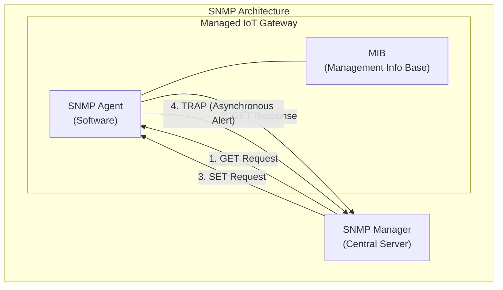
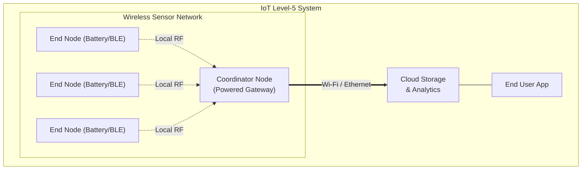

# IoT CIE-1 Exam Preparation Guide

---

## Part A: 1-Mark Questions

### 1. Define internet of things.
\
**Answer:** The Internet of Things (IoT) is a massive, interconnected network of physical devices embedded with sensors, software, and communication hardware. These "things" collect, process, and exchange data with other devices and cloud systems over the internet, typically without requiring active human intervention.

### 2. List the Domain specific IoTs.
\
**Answer:** Domain-specific IoT refers to IoT networks tailored for particular industries. Major examples include **Smart Homes** (automation), **Smart Cities** (traffic and waste management), **Industrial IoT or IIoT** (manufacturing and predictive maintenance), **Smart Agriculture** (soil and crop monitoring), and **Healthcare IoT** (remote patient monitoring).

### 3. What is YANG used for in IoT system management?
\
**Answer:** YANG (Yet Another Next Generation) is a formal data modeling language. In IoT network management, it is used to strictly define the structure, configuration data, and state data of network devices, which is then transported and manipulated using the NETCONF protocol.

### 4. Name one function of SNMP in IoT.
\
**Answer:** One primary function of SNMP (Simple Network Management Protocol) in IoT is **performance and health monitoring**. It allows administrators to poll remote edge devices to check their uptime, monitor CPU or bandwidth usage, and receive automated alerts (Traps) if a device fails.

### 5. What is the function of a sensor in an IoT system?
\
**Answer:** A sensor acts as the input mechanism for an IoT system. Its primary function is to detect physical parameters or changes in the surrounding environment (such as temperature, humidity, motion, or pressure) and convert these physical phenomena into readable electrical signals or digital data for the microcontroller to process.

### 6. Explain its characteristics of IoT.
\
**Answer:** The key characteristics of IoT include **Connectivity** (devices must be linked to a network), **Dynamic and Self-Adapting** behavior (devices adjust to environmental changes), **Enormous Scale** (networks can comprise millions of nodes), and **Unique Identity** (each device has a unique IP or URI for addressing).

### 7. Differentiate between Sensors and Actuators with examples.
\
**Answer:** A **sensor** monitors the environment and collects input data (e.g., a PIR sensor detecting human motion). An **actuator** takes electrical control signals from the system and converts them into physical action or output (e.g., a relay turning on a light bulb, or a servo motor opening a valve).

### 8. Explain Embedded Systems in IoT architecture.
\
**Answer:** An embedded system is a specialized computing system that functions as the "brain" of an IoT node. It typically consists of a microcontroller (like an Arduino) or microprocessor (like a Raspberry Pi), embedded memory, and specific software (firmware) designed to perform a dedicated task, such as reading sensor data and transmitting it over a network. 

### 9. Define software defined networking (SDN).
\
**Answer:** Software-Defined Networking (SDN) is a modern network architecture that separates the network's **control plane** (the logic that decides where traffic goes) from the **data plane** (the underlying hardware that forwards the traffic). This allows network administrators to centrally and programmatically control network behavior using software applications.

### 10. Explain network function virtualization (NFV).
\
**Answer:** Network Function Virtualization (NFV) is the process of replacing dedicated, proprietary networking hardware (like physical firewalls, load balancers, and routers) with software-based virtual machines. These virtual functions run on standard, commercial off-the-shelf (COTS) servers, highly reducing hardware costs and increasing deployment flexibility.

### 11. Explain SNMP Protocol and its applications in IoT.
\
**Answer:** SNMP is an application-layer protocol used heavily in network management. In IoT, it is applied to manage large fleets of gateway devices. It allows a central server to query devices for status updates (`GET`), change their configurations remotely (`SET`), and listen for critical system warnings (`TRAPS`) like a sudden loss of network connectivity.

### 12. Define the term "Metadata" in the context of IoT device resources.
\
**Answer:** Metadata is fundamentally "data that describes other data." In IoT, raw sensor data (e.g., "25") is meaningless on its own. Metadata provides the necessary context, such as the unit of measurement ("Celsius"), the timestamp of the reading, the sensor's geographic location, and the device ID.

### 13. State the difference between a Physical Device and a Virtual Entity in IoT.
\
**Answer:** A **physical device** is the actual, tangible piece of hardware deployed in the real world, like a smart thermostat on a wall. A **virtual entity** (often called a Digital Twin) is the software representation or data model of that physical device stored in the cloud, which mimics its current state and allows applications to interact with the device virtually.

### 14. What is the role of the Data Plane in an SDN architecture?
\
**Answer:** The Data Plane, also known as the forwarding plane, consists of the actual network switches and routers. Its sole role is to execute the forwarding rules dictated by the SDN Controller (the Control Plane), moving data packets from incoming ports to the correct outgoing ports efficiently.

### 15. What is the full form of YANG in the context of device modeling?
\
**Answer:** YANG stands for **Yet Another Next Generation**. It is an IETF standard modeling language used specifically to model network configuration data.

### 16. What is the purpose of the SoC (System on Chip) in a Raspberry Pi compared to a traditional CPU?
\
**Answer:** An SoC integrates almost all critical computer components—including the CPU, GPU, RAM, and input/output controllers—onto a single silicon chip. Compared to a traditional multi-chip CPU motherboard, an SoC drastically reduces power consumption, physical size, and manufacturing cost, making it ideal for compact IoT edge devices.

### 17. Which pin on the Arduino provides a regulated 5V output?
\
**Answer:** The pin labeled **5V** located in the power header section of the Arduino board provides a regulated 5-volt DC output. This pin is commonly used to power external components like sensors, breadboards, and small displays.

### 18. What role does cloud computing play in IoT?
\
**Answer:** Cloud computing provides the centralized infrastructure needed to support massive IoT deployments. It offers virtually limitless storage for accumulating historical sensor data, powerful compute resources to run complex machine learning analytics on that data, and globally accessible platforms to build user-facing dashboards and applications.

### 19. What is the focus of physical design in IoT?
\
**Answer:** The physical design of an IoT system focuses on the tangible, hardware-level architecture. It defines the specific types of IoT nodes (sensors, actuators, edge devices), the physical network topology, and the hardware communication interfaces (like USB, I2C, SPI) required to build the physical network.

### 20. Name one function of SNMP in IoT.
\
**Answer:** *(Note: Duplicate of Q4)* A key function of SNMP is **fault management**. It allows IoT gateway devices to instantly notify a central management server if a critical error occurs, ensuring rapid response to hardware or network failures.

### 21. What is the purpose of the controller in the SDN architecture?
\
**Answer:** The SDN Controller acts as the "brain" of the network. It maintains a global, comprehensive view of the entire network topology and translates the administrator's high-level network policies into low-level forwarding rules, which it then pushes down to the data plane switches.

### 22. What is the primary function of GPIO pins in Arduino and Raspberry Pi?
\
**Answer:** General Purpose Input/Output (GPIO) pins act as the physical bridge between the microcontroller's software and the real world. They are programmed to act either as **inputs** (reading electrical voltages from sensors) or as **outputs** (sending electrical voltages to trigger actuators like LEDs or motors).

### 23. Which cable is typically used to connect Arduino to a PC for programming and power?
\
**Answer:** A standard **USB Type-A to Type-B** cable (commonly known as a printer cable) is used to connect an Arduino Uno to a computer. This single cable facilitates the transfer of compiled code from the IDE to the board and supplies the necessary 5V power to run the microcontroller.

---

## Part B: Long Questions

### 1. What are the characteristics of IoT?
\
**Answer:** The Internet of Things represents a paradigm shift in computing, defined by several core characteristics that distinguish it from standard internet applications:
* **Dynamic and Self-Adapting:** IoT devices must be capable of dynamically adapting to changing contexts. For example, a smart camera can automatically switch to infrared night mode when light levels drop, or a system can lower its transmission rate if network bandwidth becomes constrained.
* **Self-Configuring:** Large IoT deployments require devices that can connect to the network, fetch their required configurations, and register themselves with cloud platforms with minimal human intervention.
* **Interoperable Communication Protocols:** IoT systems rely on a diverse mix of specialized protocols (like MQTT, CoAP, Zigbee, and BLE) to ensure that heterogeneous devices from different manufacturers can communicate effectively.
* **Unique Identity:** Every IoT node requires a unique identifier (such as an IPv6 address, MAC address, or universal resource identifier) so that the control system can query, update, or command individual devices among millions.
* **Enormous Scale:** Unlike traditional IT networks, an IoT network might consist of hundreds of thousands of endpoints. The architecture must be inherently scalable to manage the massive influx of data and connections.

### 2. How do IoT levels and templates contribute to designing an efficient IoT architecture?
\
**Answer:** Designing an IoT system from scratch is complex. **IoT Levels (1 through 6)** and **Templates** provide standardized blueprints that streamline this process by aligning the system architecture with the specific operational requirements.
* **IoT Levels:** These levels categorize architectures based on where data is processed, the complexity of the nodes, and the volume of data. 
    * *Level 1* is entirely local; a single device collects data, analyzes it, and controls an actuator without cloud reliance (e.g., a simple room thermostat).
    * *Level 6* involves independent end nodes, centralized cloud computing, and complex cloud-based analytics (e.g., a city-wide smart grid). By selecting the correct level, engineers avoid over-engineering simple problems or under-powering complex ones.
* **IoT Templates:** Templates provide modular definitions for the functional blocks of a system (Device, Communication, Services, Management, Application). By using standardized templates, developers can ensure interoperability, reuse existing codebases, and maintain a clear separation of concerns, drastically reducing development time and improving overall system efficiency.

### 3. Analyse the functional differences between SDN and NFV when deployed in a distributed IoT infrastructure.
\
**Answer:** Both Software-Defined Networking (SDN) and Network Function Virtualization (NFV) are heavily utilized to make IoT infrastructures more flexible and scalable, but they address entirely different aspects of network management. 

| Feature | SDN (Software-Defined Networking) | NFV (Network Function Virtualization) |
| :--- | :--- | :--- |
| **Primary Goal** | Centralize network control and routing logic. | Replace dedicated hardware appliances with software. |
| **Mechanism** | Separates the Control Plane from the Data Plane. | Decouples network functions from proprietary hardware. |
| **IoT Application** | Dynamically reroutes traffic if an IoT gateway becomes congested; creates isolated "slices" for critical sensor data. | Deploys virtual firewalls, load balancers, or intrusion detection systems directly onto edge servers. |
| **Focus** | How data packets are moved through the network. | The services and security functions applied to the data. |

**In a distributed IoT system:** NFV allows a company to spin up a virtual security gateway at a remote factory using standard servers rather than shipping specialized hardware. SDN then manages how the thousands of factory sensors route their traffic through that newly created virtual gateway.

### 4. Describe the architecture and functions of SNMP used for IoT system management.
\
**Answer:** The Simple Network Management Protocol (SNMP) is a legacy, yet robust, architecture used to monitor the health and performance of IoT gateways and routers. 


```mermaid
graph TD
    subgraph snmp_architecture ["SNMP Architecture"]
        M["SNMP Manager\n(Central Server)"]
        subgraph agent_node ["Managed IoT Gateway"]
            A["SNMP Agent\n(Software)"]
            MIB["MIB\n(Management Info Base)"]
            A --- MIB
        end
        M -->|1. GET Request| A
        A -->|2. GET Response| M
        M -->|3. SET Request| A
        A -->|"4. TRAP (Asynchronous Alert)"| M
    end
```
**Architecture Components:**
1.  **SNMP Manager:** A centralized software console used by network administrators to monitor the network.
2.  **SNMP Agent:** A software module running on the managed IoT device (like a router). It collects local operational data.
3.  **MIB (Management Information Base):** A hierarchical database on the device that structures the data the agent collects using Object Identifiers (OIDs).

**Functions:**
* **Polling (GET):** The Manager requests specific data points (e.g., CPU load) from the Agent.
* **Configuration (SET):** The Manager sends a command to alter a configuration value in the MIB.
* **Alerting (TRAP):** If a critical event occurs (like a port failure), the Agent autonomously sends a Trap message to the Manager without waiting to be polled, enabling rapid incident response.

### 5. Explain the steps involved in setting up Raspberry Pi for IoT applications. State differences between Arduino and Raspberry Pi.
\
**Answer:** Setting up a Raspberry Pi transforms it from a bare board into a fully functional edge-computing node.
**Setup Steps:**
1.  **OS Installation:** Download the Raspberry Pi Imager and flash a microSD card with a Linux-based OS (typically Raspberry Pi OS).
2.  **Hardware Connection:** Insert the microSD card, connect a keyboard, mouse, monitor (via HDMI), and power the device using a 5V USB-C or Micro-USB supply.
3.  **Initial Configuration:** Boot the OS, connect to the local Wi-Fi, and open the `raspi-config` terminal utility.
4.  **Enable IoT Interfaces:** Within `raspi-config`, explicitly enable necessary communication interfaces such as SSH (for remote access), I2C, SPI, and 1-Wire.
5.  **Environment Setup:** Update the package lists (`sudo apt update`) and install necessary programming libraries (like Python's `RPi.GPIO` or `gpiozero`).

**Differences:**
* **Computing Power:** Arduino is a simple *microcontroller* designed to execute a single, highly repetitive task (like reading a sensor) with absolute real-time precision. Raspberry Pi is a complex *microprocessor* running a full operating system.
* **Multitasking:** Arduino runs one loop continuously (bare-metal). The Pi can multitask, meaning it can simultaneously read sensors, host a database, and run a web server.
* **Connectivity:** Pi has native Wi-Fi, Ethernet, and Bluetooth. Standard Arduinos require external shields or modules for internet connectivity.

### 6. Compare MQTT, CoAP and HTTP protocols used in IoT. Design an IoT architecture for smart city traffic monitoring.
\
**Answer:** Choosing the right communication protocol is critical based on device constraints and network reliability.

* **HTTP (Hypertext Transfer Protocol):** A heavy, robust Client/Server protocol. It relies on TCP, making it highly reliable but very resource-intensive. It is generally avoided for battery-powered sensors due to large header overheads.
* **MQTT (Message Queuing Telemetry Transport):** A lightweight Publish/Subscribe protocol running over TCP. Devices (Publishers) send data to a central Broker, which distributes it to interested Subscribers. It is excellent for low-bandwidth environments and code-constrained devices.
* **CoAP (Constrained Application Protocol):** A specialized web transfer protocol for heavily constrained nodes. It uses a Client/Server model like HTTP but runs over UDP to minimize overhead and power consumption.

**Smart City Traffic Architecture:**
1.  **Perception Layer:** Inductive loop sensors and low-power cameras at intersections collect traffic density data. They use **CoAP** over a low-power wireless network to send small data packets locally.
2.  **Edge/Gateway Layer:** Roadside IoT gateways aggregate this CoAP data. They translate the data and **Publish** it to a central server using **MQTT** over standard cellular networks (4G/5G).
3.  **Cloud Layer:** A central MQTT Broker receives the data and routes it to an analytics application. The application updates city dashboards via standard **HTTP/WebSockets** and publishes new timing sequences back to the traffic light controllers via MQTT.

### 7. Explain how SDN improves scalability in large IoT networks.
\
**Answer:** Traditional networking relies on distributed control; every individual router and switch must be manually configured with routing tables and security policies. In a massively scaling IoT network (where thousands of devices are added monthly), this manual approach becomes an unmanageable bottleneck. 

Software-Defined Networking (SDN) fundamentally solves this scalability issue by centralizing the network's intelligence. 
* **Centralized Provisioning:** Administrators interact with a single, central SDN Controller. When a new subnet of 500 IoT sensors is deployed, the administrator defines the routing and security policies once in the software controller.
* **Automated Deployment:** The SDN Controller uses standard protocols (like OpenFlow) to automatically push these new forwarding rules down to the data plane switches in real-time. 
* **Dynamic Adaptation:** If network traffic spikes from a specific sensor array, the SDN controller can automatically recalculate optimal paths and reprogram the switches on the fly, ensuring the network scales elastically without human intervention.

### 8. Compare NETCONF and SNMP for network device management.
\
**Answer:** While both protocols serve to manage network devices, NETCONF was designed to overcome the severe limitations of SNMP in modern, complex networks.

* **Data Modeling:** SNMP relies on Management Information Bases (MIBs) and simple OIDs, which are unstructured and difficult to read. NETCONF utilizes **YANG**, a highly structured modeling language that clearly defines how configuration data should be formatted.
* **Operations:** SNMP essentially only offers basic `GET` and `SET` commands. NETCONF uses Remote Procedure Calls (RPCs) formatted in XML, allowing for complex, nested configuration commands.
* **Reliability & Transport:** SNMP traditionally runs over UDP, meaning a configuration command could get lost in transit without the manager knowing. NETCONF runs over SSH (TCP), ensuring secure, reliable, and verified delivery.
* **Transactions:** The most significant difference is transactional support. If an administrator uses NETCONF to update 10 settings on a router and the 9th setting fails, NETCONF rolls back the entire transaction to prevent the router from breaking. SNMP cannot do this.

### 9. Explain Raspberry Pi architecture and features.
\
**Answer:** The Raspberry Pi is a series of single-board computers built around a Broadcom System-on-Chip (SoC). Its architecture is designed to provide PC-level capabilities in a credit-card-sized footprint.
* **Core Processing:** It features an ARM Cortex CPU (ranging from single-core in early models to quad-core in the Pi 4/5) and a fully integrated VideoCore GPU capable of decoding high-definition video.
* **Memory and Storage:** It utilizes onboard RAM (1GB to 8GB) and relies entirely on a removable microSD card to house its Linux operating system and user data.
* **Extensive Connectivity:** Modern Pi architectures include built-in dual-band Wi-Fi, Bluetooth/BLE, Gigabit Ethernet, and multiple USB (2.0 and 3.0) ports for peripherals.
* **IoT Interfacing:** The defining feature is the **40-pin GPIO header**. These pins allow direct electrical interaction with physical hardware. The architecture supports standard digital input/output, Hardware PWM (Pulse Width Modulation) for motor control, and specialized serial protocols like I2C and SPI for communicating with advanced sensors and displays.

### 10. Explain I2C communication protocol.
\
**Answer:** I2C (Inter-Integrated Circuit) is a widely used, synchronous serial communication protocol developed to attach lower-speed peripheral integrated circuits to microcontrollers. It is highly valued in IoT for its simplicity and efficiency.

It operates using only two functional wires (plus ground):
1.  **SDA (Serial Data Line):** The bidirectional line used to actually transmit the data bits.
2.  **SCL (Serial Clock Line):** The line that carries the clock signal generated by the Master device to synchronize the data transfer.

**How it works:** I2C utilizes a Master-Slave architecture. The microcontroller (e.g., Arduino) acts as the Master. Every sensor or display attached to the bus acts as a Slave and has a unique 7-bit or 10-bit hexadecimal address. When the Master wants to communicate, it transmits the target address over the SDA line. Only the Slave matching that address responds. This allows dozens of sensors to be daisy-chained to the exact same two pins on a microcontroller, saving immense physical space and wiring complexity.

### 11. Explain the IoT Level-5 architecture. Why is a "Coordinator" node essential in this level?
\
**Answer:** IoT Level-5 is a complex architecture typically deployed in environments like Wireless Sensor Networks (WSNs) for smart agriculture or structural monitoring, where end nodes are distributed over a wide area.


```mermaid
graph TD
    subgraph level_5 ["IoT Level-5 System"]
        subgraph wsn ["Wireless Sensor Network"]
            E1["End Node (Battery/BLE)"]
            E2["End Node (Battery/BLE)"]
            E3["End Node (Battery/BLE)"]
            C["Coordinator Node\n(Powered Gateway)"]
        end
        Cloud["Cloud Storage\n& Analytics"]
        App["End User App"]
        
        E1 -.->|Local RF| C
        E2 -.->|Local RF| C
        E3 -.->|Local RF| C
        C ==>|Wi-Fi / Ethernet| Cloud
        Cloud --- App
    end
```

**Why a Coordinator is Essential:**
In a Level-5 system, the End Nodes are usually highly constrained—they run on batteries, have very weak processors, and utilize low-power, short-range radios (like Zigbee or Bluetooth). They do not have the power, network stack, or hardware to connect directly to the Internet. 
The **Coordinator Node** acts as a crucial bridge. It is physically wired to a power source and has high computing capability. It collects the low-power RF data from all the local end nodes, aggregates it, translates it into standard IP protocols, and transmits it over Wi-Fi or Cellular to the Cloud. Without the Coordinator, the sensor network would be entirely isolated.

### 12. Analyze the functional blocks of an IoT system. How do the "Service" and "Management" blocks interact to ensure system reliability?
\
**Answer:** A complete IoT system relies on a stack of functional blocks:
* **Device:** The hardware sensors and microcontrollers.
* **Communication:** The protocols mapping data across networks.
* **Services:** The logic that exposes device capabilities (APIs), handles device discovery, and performs data analytics.
* **Management:** The block responsible for device provisioning, health monitoring, firmware updates, and tracking CPU/battery status.
* **Security:** Handles authentication and encryption.
* **Application:** The user-facing dashboard.

**Interaction for Reliability:** The **Management** block constantly monitors the hardware state of the Device block. If the Management block detects an anomaly—for example, a sensor's battery dropping below 10%, or the CPU overheating—it immediately communicates this context to the **Service** block. The Service block can then autonomously trigger a reliability protocol, such as halting intensive local machine learning analytics or reducing the data transmission frequency, thereby extending the life of the failing node and preventing system-wide data corruption.

### 13. Explain the concept of Interoperability in IoT. Why is it a significant challenge in multi-vendor environments?
\
**Answer:** Interoperability is the ability of disparate computing systems, software platforms, and hardware devices to connect seamlessly, exchange data, and use the information that has been exchanged without requiring complex, custom integration efforts.

**The Multi-Vendor Challenge:**
In the current IoT landscape, interoperability is a massive hurdle because manufacturers frequently develop isolated "walled gardens." Vendor A might build a smart thermostat using a proprietary 900MHz radio protocol and a closed cloud API. Vendor B might build smart blinds using standard Zigbee. 
Because there is no universally enforced standard at the application layer, getting Vendor A's thermostat to automatically close Vendor B's blinds to cool a room is incredibly difficult. It requires developers to build complex, custom middleware to translate the varying data formats and protocols. This fragmentation stifles innovation, increases deployment costs, and frustrates end-users who expect seamless automation.

### 14. Differentiate between M2M and IoT based on three parameters: Communication type, Data handling, and Hardware focus.
\
**Answer:** While Machine-to-Machine (M2M) is the historical foundation of IoT, the two paradigms differ significantly in scope and application.

| Parameter | M2M (Machine-to-Machine) | IoT (Internet of Things) |
| :--- | :--- | :--- |
| **Communication Type** | Point-to-point. Uses dedicated, closed networks (cellular, wired, or proprietary RF). | IP-based and open. Uses standard Internet protocols to communicate across wide-area networks. |
| **Data Handling** | Highly localized. Data is used strictly for immediate automation, alerting, or local control loops. | Cloud-centric. Massive data volumes are aggregated globally and subjected to Big Data analytics and Machine Learning. |
| **Hardware Focus** | Specific and rigid. Hardware is hard-coded to solve one exact industrial problem. | Generalized and versatile. Edge hardware often runs operating systems and can be updated over-the-air to perform new tasks. |

### 15. How does the Raspberry Pi OS (Linux-based) provide an advantage over the Arduino's Bare-Metal programming for complex IoT applications?
\
**Answer:** The fundamental advantage of the Raspberry Pi OS lies in its capability for **preemptive multitasking** and advanced resource management. 

When an Arduino runs bare-metal, it executes a single loop of code sequentially. If it pauses to wait for a network request to complete, it cannot read a sensor during that pause. 
Because the Raspberry Pi runs a full Linux kernel, it can manage multiple independent threads and processes simultaneously. This means a single Pi can act as an advanced IoT gateway: it can constantly read data from a serial port in the background, run a local SQL database to store that data, host a lightweight Apache web server to display the data to users, and execute heavy Python scripts to encrypt the data before sending it to the cloud. This concurrent execution environment is mandatory for complex edge computing, which bare-metal microcontrollers simply cannot support.

### 16. Analyze the GPIO pinout of a Raspberry Pi. Explain the steps to interface a PIR motion sensor and trigger a camera module when motion is detected.
\
**Answer:** The standard Raspberry Pi features a 40-pin GPIO header. It includes a mix of power pins (two 5V, two 3.3V), eight Ground pins, and 26 standard GPIO data pins that operate at a strictly 3.3V logic level.

**Interfacing Steps:**
1.  **Hardware Wiring:** A PIR (Passive Infrared) motion sensor typically has three pins. Connect the sensor's VCC to a 5V pin on the Pi, GND to a Ground pin, and the OUT (digital signal) to a designated data pin, such as GPIO 17.
2.  **Camera Setup:** Connect the official Raspberry Pi Camera Module to the CSI (Camera Serial Interface) port using the ribbon cable. Enable the camera interface via the `raspi-config` tool.
3.  **Software Configuration:** Write a Python script importing the `gpiozero` library (which simplifies interaction) and the system `subprocess` or `picamera` library.
4.  **Logic Execution:** Configure GPIO 17 as an input. The script enters a monitoring loop. When the PIR detects motion, it sends a `HIGH` voltage to GPIO 17. The script detects this state change and executes a system command to trigger the camera module, capturing and saving a photograph.

### 17. How are sensors and actuators integrated into the design of IoT systems, and how do they affect system performance?
\
**Answer:** Sensors and actuators represent the "Perception" layer of an IoT architecture, serving as the critical interface between the digital system and the physical world.
* **Integration:** They are physically integrated with microcontrollers via varying interfaces. Simple digital sensors connect directly to GPIO pins. Analog sensors require an ADC (Analog-to-Digital Converter) to translate varying voltages into discrete numbers. Complex sensors use I2C or SPI buses.
* **Impact on Performance:** The quality of this hardware directly dictates the viability of the entire system (the "garbage in, garbage out" principle). A poorly calibrated sensor will flood the cloud with inaccurate data, rendering advanced analytics useless. Furthermore, high-frequency polling of sensors consumes significant power and network bandwidth. Therefore, integrating "edge intelligence"—where the microcontroller filters out redundant sensor noise before transmitting—is essential to maintain system responsiveness and battery life.

### 18. How do wireless sensor networks (WSNs) work in IoT systems, and what role do they play in collecting and sending data?
\
**Answer:** A Wireless Sensor Network (WSN) consists of dozens to thousands of autonomous, spatially distributed sensor nodes. 

**How they work:** Each node is equipped with a specific sensor, a microcontroller, a power source (usually a battery), and a low-power radio transceiver. Instead of every node trying to connect directly to a distant router, nodes organize themselves into self-healing topologies, such as a **Mesh Network**. 
**Their Role:** In a mesh setup, nodes cooperate. If Node A wants to send data but is too far from the central Gateway, it sends its data to Node B, which forwards it to Node C, hopping across the network until it reaches the Gateway. This multi-hop routing allows the WSN to monitor massive physical areas (like agricultural fields or forest fire zones) while keeping the power consumption and radio strength of individual nodes incredibly low, ensuring the network can run unattended for years.

### 19. Identify the key features of NETOPEER and explain how it enhances configuration and control in IoT networks.
\
**Answer:** NETOPEER is a robust, open-source toolset (functioning as both a client and a server) designed to implement the NETCONF network management protocol.

**Key Features:**
* **Native YANG Support:** NETOPEER inherently understands and enforces YANG data models, ensuring all configuration data is strictly validated before being applied.
* **Secure Transport:** It mandates secure communication by tunneling all XML-encoded RPC commands through SSH or TLS.
* **Datastore Architecture:** It maintains clear separation between `running`, `startup`, and `candidate` configurations.

**Enhancement of Control:** NETOPEER drastically enhances IoT control by enabling highly automated, programmatic management of edge routers. Instead of an engineer writing fragile scripts to parse CLI text outputs, NETOPEER provides structured XML responses. Its transactional nature ensures that complex configuration updates across an IoT gateway are applied safely; if any part of a multi-step configuration fails validation, NETOPEER rejects the entire candidate config, preventing the router from entering an unstable state.

### 20. Apply SDN and NFV in an industrial IoT system and show how they help improve resource use, system growth, and automation.
\
**Answer:** In an Industrial IoT (IIoT) setting, such as a massive smart manufacturing plant, the combination of SDN and NFV transforms static operational technology into an agile IT environment.

* **Improving Resource Use (NFV):** A factory typically relies on dozens of hardware-based PLCs (Programmable Logic Controllers) and physical security appliances. NFV allows the factory to virtualize these PLCs. The logic now runs as software on centralized, high-performance edge servers. This eliminates the need to maintain, power, and cool dozens of disparate hardware boxes.
* **System Growth and Automation (SDN):** As the factory expands, adding hundreds of new robotic sensors, SDN manages the scaling. The SDN controller automatically provisions new subnets and applies security policies. Furthermore, SDN enables **Network Slicing**. It can automatically guarantee high-bandwidth, zero-latency network paths for critical robotic control signals, while isolating less critical data (like ambient temperature logs) to lower-priority paths, entirely through automated software commands.

### 21. Explain the difference between analog and digital signals, and how Raspberry Pi and Arduino handle them using their input/output pins.
\
**Answer:** Understanding signal types is fundamental for interfacing hardware.
* **Analog Signals:** These are continuous signals that can represent an infinite number of values within a given range (e.g., a light sensor outputting a smooth curve of voltages anywhere between 0V and 5V).
* **Digital Signals:** These are discrete signals that represent only two possible states: HIGH (typically 5V or 3.3V, representing binary 1) or LOW (0V, representing binary 0).

**Hardware Handling:**
* **Arduino:** Contains a built-in Analog-to-Digital Converter (ADC). Its dedicated analog pins (`A0` through `A5`) can directly read varying analog voltages and convert them into discrete digital values (ranging from 0 to 1023) for the code to understand. It handles digital signals natively on its standard numbered pins.
* **Raspberry Pi:** The Pi is purely a digital device. Its GPIO pins can perfectly read digital HIGH/LOW states. However, it **does not** possess a built-in ADC. To read an analog signal, you must wire an external ADC microchip (such as the MCP3008) to the Pi using the SPI communication protocol.

### 22. How can you connect a temperature sensor to a Raspberry Pi using GPIO pins, read data from it, and use that data to control an output device?

**Answer:** This process involves physical wiring, library integration, and programmatic logic. Let's use a standard DHT11 digital temperature sensor and a simple LED as an alarm actuator.

**Step 1: Physical Wiring**
* **Sensor:** Connect the DHT11 VCC pin to the Pi's 3.3V pin, the GND pin to a Pi Ground, and the Data pin to a specific GPIO, let's say GPIO 4.
* **Actuator:** Connect the anode (long leg) of an LED to GPIO 17 via a current-limiting resistor (e.g., 330 ohm). Connect the cathode to Ground.

**Step 2: Software Implementation**
In Python, you would install a library designed for the sensor (e.g., `Adafruit_DHT`) to handle the complex timing required to read the data pin, and the `gpiozero` library for the LED.

**Step 3: Control Logic**
```python
import Adafruit_DHT
from gpiozero import LED
from time import sleep

sensor = Adafruit_DHT.DHT11
pin = 4
warning_led = LED(17)

while True:
    humidity, temperature = Adafruit_DHT.read_retry(sensor, pin)
    
    if temperature is not None:
        if temperature > 30.0:
            warning_led.on()  # Trigger actuator if threshold exceeded
        else:
            warning_led.off()
    sleep(2)
```
This loop continuously reads the environmental context and applies a control structure to trigger physical automation.
